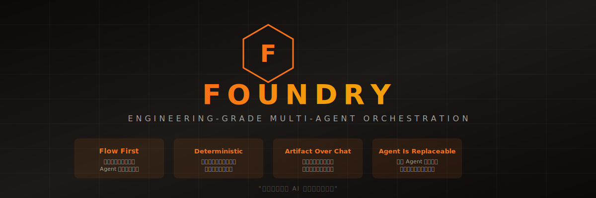
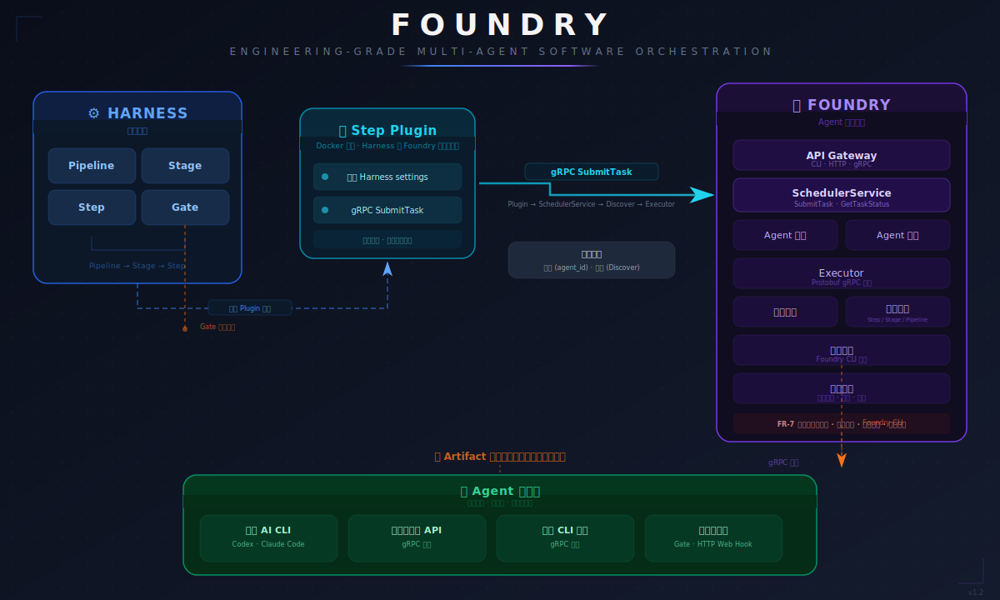

# Foundry

> 以 Harness 为流程引擎的工程级多 Agent 软件研发编排系统



## 项目定义

Foundry 不是一个业务应用，也不是 AI 编程助手，而是一个**用来构建软件的系统**。

Foundry 的目标是：

- 显式建模软件研发流程
- 在流程中调度多个职责单一的 Agent
- Agent 可以是：本地 AI CLI 工具（Codex CLI、Claude Code 等）、远程大模型 API、传统 CLI 工具、人类工程师（Gate 模式）
- 所有行为必须：可审计、可回滚、可替换、可失败

Foundry 不追求"自动写完项目"，而追求**让复杂工程在 AI 参与下仍然可控**。

## 核心工程哲学

| 原则 | 含义 |
|------|------|
| **Flow First** | 一切行为必须附着在明确的流程（Pipeline / Stage / Step）中，Agent 不拥有流程控制权 |
| **Deterministic Over Smart** | 稳定、可预测优先于聪明，宁可保守也不允许不可控 |
| **Artifact Over Conversation** | 系统的核心资产是工程产物，而不是对话，任何无结构输出都视为失败 |
| **Agent Is Replaceable** | 不依赖某个模型的"聪明程度"，任意 Agent 都应可被替换或禁用 |

## 协作模型

Foundry v1 只支持一种协作模式：**多 Agent「分工并行」模型**

- 每个 Agent 只承担单一职责
- Agent 之间禁止直接通信
- 协作只通过结构化 Artifact 完成
- 并行、顺序、失败处理全部由流程系统负责

系统中不存在：自治 Agent、自我规划 Agent、Agent 之间的讨论或博弈。

## Agent 的系统级抽象

在 Foundry 中，**Agent = 受控执行器（Executor）**。

Agent 必须具备：

- 明确输入（Task + Context + Workspace）
- 明确输出（Artifact）
- 明确职责边界

Agent 不具备：

- 项目视角
- 架构裁决权
- 需求扩展权
- 流程决策权

Agent 的失败是正常状态，Foundry 的价值在于管理失败，而不是避免失败。

### Agent 类型与能力

四种 Agent 类型（执行模板）：

| 类型 | 执行方式 | 说明 |
|------|---------|------|
| 本地 AI CLI 工具 | 子进程 + Prompt | Codex CLI、Claude Code 等 |
| 远程大模型 API | HTTP/gRPC 调用 | 远程大模型服务 |
| 传统 CLI 工具 | 子进程 + 退出码 | 标准 CLI 工具 |
| 人类工程师（Gate 模式） | Web Hook + 等待 | 通过 Gate 介入 |

Capabilities 能力声明（第二维度，与 AgentType 正交）：

> AgentType 定义"如何执行"，Capabilities 定义"能做什么"。新 Agent 形态通过"选择最接近的执行模板 + 声明能力"接入。

v1 预定义能力：`ai_reasoning`、`tool_use`、`code_generation`、`code_review`、`security_scan`、`deterministic`、`approval`、`notification`

详见 [agent_executor_architecture.md](docs/design/agent_executor_architecture.md)。

## Foundry 与 Harness 的关系

| 层面 | Harness 负责 | Foundry 负责 |
|------|-------------|-------------|
| 流程 | Pipeline / Stage / Step / Gate 执行 | — |
| Agent | — | Agent 抽象、Task / Artifact 规范、统一接入、调度执行 |
| 审计 | — | 审计结构定义、记录写入、查询追溯 |
| 边界 | 不理解 Agent 语义 | 不控制流程执行 |

## 业务架构



完整架构图详见 [docs/architecture.md](docs/architecture.md)，包含整体架构、协作模型、Agent 生命周期三个 Mermaid 图。

## 术语表

| 术语 | 定义 |
|------|------|
| Flow | 流程，一切行为的附着载体，由 Pipeline / Stage / Step 构成 |
| Pipeline | 研发流程的顶层容器，由多个 Stage 组成 |
| Stage | 流程阶段，由多个 Step 组成，是阶段边界 |
| Step | 流程步骤，是 Foundry 调度 Agent 的最小触发单元（Harness Step 通过 Foundry API 触发 Agent 执行） |
| Gate | 人类 / 规则介入点，用于审批、确认、修正 |
| Agent | 受控执行器（Executor），具备明确输入、输出和职责边界 |
| AgentType | Agent 执行模板枚举，定义"如何执行"（本地 AI CLI / 远程 API / 传统 CLI / 人类 Gate） |
| Capabilities | Agent 能力声明，定义"能做什么"，与 AgentType 正交的第二维度 |
| Task | Agent 的输入描述，包含任务描述（TaskSpec）、上下文（Context）、工作空间（Workspace） |
| TaskSpec | Task 的任务描述子结构，包含 description、agent_type、expected_artifact_types、parameters、constraints |
| Artifact | Agent 的输出产物，结构化的工程产物，非无结构对话 |
| ArtifactType | Artifact 类型枚举（代码评审报告、安全扫描报告、构建产物等 11 种 + 自定义） |
| ArtifactRef | 前置 Artifact 引用，用于 Context.upstream_artifacts 中跨 Step 传递 |
| Executor | Agent 的执行器抽象，接口由 Protobuf 定义（proto/executor.proto），统一封装不同类型 Agent 的执行逻辑 |
| ExecutionStatus | Agent 执行结果枚举（SUCCESS / FAILED / TIMEOUT / CANCELLED） |
| AgentRegistration | Agent 注册信息，由 AgentRegistrationSpec（静态注册信息）和 AgentRuntimeState（运行时状态）组成 |
| AgentRegistrationSpec | Agent 静态注册信息，由 Executor 提供（agent_id、agent_type、capabilities、endpoint 等） |
| AgentRuntimeState | Agent 运行时状态，由 Registry 管理（status、running_tasks、enabled 等） |
| Registry | Agent 注册中心，管理 Agent 的注册、发现、状态和配置 |
| CapabilityRegistry | 能力注册表，管理 v1 预定义和自定义能力标识 |
| AgentStatus | Agent 运行时状态枚举（REGISTERING / AVAILABLE / BUSY / UNHEALTHY / DISABLED / DEREGISTERING） |
| Intervention | 人工介入记录，当 Step 失败后等待人类工程师操作时创建 |
| InterventionStatus | 介入记录状态枚举 |
| RollbackGranularity | 回滚粒度枚举（Step / Stage / Pipeline） |
| OnFailureStrategy | Pipeline 级别 on_failure 策略配置 |
| AuditEvent | 审计事件，记录一次 Agent 执行的完整信息（输入/输出/上下文/时间戳） |
| AuditEventType | 审计事件类型枚举（15 种） |
| Audit | 全流程追溯记录，包含每次 Agent 执行的完整信息 |
| Context | Agent 执行任务的上下文信息，包含环境变量、依赖关系、前置 Artifact 引用等 |
| Workspace | Agent 执行任务的工作空间，包含代码仓库路径、文件系统挂载、工作目录等 |

## v1 能力边界

### v1 实现

- Agent Executor 抽象（本地 AI CLI 工具 / 远程大模型 API / 传统 CLI 工具 / 人类工程师（Gate 模式））
- Task 与 Artifact 的结构化定义
- Foundry 调度 Agent 执行（Harness 触发，Foundry 调度）
- 失败处理与人工介入机制
- 回滚机制
- 流程审计与追溯
- Agent 注册与发现
- Agent 约束规范
- 1–2 个可复用的软件研发流程模板

### v1 明确不做

- 自动规划研发流程
- 自演化 / 自反思 Agent
- 端到端无人值守交付
- Agent 之间的智能协商
- 自治 Agent、自我规划 Agent

## 技术栈

> 详细对比分析和决策理由见 [docs/design/tech_stack_and_architecture.md](docs/design/tech_stack_and_architecture.md)。

| 类别 | 选型 | 说明 |
|------|------|------|
| 编程语言 | Go 1.22+ | 稳定可预测、并发原生、单一二进制部署 |
| RPC 框架 | gRPC + Protobuf | 内部组件通信、Executor 接口定义、Agent 远程调度 |
| CLI 框架 | Cobra | Go 生态标准 CLI 框架 |
| 容器交互 | Docker SDK for Go | Agent 容器化执行 |
| Harness 集成 | 容器化插件模型 | Foundry 作为编排层，通过 CLI/gRPC API 接收 Harness 调度 |

## 失败与人工介入

失败是系统的一等公民。Foundry 必须支持：

- Agent 输出无效（D-1：校验失败）
- 产物格式错误（D-2：格式不匹配）
- 执行超时（D-3：超时检测）
- 人工中断与接管（D-4：显式取消）

任何失败都必须：可被定位、可被复现、可被人工修正。

失败处理路径由 Pipeline 配置决定（`on_failure` 策略），支持重试、人工介入（6 种操作：approve/reject/correct/rollback/cancel/skip）、回滚（3 种粒度：Step/Stage/Pipeline）。

详见 [failure_handling_and_human_intervention.md](docs/design/failure_handling_and_human_intervention.md)。

## 流程审计

所有 Agent 的执行行为必须可追溯。审计日志记录完整的执行信息（输入/输出/上下文/时间戳），默认使用 SQLite 存储（可选 PostgreSQL），支持 gRPC + REST 双协议查询，可按 Pipeline/Stage/Step、时间范围、Agent 类型等维度查询，支持 JSONL/CSV 导出。

详见 [audit_scheme.md](docs/design/audit_scheme.md)。

## Agent 注册与发现

Agent 通过 Registry 注册自身信息（类型、能力、端点地址），Scheduler 通过 Registry 发现和选择可用 Agent。支持动态启用/禁用 Agent，无需重启系统。

发现算法按 6 级优先级过滤：AgentType → ArtifactType → Capabilities → Labels → 状态 → 负载均衡。

详见 [agent_registry_and_discovery.md](docs/design/agent_registry_and_discovery.md)。

## Harness 集成

Foundry 通过 Harness Plugin Step 集成，Harness 掌管流程控制权（Pipeline/Stage/Step 调度），Foundry 掌管 Agent 调度。Foundry Step Plugin 是 Docker 镜像，作为 Harness Plugin Step 运行，通过 gRPC 与 Foundry Core 通信。

重试由 Foundry 内部管理，Harness failure strategy 统一为 MarkAsFailure。人工介入通过 Foundry CLI 操作。

详见 [harness_integration.md](docs/design/harness_integration.md)。

## 项目结构

```
Foundry/
├── README.md                                    # 本文档 — 项目定义与概述
├── CLAUDE.md                                    # AI 辅助开发上下文
├── PROGRESS.md                                  # 进度跟踪
├── docs/
│   ├── architecture.md                          # 业务架构图（Mermaid）
│   ├── pipeline_scenarios.md                    # 常见场景 Pipeline 模板
│   ├── design/                                  # 设计文档
│   │   ├── tech_stack_and_architecture.md        # 技术栈选型与项目架构
│   │   ├── task_artifact_data_model.md           # 核心数据模型（Task & Artifact）
│   │   ├── agent_executor_architecture.md        # Agent Executor 架构设计
│   │   ├── failure_handling_and_human_intervention.md  # 失败处理与人工介入机制
│   │   ├── audit_scheme.md                       # 流程审计方案
│   │   ├── agent_registry_and_discovery.md       # Agent 注册与发现机制
│   │   └── harness_integration.md                # Harness 集成方案
│   └── assets/
│       ├── foundry-banner.svg                   # 产品 Banner
│       └── foundry-architecture.svg             # 架构图
├── .trae/
│   ├── rules/                                   # 项目规则（按生效方式拆分）
│   │   ├── project_rules.md                     # 核心约束（始终生效）
│   │   ├── core_naming.md                       # 核心概念命名（始终生效）
│   │   ├── naming_conventions.md                # 命名规范（代码文件生效）
│   │   ├── documentation_standards.md           # 文档规范（Markdown 文件生效）
│   │   ├── design_doc_standards.md              # 设计文档规范（智能生效）
│   │   ├── git_conventions.md                   # 版本控制规范（智能生效）
│   │   ├── protobuf_schema_standards.md         # Protobuf 与 JSON Schema 规范（Proto/Schema 文件生效）
│   │   ├── review_process.md                    # 评审流程（手动触发）
│   │   └── engineering_checklist.md             # 工程哲学检查清单（智能生效）
│   └── specs/
│       └── foundry-v1/
│           ├── spec.md                          # 产品需求文档
│           ├── tasks.md                         # 实现计划
│           └── checklist.md                     # 验证清单
├── cmd/                                         # CLI 入口
│   ├── foundry/                                 # 主 CLI（foundry）
│   └── foundry-agent/                           # Agent 执行器入口（foundry-agent）
├── internal/                                    # 内部包（不可外部导入）
│   ├── agent/                                   # Agent Executor 实现
│   ├── scheduler/                               # Agent 调度层
│   ├── gateway/                                 # API Gateway（CLI/HTTP/gRPC）
│   ├── model/                                   # Task/Artifact 数据模型
│   ├── registry/                                # Agent 注册与发现
│   ├── failure/                                 # 失败处理与回滚
│   ├── audit/                                   # 流程审计
│   ├── harness/                                 # Harness 集成适配
│   └── config/                                  # 配置管理
├── proto/                                       # Protobuf 接口定义
├── gen/                                         # 生成的 gRPC 代码（不手动编辑）
├── configs/                                     # 配置文件
├── schemas/                                     # JSON Schema 文件
├── data/                                        # 运行时数据（Registry 快照、审计数据库等）
├── test/                                        # 集成测试
└── scripts/                                     # 构建/部署脚本
```

## 当前状态

项目处于 **v1 设计文档阶段**，正在产出工程设计文档，为后续编码实现提供可审计、可评审、可执行的设计基线。

### 设计文档任务

> 详细任务分解、依赖关系、进度状态见 [PROGRESS.md](./PROGRESS.md)。
> 任务定义和验收标准见 [tasks.md](.trae/specs/foundry-v1/tasks.md)。

### 待决问题

> 待决问题的解决进度追踪见 [PROGRESS.md](./PROGRESS.md) 第三章「Open Questions 追踪」。

### 编码阶段工作流（未来）

1. 所有代码必须追溯到对应的设计文档
2. 遵循 `.trae/rules/` 下的规则文件
3. 不得跳过测试或审计日志
4. 每个 Agent 集成必须实现 `proto/executor.proto` 中定义的 Executor gRPC 接口

## 目标用户

- 软件架构师
- DevOps 工程师
- 工程团队负责人
- 一线开发者（Agent 编写与使用者）
