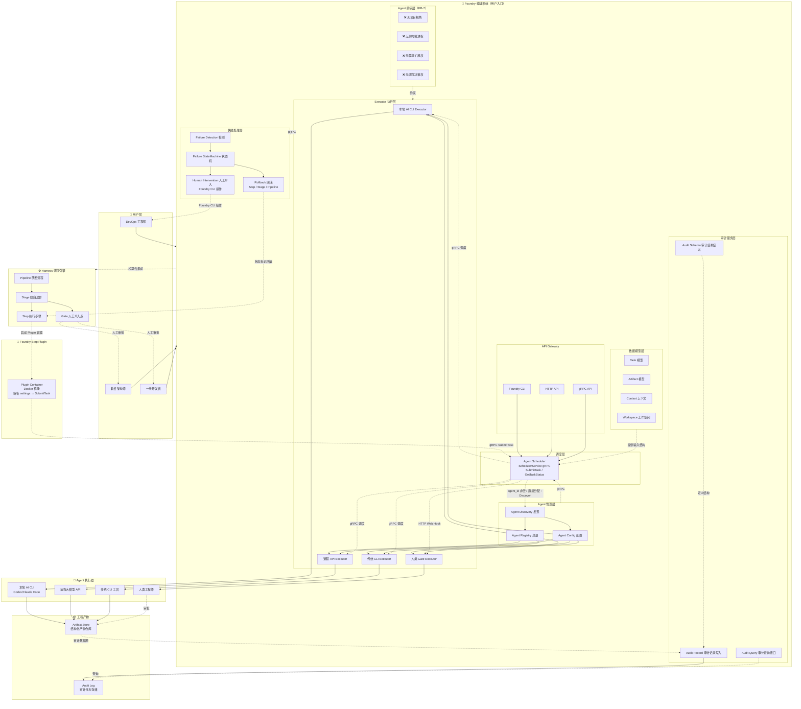
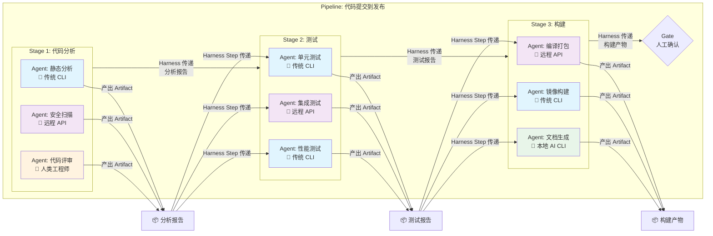
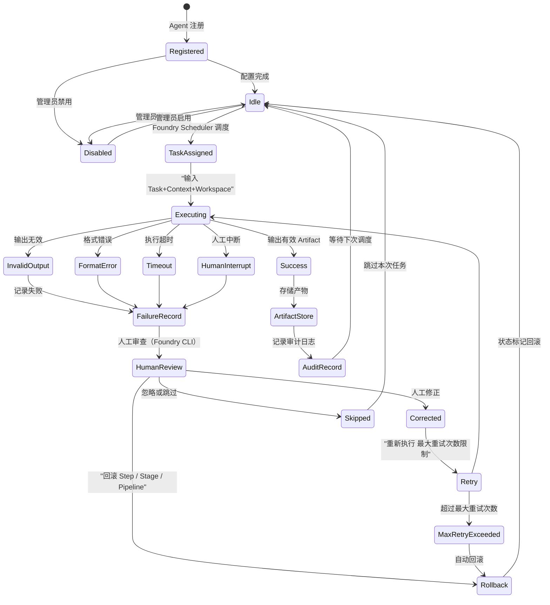

# Foundry 业务架构图

| 属性 | 内容 |
|------|------|
| **文档标题** | Foundry 业务架构图 |
| **文档作者** | Foundry Team |
| **文档日期** | 2026-05-04 |
| **文档版本** | v1.2 |
| **文档描述** | Foundry 系统的整体架构、协作模型和 Agent 生命周期的可视化说明 |

---

## 整体架构

### 整体架构解读

上图展示了 Foundry 的分层架构，核心设计要点：

- **用户层**：软件架构师、DevOps 工程师和一线开发者通过 Foundry 作为统一入口与系统交互
- **API Gateway**：提供三种接入方式——Foundry CLI、HTTP API、gRPC API，统一路由到 Agent Scheduler
- **Foundry 编排系统**：包含七个子层——API Gateway、数据模型层（Task/Artifact/Context/Workspace）、Agent 约束层（FR-7 四项禁止能力）、Agent 管理层（注册/发现/配置）、调度层（Agent Scheduler SchedulerService gRPC，提供 SubmitTask/GetTaskStatus 接口）、Executor 执行层（四种 Agent 类型）、失败处理层（检测/状态机/回滚/人工介入）、审计服务层（结构定义/查询接口/记录写入）
- **Foundry Step Plugin**：Docker 镜像，作为 Harness Plugin Step 运行，解析 Harness settings 后通过 gRPC 调用 Foundry Core SchedulerService.SubmitTask，是 Harness 与 Foundry 的桥梁
- **Harness 流程引擎**：负责 Pipeline/Stage/Step/Gate 的执行，通过启动 Plugin 容器触发 Foundry Agent 调度
- **Agent 执行器**：四种类型的 Agent 执行任务并产出 Artifact
- **工程产物**：结构化 Artifact Store 和 Audit Log 存储

关键设计决策：

1. Foundry 与 Harness 松耦合——Harness Step 启动 Plugin 容器，Plugin 通过 gRPC 与 Foundry Core 通信，Foundry 内部管理 Agent 调度，Harness 不直接接触 Executor
2. Foundry Step Plugin 是唯一桥梁——Harness 与 Foundry 之间不共享数据库、不共享文件系统、不共享进程空间，所有交互通过 Plugin → gRPC → SchedulerService 完成
3. gRPC 全链路通信——Foundry 内部组件（Scheduler、Registry、Audit、Failure Handler）通过 gRPC 通信，实现模块解耦和独立演进
4. Agent Scheduler 作为核心调度枢纽——所有 Agent 调度请求经 Scheduler 统一处理，支持两种调度模式：精确调度（agent_id 非空时直接分配指定 Executor）和自动发现（agent_id 为空时通过 Registry.Discover 匹配）
5. Agent 约束（FR-7）作为独立层强制执行，确保 Agent 无法获得项目视角、架构裁决权、需求扩展权或流程决策权
6. 失败处理是一等公民，拥有独立的检测、状态机、回滚和人工介入机制；人工介入通过 Foundry CLI 操作，不经过 Harness Gate
7. 回滚采用状态标记（非物理删除），支持三种粒度：Step 级、Stage 级、Pipeline 级
8. 审计记录写入从 Harness 移至 Foundry 审计服务层——Foundry 掌握完整的审计数据链

## Agent 协作模型（分工并行）

> 核心原则：Agent 之间禁止直接通信，协作只通过结构化 Artifact 完成，由 Harness Step 负责传递。

### 协作模型解读

上图以"代码提交到发布"Pipeline 为例，展示了多 Agent「分工并行」协作模型：

- **Stage 间串行**：每个 Stage 必须全部完成后才能进入下一个 Stage，Artifact 由 Harness Step 在 Stage 间传递
- **Stage 内并行**：同一 Stage 内的 Step 可以并行执行，各自产出独立的 Artifact
- **Agent 间无直接通信**：Agent 之间禁止直接通信，所有协作通过结构化 Artifact 完成
- **调度路径**：Harness Step → 启动 Plugin 容器 → gRPC SubmitTask → Foundry Core SchedulerService → Registry.Discover → gRPC 调度 Agent 执行
- **Gate 把关**：在不可逆操作（如生产发布）前设置 Gate，由人类工程师审批

颜色编码：🔵 传统 CLI 工具、🟣 远程大模型 API、🟠 人类工程师、🟢 本地 AI CLI 工具

## Agent 执行生命周期

### 生命周期解读

上图展示了 Agent 从注册到执行的完整状态机：

- **注册与配置**：Agent 注册后进入 Idle 状态；管理员可随时禁用/启用 Agent
- **调度与执行**：Foundry Agent Scheduler 通过 gRPC 调度任务后，Agent 接收 Task+Context+Workspace 输入进入 Executing 状态
- **成功路径**：输出有效 Artifact → 存储产物 → 记录审计日志 → 回到 Idle 等待下次调度
- **失败路径**：四种失败类型（输出无效、格式错误、超时、人工中断）→ 记录失败 → 人工审查（通过 Foundry CLI 操作）
- **人工介入**：人工审查后可执行修正（重试）、回滚（Step/Stage/Pipeline 三种粒度，状态标记）或跳过
- **重试保护**：最大重试次数限制防止无限重试；超过限制触发自动回滚
- **审计闭环**：每次执行无论成功或失败，均生成审计记录

---

## 修订历史

| 版本 | 日期 | 修改内容 | 作者 |
|------|------|---------|------|
| v1.0 | 2026-05-04 | 初始版本 | Foundry Team |
| v1.1 | 2026-05-04 | 新增 API Gateway 和 Agent Scheduler 调度层；调度路径从 Harness 直接调度改为 Foundry Scheduler gRPC 调度；审计记录写入从 Harness 移至 Foundry；整体架构从六层扩展为七层 | Foundry Team |
| v1.2 | 2026-05-05 | 同步 Task 7 设计决策：新增 Foundry Step Plugin 组件（Docker 镜像，Harness 与 Foundry 的唯一桥梁）；修正交互路径（Harness Step → Plugin 容器 → gRPC SubmitTask → SchedulerService，不再经过 API Gateway）；SchedulerService 标注 SubmitTask/GetTaskStatus 接口；新增精确调度模式（agent_id 非空时跳过发现算法）；修正人工介入路径（Foundry CLI 操作，不经过 Harness Gate）；修正回滚路径（状态标记，Step/Stage/Pipeline 三种粒度）；更新调度路径描述 | Foundry Team |
