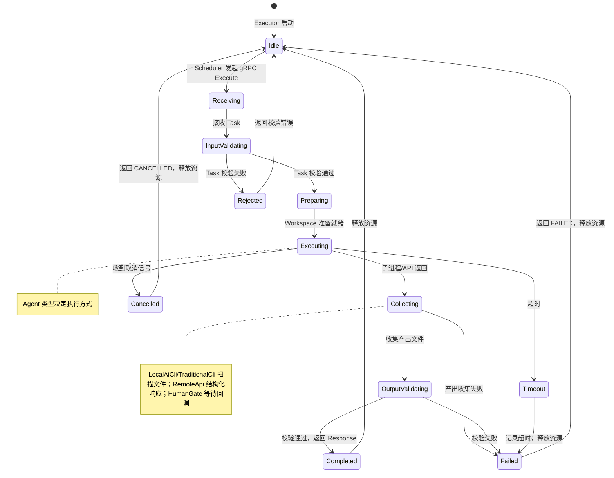

# Foundry v1 - Agent Executor 架构设计文档

| 属性 | 内容 |
|------|------|
| **文档标题** | Foundry v1 - Agent Executor 架构设计文档 |
| **文档作者** | Foundry Team |
| **文档日期** | 2026-05-06 |
| **文档版本** | v1.3 |
| **文档描述** | Foundry v1 Agent Executor 统一接口设计，覆盖四种 Agent 类型（本地 AI CLI、远程 API、传统 CLI、人类 Gate）的接入规范、约束机制、输入输出契约和调度生命周期 |

---

## 概述

本文档定义 Foundry v1 的 Agent Executor 架构，是连接「数据模型」（Task 2）与「流程调度」（Task 7）的核心桥梁。Agent Executor 是 Foundry 中"Agent = 受控执行器"这一核心抽象的具体体现。

本文档覆盖 FR-1（Agent Executor 架构设计）和 FR-7（Agent 约束规范定义），对应验收标准 AC-1 和 AC-7。同时解决 Task 2 遗留的三个待决问题：Artifact 大小限制、调度结果记录、Artifact 产出数量约束。

### 读者

- 软件架构师：理解 Executor 统一接口和四种 Agent 类型的架构决策
- 一线开发者：根据接入规范实现具体的 Agent Executor
- DevOps 工程师：理解 Agent 容器化执行模式和网络配置
- 流程设计师：理解 Agent 如何在 Pipeline/Stage/Step 中被调度

### 前置依赖

- [tech_stack_and_architecture.md](tech_stack_and_architecture.md)：技术栈选型（Go 1.22+、gRPC + Protobuf、容器化插件模型）、项目目录结构（internal/agent/、proto/、gen/）
- [task_artifact_data_model.md](task_artifact_data_model.md)：Task/Artifact/Context/Workspace 完整字段定义、AgentType/ArtifactType 枚举、Protobuf 消息定义（common.proto/task.proto/artifact.proto）、校验错误码（9 个）、Artifact 生命周期状态机（8 个状态）、ArtifactRef 引用完整性约束、parameters 约定键
- [spec.md](../../.trae/specs/foundry-v1/spec.md)：FR-1（四种 Agent 类型）、FR-7（Agent 约束规范）

---

## 设计动机

### 为什么需要统一的 Executor 架构

Foundry v1 面临的核心挑战是：四种 Agent 类型的执行方式差异巨大，但上层调度系统必须以统一的方式对待它们。

| Agent 类型 | 执行方式 | 通信协议 | 特点 |
|-----------|---------|---------|------|
| 本地 AI CLI | 子进程调用 | stdin/stdout + 文件系统 | 交互式，可能需要多轮对话 |
| 远程 API | HTTP/gRPC 调用 | REST/gRPC | 无状态 API 调用，延迟不确定 |
| 传统 CLI | 子进程调用 | 退出码 + stdout/stderr | 批处理模式，不交互 |
| 人类 Gate | Web Hook + 轮询 | HTTP | 异步等待，可能需要数分钟到数小时 |

统一 Executor 架构的核心价值：

1. **屏蔽执行方式差异**：Scheduler 调用 `Execute(task)` 即可，不关心底层是子进程还是 HTTP 调用
2. **支持 Agent Is Replaceable**：替换 Agent 实现只需替换 Executor 实例，Scheduler 和 Pipeline 无感知
3. **统一失败处理**：所有 Agent 的失败通过统一的 ExecutionStatus 和错误码表达，失败处理模块（Task 5）无需理解 Agent 内部
4. **统一审计记录**：所有 Agent 的执行通过统一的钩子记录审计日志（Task 6）

### 设计约束

| 约束来源 | 约束内容 |
|---------|---------|
| Flow First | Executor 不拥有流程控制权，不决定"执行什么"——Task 由 Scheduler 传入，Executor 只负责"如何执行" |
| Deterministic Over Smart | 给定相同 Task 输入，Executor 的输出格式确定；失败模式有明确定义的错误码 |
| Artifact Over Conversation | Executor 输出必须是 Artifact 列表，禁止返回无结构文本 |
| Agent Is Replaceable | Executor 接口是 gRPC 服务契约，任何实现该契约的组件都可作为 Agent 接入 |

---

## 详细设计

### 1. 架构概览

Agent Executor 在 Foundry 中的位置：

```
┌─────────────────────────────────────────────────────────┐
│                      Harness Pipeline                    │
│  Stage A ──► Stage B ──► Stage C ──► Gate ──► Stage D  │
└──────┬──────────────────────────────────────────────────┘
       │ Step 触发
       ▼
┌─────────────────────────────────────────────────────────┐
│                   Foundry Scheduler                      │
│  ┌──────────┐  ┌──────────┐  ┌──────────────────────┐  │
│  │ 接收 Task │─►│ 分配队列  │─►│ 选择 Executor 实例   │  │
│  └──────────┘  └──────────┘  └──────────┬───────────┘  │
│                                         │               │
│                    gRPC Execute(Task)    │               │
│                                         ▼               │
│  ┌──────────────────────────────────────────────────┐   │
│  │              Executor (gRPC Service)              │   │
│  │  ┌──────────┐ ┌──────────┐ ┌──────────┐ ┌─────┐ │   │
│  │  │Local AI  │ │Remote API│ │Trad. CLI │ │Human│ │   │
│  │  │CLI Agent │ │Agent     │ │Agent     │ │Gate │ │   │
│  │  └──────────┘ └──────────┘ └──────────┘ └─────┘ │   │
│  └──────────────────────────────────────────────────┘   │
│                                         │               │
│                    gRPC Response        │               │
│                    (Artifacts + Status)  ▼               │
│  ┌──────────────────────────────────────────────────┐   │
│  │  Artifact 收集 → Schema 校验 → Artifact Store    │   │
│  └──────────────────────────────────────────────────┘   │
└─────────────────────────────────────────────────────────┘
```

**关键决策：Executor 以 gRPC Service 暴露**

- Executor 接口通过 `proto/foundry/v1/executor.proto` 定义
- 每个 Agent 类型实现一个 gRPC Server，注册到 Registry（Task 4）
- Scheduler 通过 gRPC 调用 Execute，获取 Artifact 列表
- 这种设计使得 Agent 可以运行在独立进程中甚至独立容器中

---

### 2. Executor 统一接口

#### 2.1 gRPC Service 定义

Executor 是 Foundry 中所有 Agent 必须实现的核心接口，定义为 gRPC Service：

```protobuf
syntax = "proto3";

package foundry.v1;

option go_package = "github.com/foundry/foundry/gen/foundry/v1";

import "foundry/v1/common.proto";
import "foundry/v1/task.proto";
import "foundry/v1/artifact.proto";

service Executor {
  rpc Execute(ExecuteRequest) returns (ExecuteResponse);
  rpc GetCapabilities(GetCapabilitiesRequest) returns (GetCapabilitiesResponse);
  rpc HealthCheck(HealthCheckRequest) returns (HealthCheckResponse);
}

message ExecuteRequest {
  Task task = 1;
}

message ExecuteResponse {
  repeated Artifact artifacts = 1;
  ExecutionStatus status = 2;
  string error_message = 3;
  ExecutionMetrics metrics = 4;
}

> **设计决策：ExecuteResponse 中的 Artifact 使用 file_path 而非 data 传递内容。** 原因：1) gRPC 默认最大消息大小为 4MB，而 TraditionalCLI 的单个 Artifact 可达 50MB，内联 data 会导致 gRPC 调用失败；2) Executor 将产出文件写入 Workspace.output_dir，ExecuteResponse 中的 Artifact.content 使用 file_path 引用这些文件；3) Foundry Core 在收到 ExecuteResponse 后，从 file_path 读取文件内容、计算 checksum、执行 Schema 校验，然后将完整的 Artifact（含 data 或 file_path）写入 Artifact Store。这种方式将大文件传输与 gRPC 调用解耦，符合 Deterministic Over Smart 原则。

enum ExecutionStatus {
  EXECUTION_STATUS_UNSPECIFIED = 0;
  EXECUTION_STATUS_SUCCESS = 1;
  EXECUTION_STATUS_FAILED = 2;
  EXECUTION_STATUS_TIMEOUT = 3;
  EXECUTION_STATUS_CANCELLED = 4;
}

message ExecutionMetrics {
  int64 start_time_unix_ms = 1;
  int64 end_time_unix_ms = 2;
  int64 duration_ms = 3;
}

> **设计决策：从 ExecutionMetrics 中移除 retry_count 字段。** 原因：1) 重试由 Scheduler 管理（见操作规范第 3 节），Executor 不感知重试逻辑，无法正确填充此字段；2) 重试次数由 Scheduler 在 TaskSchedulingRecord 中维护（见 7.2 节），审计查询时从 Audit 记录获取；3) Executor 只负责单次执行的时间指标（start_time、end_time、duration），职责边界清晰。

message GetCapabilitiesRequest {}

message GetCapabilitiesResponse {
  AgentType agent_type = 1;
  repeated ArtifactType supported_artifact_types = 2;
  string agent_id = 3;
  string agent_version = 4;
  int32 max_concurrent_tasks = 5;
  repeated string labels = 6;
  repeated string capabilities = 7;
}

message HealthCheckRequest {}

message HealthCheckResponse {
  bool healthy = 1;
  string message = 2;
}
```

#### 2.2 Execute 方法契约

| 契约维度 | 定义 |
|---------|------|
| **输入** | `ExecuteRequest.task` — 完整的 Task 对象（含 TaskSpec、Context、Workspace） |
| **输出** | `ExecuteResponse.artifacts` — 0 个或多个 Artifact 列表 |
| **状态** | `ExecutionStatus` 枚举，明确表达成功/失败/超时/取消四种终态 |
| **错误** | 失败时 `error_message` 提供人类可读的错误描述 |
| **指标** | `ExecutionMetrics` 提供执行时间等基础指标 |
| **幂等性** | Executor 不保证幂等，同一 Task 重复执行可能产生不同结果 |
| **超时** | Executor 必须遵守 `Task.timeout_seconds` 字段，超时后返回 `EXECUTION_STATUS_TIMEOUT` |
| **取消** | Scheduler 可通过 gRPC context cancellation 取消执行，Executor 应响应取消信号 |

**Execute 方法的四条不变式**：

1. **必须返回 status**：无论成功失败，`status` 字段必填，不能为空或 UNSPECIFIED
2. **失败时 artifacts 可为空**：`status != SUCCESS` 时，`artifacts` 可以为空列表
3. **成功时至少 1 个 Artifact**：`status == SUCCESS` 时，`artifacts` 至少包含 1 个 Artifact
4. **错误必须可诊断**：`status == FAILED` 时，`error_message` 必须提供足够的诊断信息

#### 2.3 GetCapabilities 辅助接口

每个 Executor 必须暴露其能力信息，供 Registry 和 Scheduler 使用：

| 字段 | 用途 |
|------|------|
| `agent_type` | 声明 Agent 类型，用于 Scheduler 匹配 Task 的 `agent_type` 要求 |
| `supported_artifact_types` | 能产出的 Artifact 类型列表，用于 Scheduler 过滤 |
| `agent_id` | 全局唯一的 Agent 实例标识（Registry 注册时生成） |
| `agent_version` | Agent 实现版本号，用于审计追溯和能力演进 |
| `max_concurrent_tasks` | 最大并发执行数，Scheduler 据此限流 |
| `labels` | 自定义标签，用于 Scheduler 的高级过滤（如 "fast"、"gpu-required"） |
| `capabilities` | 能力声明列表，用于 Scheduler 精细匹配 Task 所需能力（见 2.6 节） |

#### 2.4 HealthCheck 健康检查接口

Scheduler 在分配 Task 前通过 HealthCheck 确认 Executor 可用：

- `healthy = true`：Executor 可以接收 Task
- `healthy = false`：Executor 不可用，Scheduler 应选择其他 Executor 或触发失败处理
- HealthCheck 超时（默认 5 秒）视为 unhealthy

#### 2.5 Executor 并发控制

Executor 通过内部信号量（semaphore）机制控制并发执行数：

- Executor 启动时根据 `max_concurrent_tasks` 初始化信号量
- 收到 Execute 请求时，先获取信号量；获取失败则返回 `UNAVAILABLE` gRPC 状态码
- 执行完成后释放信号量
- Scheduler 收到 `UNAVAILABLE` 后选择其他 Executor 或等待重试

> **设计决策**：并发控制在 Executor 侧而非 Scheduler 侧实现，原因：1) Executor 最清楚自身资源容量；2) 避免 Scheduler 维护每个 Executor 的运行时计数；3) gRPC 标准状态码 `UNAVAILABLE` 天然表达"暂时不可用"语义。

#### 2.6 Capabilities 能力声明层

##### 设计动机

当前 4 种 AgentType 是"执行模板"——定义了 Agent **如何执行**（子进程/API/人类回调）。但 Agent 的 **能力**（能做什么）与执行方式是正交的两个维度：

| 维度 | 含义 | 示例 |
|------|------|------|
| 执行模板（AgentType） | 如何执行 | 子进程 + Prompt / HTTP API / 人类回调 |
| 能力声明（Capabilities） | 能做什么 | AI 推理 / 工具调用 / 安全扫描 / 通知 |

当新 Agent 形态出现时（如 MCP Agent、Function Calling Agent），它可能使用已有的执行模板但具备不同的能力。如果仅靠 AgentType 分类，新形态难以归类。

**解决方案**：保留 4 种 AgentType 作为执行模板不变，增加 `capabilities` 能力声明作为第二维度。新 Agent 形态通过"选择最接近的执行模板 + 声明能力"接入。

```
执行模板（4 种，解决"如何执行"）:
  LOCAL_AI_CLI    → 子进程 + Prompt 输入 + 文件产出
  REMOTE_API      → HTTP 调用 + Request/Response
  TRADITIONAL_CLI → 子进程 + 命令参数 + 退出码判定
  HUMAN_GATE      → Webhook 等待 + 人类决策

能力声明（开放列表，解决"能做什么"）:
  ai_reasoning    → 具备 AI 推理能力
  tool_use        → 可调用外部工具
  code_generation → 可生成代码
  ...
```

##### v1 预定义能力清单

| 能力标识 | 含义 | 典型 Agent |
|---------|------|-----------|
| `ai_reasoning` | 具备 AI 推理能力，输出不确定 | LocalAiCli, RemoteApi |
| `tool_use` | 可调用外部工具（MCP、Function Calling） | LocalAiCli（MCP 客户端） |
| `code_generation` | 可生成代码/补丁 | LocalAiCli, RemoteApi |
| `code_review` | 可做代码评审 | LocalAiCli, RemoteApi |
| `security_scan` | 可做安全扫描 | RemoteApi（Trivy API） |
| `deterministic` | 输出确定，相同输入相同结果 | TraditionalCli |
| `approval` | 可做审批决策 | HumanGate |
| `notification` | 可发送通知（副作用型，无自然 Artifact 产出） | TraditionalCli（slack-cli） |

> **设计约束**：能力标识是开放列表，v1 预定义以上 8 种。新增能力标识需在 Registry 中注册（Task 4），避免重复定义和命名冲突。

##### 新形态 Agent 接入示例

**MCP Agent**（通过 MCP 协议连接外部工具服务器）：

```yaml
agent_type: AGENT_TYPE_LOCAL_AI_CLI
capabilities: ["ai_reasoning", "tool_use"]
parameters:
  cli_command: "mcp-client"
  mcp_servers: "github,filesystem"
```

Scheduler 看到的信息：执行方式 = 子进程 + Prompt（和 LocalAiCli 一样），能力 = AI 推理 + 工具调用。

**Function Calling Agent**（LLM 通过 function calling 动态调用函数）：

```yaml
agent_type: AGENT_TYPE_REMOTE_API
capabilities: ["ai_reasoning", "tool_use"]
parameters:
  api_endpoint: "https://api.openai.com/v1/chat/completions"
  tools: "weather_api,calculator"
```

**通知 Agent**（发送 Slack/Email 通知，无自然 Artifact 产出）：

```yaml
agent_type: AGENT_TYPE_TRADITIONAL_CLI
capabilities: ["notification"]
parameters:
  command: "slack-cli"
  exit_codes: "0"
```

##### 通知类 Agent 的 Artifact 自动补全

Execute 不变式 3 规定"SUCCESS 时至少 1 个 Artifact"，但通知类 Agent 没有自然产出。当 Executor 声明 `notification` 能力时，Foundry Core 自动构造 `ARTIFACT_TYPE_EXECUTION_RECORD` 类型的 Artifact：

```go
func autoFillExecutionRecord(resp *ExecuteResponse, caps *GetCapabilitiesResponse) {
    if resp.Status == EXECUTION_STATUS_SUCCESS && len(resp.Artifacts) == 0 {
        for _, cap := range caps.Capabilities {
            if cap == "notification" {
                resp.Artifacts = append(resp.Artifacts, &Artifact{
                    ArtifactId:   uuid.NewString(),
                    ArtifactType: ARTIFACT_TYPE_EXECUTION_RECORD,
                    Metadata: map[string]string{
                        "producer_agent_id": caps.AgentId,
                        "execution_status":  "SUCCESS",
                    },
                })
                break
            }
        }
    }
}
```

> **跨文档同步说明**：`ARTIFACT_TYPE_EXECUTION_RECORD` 为本文档新增的 ArtifactType 枚举值，需同步添加到 Task 2 的 ArtifactType 枚举中。

##### Capabilities 与 AgentType 的关系

| AgentType | 默认 capabilities | 说明 |
|-----------|------------------|------|
| LOCAL_AI_CLI | `ai_reasoning` | AI CLI 工具默认具备推理能力 |
| REMOTE_API | `ai_reasoning` | 远程 API 默认具备推理能力 |
| TRADITIONAL_CLI | `deterministic` | 传统 CLI 默认输出确定 |
| HUMAN_GATE | `approval` | 人类 Gate 默认具备审批能力 |

> 默认 capabilities 在 Executor 未显式声明时自动填充。Executor 可通过配置覆盖默认值（如 TraditionalCli 声明 `notification` 替代 `deterministic`）。

---

### 3. Go 接口定义

虽然 gRPC 代码由 Protobuf 生成，但在 Foundry 内部，还需要一个 Go 层的适配接口用于 Executor 注册和生命周期管理：

```go
package agent

import (
    "context"
    "github.com/foundry/foundry/gen/foundry/v1"
)

type Executor interface {
    Execute(ctx context.Context, task *foundryv1.Task) (*foundryv1.ExecuteResponse, error)
    GetCapabilities(ctx context.Context) (*foundryv1.GetCapabilitiesResponse, error)
    HealthCheck(ctx context.Context) (*foundryv1.HealthCheckResponse, error)
    Shutdown(ctx context.Context) error
}

type ExecutorFactory interface {
    Create(config ExecutorConfig) (Executor, error)
    Type() foundryv1.AgentType
}
```

`ExecutorFactory` 用于从配置创建 Executor 实例，是实现 Agent Is Replaceable 的关键抽象——只需提供不同的 Factory 实现即可接入不同 Agent。

---

### 4. 四种 Agent 类型接入规范

#### 4.1 本地 AI CLI Agent（LocalAiCliExecutor）

**适用场景**：使用 Codex CLI、Claude Code、Cursor CLI 等本地 AI 编程工具执行代码评审、代码生成、设计提案等任务。

##### 执行模型

```
┌──────────────────────────────────────────────────────┐
│                LocalAiCliExecutor                     │
│                                                       │
│  1. 解析 Task → 构造 CLI 命令和 Prompt               │
│  2. 启动 CLI 子进程 (os/exec)                         │
│  3. 通过 stdin 发送 Prompt + Context                  │
│  4. 等待子进程退出或超时                               │
│  5. 从 Workspace.output_dir 收集产出的文件            │
│  6. 构造 Artifact 对象并返回                           │
└──────────────────────────────────────────────────────┘
```

##### 配置示例

```yaml
# configs/agents/local-ai-cli.yaml
agent_type: AGENT_TYPE_LOCAL_AI_CLI
agent_id: "codex-cli-default-v1"
agent_version: "1.0.0"
max_concurrent_tasks: 2
parameters:
  cli_command: "codex"
  model: "gpt-4"
  max_tokens: "8192"
execution:
  timeout_override_seconds: 600
  working_dir_template: "/workspaces/{task_id}"
network_mode: "bridge"
resource_limits:
  max_artifact_size_bytes: 10485760
  cpu_limit: "2.0"
  memory_limit_mb: 4096
```

##### 关键参数说明

| 参数键 | 必填 | 说明 |
|--------|------|------|
| `cli_command` | 是 | CLI 工具的可执行路径或命令名 |
| `model` | 否 | 使用的模型标识，CLI 工具默认模型时可不设置 |
| `max_tokens` | 否 | 最大输出 token 数，由 CLI 工具自行管理 |
| `system_prompt` | 否 | 系统 Prompt 模板路径，覆盖默认的系统 Prompt |
| `extra_args` | 否 | 传递给 CLI 工具的额外命令行参数 |

**Executor 配置结构说明**（适用于所有 Agent 类型）：

| 配置路径 | 必填 | 说明 |
|---------|------|------|
| `agent_type` | 是 | Agent 类型枚举值 |
| `agent_id` | 是 | 全局唯一的 Agent 实例标识 |
| `agent_version` | 是 | Agent 实现版本号 |
| `max_concurrent_tasks` | 是 | 最大并发执行数 |
| `parameters` | 是 | Agent 特定参数（见各类型参数说明表） |
| `execution.timeout_override_seconds` | 否 | 覆盖 Task.timeout_seconds 的超时时间 |
| `execution.working_dir_template` | 否 | 工作目录模板，`{task_id}` 会被替换 |
| `network_mode` | 否 | 容器网络模式（bridge/none） |
| `resource_limits.max_artifact_size_bytes` | 否 | 单个 Artifact 最大字节数 |
| `resource_limits.cpu_limit` | 否 | CPU 限制（如 "2.0"） |
| `resource_limits.memory_limit_mb` | 否 | 内存限制（MB） |

**RemoteApi 专属配置**：

| 配置路径 | 必填 | 说明 |
|---------|------|------|
| `api.auth.type` | 是 | 认证类型：`bearer_token` / `api_key` / `none` |
| `api.auth.token_env` | 否 | 认证 Token 的环境变量名（bearer_token 类型时必填） |
| `api.timeout_seconds` | 否 | 单次 API 调用超时（秒），默认 120 |
| `api.max_retries` | 否 | API 调用失败最大重试次数，默认 2 |
| `api.retry_backoff_ms` | 否 | 重试退避时间（毫秒），默认 1000 |

**HumanGate 专属配置**：

| 配置路径 | 必填 | 说明 |
|---------|------|------|
| `gate.webhook_url` | 是 | Gate 回调 Web Hook URL，`{task_id}` 会被替换 |
| `gate.notify_channels` | 否 | 通知渠道列表（如 `slack: #channel`、`email: user@company.com`） |
| `gate.timeout_seconds` | 否 | Gate 等待超时（秒），默认 7200（2h） |
| `gate.escalation.enabled` | 否 | 是否启用升级机制，默认 false |
| `gate.escalation.escalate_after_seconds` | 否 | 升级触发时间（秒），默认 3600 |
| `gate.escalation.escalation_target` | 否 | 升级目标（如邮箱地址） |

##### 执行的详细流程

```
1. 预执行
   a. 从 Task.task_spec.parameters 读取 cli_command
   b. 验证 CLI 工具是否可执行（which/where 检查）
   c. 构造 Prompt：Task.task_spec.description + Context 信息
   d. 准备 Workspace：确认 working_dir 和 output_dir 存在

2. 执行
   a. 启动 CLI 子进程，传递 Prompt
   b. 设置超时（Task.timeout_seconds）
   c. 等待子进程退出
   d. 收集 stdout/stderr 日志（用于审计）

3. 后执行
   a. 扫描 Workspace.output_dir 中的新文件
   b. 对每个文件构造 Artifact：
      - artifact_type 使用 Task.task_spec.expected_artifact_types 中的类型，按以下确定性规则分配：
        1) 如果 expected_artifact_types 只有 1 个类型 → 所有文件使用该类型
        2) 如果 expected_artifact_types 有多个类型 → 按文件扩展名/路径映射（映射表在 Executor 配置中定义，如 `*.json → CODE_REVIEW_REPORT`）
        3) 无法映射时使用 expected_artifact_types 的第一个类型，并记录 Warning
      - artifact_id 生成 UUID v4
      - content 使用 file_path 引用文件
      - metadata 填充（producer_agent_id、task_id 等）
      - 计算 checksum（SHA-256）
   c. 如果 output_dir 无文件 → 返回 EXECUTION_STATUS_FAILED + "no output files produced"

4. 清理（可选）
   - 删除临时文件（如中间的对话日志）
```

##### 失败模式

| 失败场景 | 返回 status | error_message |
|---------|------------|--------------|
| CLI 工具不可执行 | FAILED | "cli_command '{cmd}' not found in PATH" |
| CLI 子进程退出码非 0 | FAILED | "CLI exited with code {code}: {stderr}" |
| 执行超时 | TIMEOUT | "CLI execution timed out after {N}s" |
| output_dir 无文件 | FAILED | "agent produced no output files" |
| Artifact 文件过大 | FAILED | "artifact file '{path}' exceeds limit ({N} > {M} bytes)" |

##### 网络配置

本地 AI CLI Agent 执行时默认网络模式为 `bridge`，原因：
- Codex CLI、Claude Code 等工具需要通过网络调用远程大模型 API，`none` 模式不可行
- 可通过 TaskSpec.constraints 中 `no_internet_access=true` 在特定场景下禁用网络
- 网络隔离由容器化执行层面处理（Task 7 集成时确定）

##### Artifact 大小限制

| 参数 | 默认值 | 说明 |
|------|--------|------|
| `max_artifact_size_bytes` | 10 MB (10485760) | 单个 Artifact 文件最大大小 |
| `max_total_size_bytes` | 50 MB (52428800) | 本次执行所有 Artifact 总大小上限 |

#### 4.2 远程大模型 API Agent（RemoteApiExecutor）

**适用场景**：调用 OpenAI、Anthropic、Google 等远程大模型 API 执行代码评审、安全扫描分析、文档生成等任务。

##### 执行模型

```
┌──────────────────────────────────────────────────────┐
│                RemoteApiExecutor                      │
│                                                       │
│  1. 解析 Task → 构造 API Request                      │
│  2. 发送 HTTP/gRPC 请求到远程 API                      │
│  3. 接收流式响应（逐 token）或完整响应                  │
│  4. 将响应内容按 expected_artifact_types 结构化       │
│  5. 写入文件到 Workspace.output_dir                    │
│  6. 构造 Artifact 对象并返回                           │
└──────────────────────────────────────────────────────┘
```

##### 配置示例

```yaml
# configs/agents/remote-api.yaml
agent_type: AGENT_TYPE_REMOTE_API
agent_id: "openai-gpt4-default-v1"
agent_version: "1.0.0"
max_concurrent_tasks: 10
parameters:
  api_endpoint: "https://api.openai.com/v1/chat/completions"
  model: "gpt-4"
  temperature: "0.0"
api:
  auth:
    type: "bearer_token"
    token_env: "OPENAI_API_KEY"
  timeout_seconds: 120
  max_retries: 2
  retry_backoff_ms: 1000
execution:
  timeout_override_seconds: 300
  working_dir_template: "/workspaces/{task_id}"
network_mode: "bridge"
resource_limits:
  max_artifact_size_bytes: 5242880
  memory_limit_mb: 512
```

##### 关键参数说明

| 参数键 | 必填 | 说明 |
|--------|------|------|
| `api_endpoint` | 是 | 远程 API 端点 URL |
| `model` | 否 | 使用的模型标识，API 默认模型时可不设置 |
| `temperature` | 否 | 生成温度参数（0.0~2.0），默认 0.0（确定性输出） |
| `max_output_tokens` | 否 | 最大输出 token 数 |
| `response_format` | 否 | 响应格式要求（`json` 或 `text`），默认 `json` |
| `system_prompt` | 否 | 系统 Prompt 模板路径 |

##### 响应到 Artifact 的映射

远程 API 返回的文本需按 `expected_artifact_types` 结构化：

```
1. 如果 response_format = "json":
   → 解析 JSON，按 expected_artifact_types 提取对应部分
   → 每类生产一个 Artifact（或合并为一个 Multi-type Artifact）

2. 如果 response_format = "text":
   → 使用 Upstream Artifacts 作为参考格式
   → 尝试映射到 expected_artifact_types 的 Schema
   → 校验失败 → 返回 EXECUTION_STATUS_FAILED

3. 映射策略由 Executor 配置指定（映射表）
   - v1 内置映射表：预期 CodeReviewReport → response 中的 code_review 字段
```

##### 失败模式

| 失败场景 | 返回 status | error_message |
|---------|------------|--------------|
| API 端点不可达 | FAILED | "API endpoint unreachable: {url} ({error})" |
| 认证失败（401/403） | FAILED | "API authentication failed: {http_status}" |
| API 返回非 200 | FAILED | "API returned {http_status}: {body}" |
| 响应格式不符合预期 | FAILED | "API response does not match expected format" |
| 速率限制（429） | FAILED | "API rate limit exceeded, retry after {N}s" |
| 执行超时 | TIMEOUT | "API call timed out after {N}s" |

##### 速率限制与重试

- Executor 通过 `max_concurrent_tasks` 控制并发
- 遇到 429 时自动退避重试（最多 `max_retries` 次）
- `max_concurrent_tasks = 10` 但 API 自身有速率限制时，Scheduler 依赖 `labels` 标记（如 `rate-limited=true`）对 Executor 做选择性分配

##### Artifact 大小限制

| 参数 | 默认值 | 说明 |
|------|--------|------|
| `max_artifact_size_bytes` | 5 MB (5242880) | API 响应通常为文本，5MB 足以覆盖长文档 |
| `max_total_size_bytes` | 20 MB (20971520) | 多个 Artifact 的总大小上限 |

#### 4.3 传统 CLI Agent（TraditionalCliExecutor）

**适用场景**：调用 linter、测试框架、编译器、安全扫描工具等传统 CLI 工具，产出结构化报告。

##### 执行模型

```
┌──────────────────────────────────────────────────────┐
│              TraditionalCliExecutor                   │
│                                                       │
│  1. 解析 Task → 提取 command 和参数                   │
│  2. 启动子进程 (os/exec)                               │
│  3. 传递参数（从 TaskSpec.parameters）                 │
│  4. 等待退出                                            │
│  5. 收集 stdout/stderr + 产出文件                      │
│  6. 根据 exit_code 判断成功/失败                        │
│  7. 构造 Artifact（stdout 或文件路径）                 │
└──────────────────────────────────────────────────────┘
```

##### 配置示例

```yaml
# configs/agents/traditional-cli.yaml
agent_type: AGENT_TYPE_TRADITIONAL_CLI
agent_id: "gitleaks-scanner-v2"
agent_version: "2.0.0"
max_concurrent_tasks: 1
parameters:
  command: "gitleaks"
  exit_codes: "0"
execution:
  timeout_override_seconds: 300
  working_dir_template: "/workspaces/{task_id}"
  default_args: ["detect", "--no-git", "--report-format=json", "--report-path=/workspaces/{task_id}/output/report.json"]
network_mode: "bridge"
resource_limits:
  max_artifact_size_bytes: 52428800
  memory_limit_mb: 2048
```

##### 关键参数说明

| 参数键 | 必填 | 说明 |
|--------|------|------|
| `command` | 是 | 要执行的 CLI 命令 |
| `exit_codes` | 否 | 期望的退出码列表（逗号分隔），默认 "0"；多个期望值以逗号分隔如 "0,1,2" |
| `args` | 否 | 命令行参数（空格分隔），Executor 自行拼接 |
| `working_dir` | 否 | 子进程工作目录，默认使用 Workspace.working_dir |
| `env_vars` | 否 | 额外的环境变量（key=value 格式，逗号分隔） |
| `read_stdout_as_artifact` | 否 | 是否将 stdout 内容作为 Artifact 内容（true/false），默认 false |
| `read_stderr_as_artifact` | 否 | 是否将 stderr 内容作为 Artifact 内容（true/false），默认 false |

##### exit_codes 扩展语义

`exit_codes` 支持否定表达式，用于敏感场景：

| 表达式 | 含义 |
|--------|------|
| `"0"` | 只接受退出码 0 |
| `"0,1"` | 接受退出码 0 或 1（某些 linter 返回 1 表示发现问题但执行成功） |
| `"!1"` | 拒绝退出码 1，其他均接受 |
| 未设置 | 默认 "0" |

##### 失败模式

| 失败场景 | 返回 status | error_message |
|---------|------------|--------------|
| 命令不可执行 | FAILED | "command '{cmd}' not found" |
| 退出码不在期望列表中 | FAILED | "CLI exited with code {code} (expected: {expected})" |
| 执行超时 | TIMEOUT | "CLI execution timed out after {N}s" |
| stdout/stderr 过大 | FAILED | "stdout size ({N} bytes) exceeds Artifact limit" |
| 输出文件不存在 | FAILED | "expected output file not found: {path}" |

##### 与传统 CLI 的区别声明

传统 CLI Agent 仅执行单个命令，不涉及对话、Prompt、模型调用。与传统 DevOps Pipeline 中直接执行 CLI 不同的是：
1. CLI 输出被包装为结构化 Artifact（带类型、Schema、元数据）
2. 执行过程被审计记录（Task 6）
3. 失败触发标准化的失败处理流程（Task 5）
4. CLI 自身不感知 Foundry 的存在

##### Artifact 大小限制

| 参数 | 默认值 | 说明 |
|------|--------|------|
| `max_artifact_size_bytes` | 50 MB (52428800) | 传统 CLI 可能产出大文件（如编译产物） |
| `max_total_size_bytes` | 200 MB (209715200) | 构建/测试场景下允许较大输出 |

#### 4.4 人类工程师 Gate Agent（HumanGateExecutor）

**适用场景**：Pipeline 中需要人类审批、评审、修正的 Gate 节点，人类工程师通过 Web Hook / UI 介入。

##### 执行模型

```
┌──────────────────────────────────────────────────────┐
│                HumanGateExecutor                      │
│                                                       │
│  1. 解析 Task → 提取 Gate 类型和等待策略               │
│  2. 创建 Gate Ticket（通知人类工程师）                 │
│  3. 使用 Web Hook 等待回调                             │
│  4. 超时处理（timeout_action 决定默认动作）            │
│  5. 构造 APPROVAL_RECORD Artifact                      │
│  6. 如果是 correction → 人类产出修正后的 Artifact     │
└──────────────────────────────────────────────────────┘
```

##### 配置示例

```yaml
# configs/agents/human-gate.yaml
agent_type: AGENT_TYPE_HUMAN_GATE
agent_id: "human-gate-default-v1"
agent_version: "1.0.0"
max_concurrent_tasks: 100
parameters:
  gate_type: "approval"
  timeout_action: "escalate"
gate:
  webhook_url: "https://foundry.dev/hooks/gate/{task_id}"
  notify_channels:
    - "slack: #foundry-gates"
    - "email: platform-team@company.com"
  timeout_seconds: 7200
  escalation:
    enabled: true
    escalate_after_seconds: 3600
    escalation_target: "tech-lead@company.com"
execution:
  working_dir_template: "/workspaces/{task_id}"
network_mode: "bridge"
```

##### Gate 类型详细定义

| gate_type | 含义 | 人类操作 | 输入（展示给人类） | 输出（Artifact） |
|-----------|------|---------|-----------------|----------------|
| `approval` | 审批 | Approve / Reject | Upstream Artifacts + 审批理由 | APPROVAL_RECORD（含 is_approved） |
| `review` | 评审 | 提交评审意见 | Upstream Artifacts（如 Code Review 待评审代码） | APPROVAL_RECORD（含 review_comments） |
| `correction` | 修正 | 上传修正后文件 | Upstream Artifacts（标记需要修正的内容） | APPROVAL_RECORD + 修正后的 Artifact |

##### timeout_action 策略

| timeout_action | 含义 | 后续流程 |
|---------------|------|---------|
| `approve` | 超时自动批准 | Gate 通过，流程继续 |
| `reject` | 超时自动拒绝 | Gate 拒绝，流程进入失败处理 |
| `escalate` | 超时自动升级 | 通知 escalation_target，Gate 继续等待 |
| `retry` | 超时重试 | 重新通知原人类工程师，重置超时计时器（最多 3 次） |

##### Human Gate 的 Artifact 路径

与其他 Agent 类型不同，Human Gate Agent 不操作文件系统：

1. Gate Ticket 创建后，Web Hook 等待人类操作
2. 人类通过 Web UI / CLI / API 提交决策
3. Executor 构造 `ARTIFACT_TYPE_APPROVAL_RECORD` 类型 Artifact
4. 如果 `gate_type = correction`，人类上传的文件作为额外 Artifact
5. 所有 Artifact 直接写入 Artifact Store（不经 output_dir）

##### 关键参数说明

| 参数键 | 必填 | 说明 |
|--------|------|------|
| `gate_type` | 是 | Gate 类型：`approval` / `review` / `correction` |
| `timeout_action` | 否 | 超时默认动作：`approve` / `reject` / `escalate` / `retry`，默认 `escalate` |
| `notify_channels` | 否 | 通知渠道列表，默认使用 Executor 配置 |
| `require_justification` | 否 | 是否强制要求操作理由（true/false），默认 true |
| `allow_delegation` | 否 | 是否允许审批人委托给他人（true/false），默认 false |

##### 失败模式

| 失败场景 | 返回 status | error_message |
|---------|------------|--------------|
| Gate Ticket 创建失败 | FAILED | "Failed to create gate ticket: {error}" |
| 超时且 timeout_action = reject | FAILED | "Gate timed out after {N}s and was rejected" |
| 超时且 escalation 失败 | FAILED | "Gate timed out and escalation failed: {error}" |
| Web Hook 回调格式错误 | FAILED | "Invalid gate callback format: {error}" |
| Correction 模式下无上传文件 | FAILED | "Gate correction requires uploaded files but none provided" |

##### Human Gate 特殊约束

1. **不直接执行代码**：Human Gate 不做任何代码生成、编译、测试操作
2. **不修改流程**：Human Gate 不能决定"跳过后续 Step"或"修改 Pipeline 结构"
3. **只能操作 Gate 范围内的内容**：审批/评审/修正的范围限定在当前 Step 的上游 Artifact
4. **操作必须有理由**：`require_justification = true` 时，所有操作必须附带 Justification 文本

---

### 5. Agent 约束规范（FR-7）

Foundry v1 的 Agent 受以下四项能力约束限制，设计机制保障约束不被违反。

#### 5.1 四项约束声明

| 编号 | Agent 不具备的能力 | 含义 | 为什么 |
|------|-----------------|------|--------|
| C-1 | **项目视角** | Agent 只知道 Task 中的内容，不了解整个项目的上下文 | Agent 职责单一，项目上下文由 Pipeline Designer 通过 Context 显式传递 |
| C-2 | **架构裁决权** | Agent 不能对系统架构做出决策，只能执行 Task 中的指令 | 架构决策是 Pipeline Designer 和 Human Gate 的职责 |
| C-3 | **需求扩展权** | Agent 不能扩大或修改 Task 需求，只能按 Task 执行 | 需求的变更必须通过 Gate（人工审批） |
| C-4 | **流程决策权** | Agent 不能决定"跳过下一步"、"重试"、"终止整个 Pipeline" | Flow First 原则——流程控制权属于 Harness |

#### 5.2 约束保障机制

四项约束通过以下设计机制在架构层面保障：

```
┌─────────────────────────────────────────────────┐
│               约束保障层次                        │
│                                                   │
│  第 1 层：Executor 输入限制                         │
│  @ Executor 只能接收 Task 对象，无法访问           │
│    其他 Pipeline 信息                             │
│                                                    │
│  第 2 层：Executor 输出限制                         │
│  @ Executor 只能输出 Artifact 对象，              │
│    不能输出流程指令                                │
│                                                    │
│  第 3 层：Foundry Core 校验层                      │
│  @ Foundry Core 在 Executor 返回后校验：          │
│    - Artifact 是否符合预期 Schema                 │
│    - Artifact 数量是否超出限制                    │
│    - Artifact 是否引用了不允许的前置 Artifact     │
│                                                    │
│  第 4 层：Harness Gate 层                          │
│  @ Harness Gate 在关键节点插入人工审批             │
│    人类工程师拥有最终决策权                         │
└─────────────────────────────────────────────────┘
```

##### 第 1 层：输入限制

| 机制 | 具体实现 |
|------|---------|
| Task 是唯一输入 | Executor.Execute() 只接收 Task，无其他参数 |
| 禁止访问 Pipeline 全局状态 | Task.Context 只包含当前 Step 的信息，不含整个 Pipeline 的状态 |
| 前置 Artifact 通过引用传递 | upstream_artifacts 是 ArtifactRef 列表，Agent 可以获取内容但不能修改 |

##### 第 2 层：输出限制

| 机制 | 具体实现 |
|------|---------|
| Artifact 是唯一输出 | Executor 返回值中只有 Artifact 和 ExecutionStatus |
| 排除流程指令 | ExecutorResponse 中不包含"skip_next_step"、"retry_pipeline"等流程控制字段 |
| ExecutionStatus 只是对自身执行结果的描述 | SUCCESS/FAILED/TIMEOUT/CANCELLED 不隐含流程控制语义 |

##### 第 3 层：Foundry Core 校验约束

Foundry Core 在校验阶段对 Agent 执行以下检查：

| 检查项 | 违反后果 |
|--------|---------|
| Artifact 类型是否在 expected_artifact_types 中 | 标记为 Invalid（ARTIFACT_REF_INVALID） |
| Artifact 是否尝试引用未提供的前置 Artifact | 标记为 Invalid |
| Artifact 内容是否符合 Schema | 标记为 Invalid |
| Agent 是否修改了上游 Artifact（引用完整性） | 计算 checksum，不匹配则标记 Invalid |
| Artifact 总量是否超出限制 | 超出部分丢弃，记录 Warning |

##### 第 4 层：Harness Gate 人工介入

关键 Pipeline 节点通过 Harness Gate 插入 Human Gate Agent，确保人类工程师拥有最终审批权。

#### 5.3 TaskSpec.constraints 扩展

`TaskSpec.constraints` 字段允许为每个 Task 声明额外的约束：

```
constraints = [
  "no_internet_access=true",
  "max_output_files=3",
  "read_only_workspace=true"
]
```

约定键：
- `no_internet_access`：禁止网络访问（true/false）
- `max_output_files`：最大产出文件数
- `read_only_workspace`：Workspace 是否只读（禁止 Agent 修改源代码，true/false）
- `no_execution`：禁止执行任意命令（对 AI Agent 的安全约束，true/false）

---

### 6. Agent 执行生命周期

每个 Agent 从接收 Task 到返回 Artifact 经历以下生命周期：



**状态说明**：

| 状态 | 触发条件 | Agent 行为 |
|------|---------|-----------|
| Idle | Executor 启动/任务完成 | 等待 gRPC 连接，HealthCheck 返回 healthy |
| Receiving | Scheduler 调用 Execute | 接收 gRPC 请求 |
| InputValidating | 收到 Task | 检查 Task 字段完整性；检查 Agent 类型是否匹配 |
| Rejected | Task 校验失败 | 返回 ValidationError，不消耗资源 |
| Preparing | 校验通过 | 创建 Workspace、挂载卷、克隆仓库（如需要） |
| Executing | Workspace 就绪 | 按 Agent 类型执行任务（子进程/API 调用/等待 Gate） |
| Timeout | 超过 timeout_seconds | 强制终止子进程/API 调用，记录超时 |
| Cancelled | gRPC context 取消 | 清理资源，返回 CANCELLED |
| Collecting | 执行完成 | 收集产出文件/结构化响应/等待 Gate 回调 |
| OutputValidating | 收集完成 | 校验产出 Artifact 的类型、大小、格式 |
| Completed | 校验通过 | 返回 ExecuteResponse(status=SUCCESS)，释放资源 |
| Failed | 任何阶段失败 | 返回 ExecuteResponse(status=FAILED/TIMEOUT/CANCELLED)，释放资源 |

---

### 7. Scheduler 集成

Agent Executor 与 Foundry Scheduler 的交互通过以下协议完成：

#### 7.1 Scheduler 调度流程

```
1. Harness Step 触发 → Foundry API 接收 Task
2. Scheduler 生成 Task（填充 task_id、pipeline_id 等）
3. Scheduler 查询 Registry → 找到匹配的 Executor（按 agent_type）
4. Scheduler 执行 HealthCheck → Executor 可用
5. Scheduler 检查并发限制 → max_concurrent_tasks 未饱和
6. Scheduler 发起 gRPC Execute(task)
7. Scheduler 等待响应（带超时 = task.timeout_seconds + 缓冲 30s）
8. 收到 Response → 
   a. SUCCESS: Foundry Core 校验 Artifact → 存储 → 返回 Harness
   b. FAILED/TIMEOUT/CANCELLED: 根据 retry_limit 决定是否重试
9. 重试次数耗尽 → 触发失败处理（Task 5）
```

#### 7.2 Task 中调度结果的记录

> **解决 Task 2 待决问题：Task 调度结果是否需要记录在 Task 中？**

**决策：Task 数据模型中不增加 `assigned_agent_id` 字段。**

理由：
1. Task 是不可变的数据结构（见 Task 2 设计决策），调度结果属于运行时状态
2. 调度信息通过审计日志（Task 6）记录，不污染数据模型
3. 审计日志中记录 `executor_instance_id`，可从 Audit 查询获得 Task 被分配给哪个 Executor

替代方案：在 Scheduler 内部维护 `TaskSchedulingRecord`：

```go
type TaskSchedulingRecord struct {
    TaskID            string
    ExecutorAgentID   string      // 被分配的 Executor 实例 ID
    AssignedAt        time.Time
    Status            SchedulingStatus
    RetryCount        int32
}
```

该记录由 Scheduler 管理，不在 Task/Artifact 数据流中传递，审计查询时可关联。

#### 7.3 Task 中 Artifact 产出数量的约束

> **解决 Task 2 待决问题：TaskSpec 中是否需要增加 Artifact 数量声明？**

**决策：TaskSpec 中增加 `expected_artifact_counts` 字段。**

```protobuf
// 新增字段（task.proto TaskSpec 消息中）
message ArtifactCountSpec {
  ArtifactType artifact_type = 1;
  int32 min_count = 2;  // 最少产出数量，默认 1
  int32 max_count = 3;  // 最多产出数量，默认 0 表示无上限
}

message TaskSpec {
  // ... existing fields ...
  repeated ArtifactCountSpec expected_artifact_counts = 6;
  repeated string required_capabilities = 7;
}
```

| 场景 | min_count | max_count | Foundry Core 校验行为 |
|------|-----------|-----------|---------------------|
| 标准场景（默认） | 1 | 0（无上限） | 至少 1 个 Artifact |
| 固定数量 | 1 | 1 | 恰好 1 个 Artifact |
| 可选产出 | 0 | 1 | 可以没有该类型 Artifact（Warning，不阻塞） |
| 批量产出 | 1 | 5 | 1~5 个该类型 Artifact |

校验规则：
1. 实际产出的 Artifact 数量 `count` 满足 `min_count <= count <= max_count`（max_count=0 表示无上限）
2. 超过 max_count → 额外 Artifact 标记 Warning（`ARTIFACT_COUNT_EXCEEDS_MAX`），但仍保留前 max_count 个
3. 低于 min_count → `TYPE_NOT_PRODUCED` Warning（不阻塞，与 Task 2 约定一致）
4. 未声明 expected_artifact_counts 时，默认 min_count=1, max_count=0

> **跨文档同步说明**：`ARTIFACT_COUNT_EXCEEDS_MAX` 为本文档新增的校验 Warning 码，需同步添加到 Task 2 的校验错误码表中（严重级别：Warning，触发条件：同一 ArtifactType 的产出数量超过 expected_artifact_counts 中声明的 max_count）。

---

## 操作规范

### 1. Agent 分发决策流程

Scheduler 在接收到 Task 后，根据调度模式选择 Executor：

**调度模式**：

| 模式 | 触发条件 | 行为 |
|------|---------|------|
| 精确调度 | SubmitTaskRequest.agent_id 非空 | 跳过发现算法，直接将 Task 分配给指定 Agent |
| 自动发现 | SubmitTaskRequest.agent_id 为空 | 通过 Registry.Discover 执行 6 级过滤发现匹配的 Agent |

> **设计决策**：精确调度模式用于 Pipeline Designer 明确知道应使用哪个 Agent 的场景（如指定特定版本的代码评审 Agent），自动发现模式用于按 TaskSpec 要求动态匹配的场景。精确调度模式下，如果指定的 Agent 不可用（未注册/不健康/并发饱和），Scheduler 返回错误而非回退到自动发现模式，确保行为确定性。

**自动发现模式的 6 级过滤优先级**：

```
1. AgentType 必须匹配
   → Task.task_spec.agent_type == Executor.GetCapabilities().agent_type

2. 支持的 ArtifactType 匹配
   → Task.task_spec.expected_artifact_types ⊆ Executor.GetCapabilities().supported_artifact_types
   （可选严格匹配，默认允许 Executor 支持超集）

3. Capabilities 匹配
   → Task.task_spec.required_capabilities ⊆ Executor.GetCapabilities().capabilities
   例：Task 要求 tool_use → Executor 必须声明 tool_use

4. HealthCheck 通过
   → healthy == true

5. 并发未饱和
   → running_tasks < max_concurrent_tasks

6. Labels 匹配（如指定）
   → Task.labels 中的条件被 Executor 满足
```

### 2. 超时处理规范

| 参与者 | 超时控制方式 | 说明 |
|--------|------------|------|
| **Scheduler → Executor** | gRPC context deadline = `task.timeout_seconds + 30s`（额外缓冲） | Scheduler 的 deadline 比 Executor 的 deadline 多 30s 缓冲，确保 Executor 先超时 |
| **Executor 内部** | `task.timeout_seconds` | Executor 负责自身的超时管理 |
| **Human Gate** | `gate.timeout_seconds`（独立配置，通常 7200s = 2h） | Human Gate 的等待时间远长于其他 Agent |

> **设计决策：Human Gate 的超时独立于 Task.timeout_seconds。** 当 `Task.task_spec.agent_type = AGENT_TYPE_HUMAN_GATE` 时，Scheduler 使用 `gate.timeout_seconds`（来自 Executor 配置）替代 `Task.timeout_seconds` 作为 gRPC context deadline。原因：1) Human Gate 的等待本质是等待人类响应，300s 的默认超时对人类操作不合理；2) Task.timeout_seconds 的范围约束为 [1, 3600]，而 Human Gate 可能需要数小时；3) Scheduler 在分配 Task 时根据 agent_type 选择超时策略，不修改 Task 数据模型。

Executor 超时后：
1. gRPC context 被取消 → Executor 收到 context.Canceled
2. Executor 终止子进程 / 取消 HTTP 请求
3. Executor 返回 `EXECUTION_STATUS_TIMEOUT`
4. Scheduler 收到 TIMEOUT → 根据 retry_limit 决定是否重试

### 3. 重试机制

重试由 Scheduler 管理，而非 Executor 内部：

| 属性 | 说明 |
|------|------|
| 最大重试次数 | `Task.retry_limit`（0~5，默认 0） |
| 重试触发条件 | ExecutionStatus = FAILED 或 TIMEOUT |
| 不重试条件 | ExecutionStatus = CANCELLED（显式取消不重试） |
| 重试间隔 | 固定 5 秒（v1 不做指数退避） |
| 重试的 Executor | 可能分配不同的 Executor 实例（Agent Is Replaceable） |
| 重试的 Workspace | 每次重试使用独立 Workspace，不共享状态 |

> 重试次数由 Scheduler 在 TaskSchedulingRecord.RetryCount 中维护（见 7.2 节），不在 ExecutionMetrics 中体现。

### 4. Executor 启动与关闭

```
启动流程：
1. 加载配置（executor config file）
2. 初始化 gRPC Server（监听端口）
3. 向 Registry 注册自身（Task 4）
4. 标记 healthy = true
5. 等待 gRPC 请求

关闭流程（graceful）：
1. 标记 healthy = false（拒绝新 Task）
2. 等待所有 running Task 完成或超时
3. 向 Registry 注销自身
4. 关闭 gRPC Server
5. 清理资源
```

---

## 接口定义汇总

### Protobuf 定义

完整 Protobuf 定义见 [executor.proto proto 目录结构](tech_stack_and_architecture.md) 第 5 节。本文档第 2.1 节已给出核心 executor.proto 定义，包含：

- `Executor` service（Execute / GetCapabilities / HealthCheck）
- `ExecuteRequest` / `ExecuteResponse` 消息
- `ExecutionStatus` 枚举
- `ExecutionMetrics` 消息
- `GetCapabilitiesRequest` / `GetCapabilitiesResponse` 消息
- `HealthCheckRequest` / `HealthCheckResponse` 消息

### Go 接口定义

```go
package agent

type Executor interface {
    Execute(ctx context.Context, task *foundryv1.Task) (*foundryv1.ExecuteResponse, error)
    GetCapabilities(ctx context.Context) (*foundryv1.GetCapabilitiesResponse, error)
    HealthCheck(ctx context.Context) (*foundryv1.HealthCheckResponse, error)
    Shutdown(ctx context.Context) error
}

type ExecutorFactory interface {
    Create(config ExecutorConfig) (Executor, error)
    Type() foundryv1.AgentType
}

type ExecutorConfig struct {
    AgentID            string
    AgentType          foundryv1.AgentType
    AgentVersion       string
    MaxConcurrentTasks int32
    Parameters         map[string]string
    ResourceLimits     ResourceLimits
    NetworkMode        string
    Capabilities       []string
}

type ResourceLimits struct {
    MaxArtifactSizeBytes int64
    MaxTotalSizeBytes    int64
    CPULimit             string
    MemoryLimitMB        int32
    MaxOutputFiles       int32
}
```

---

## 约束与限制

### v1 架构边界

| 编号 | 限制项 | 说明 |
|------|--------|------|
| L-1 | **不支持 Executor 热更新** | 修改 Executor 配置需重启 Executor 进程；Agent 的动态启用/禁用由 Registry（Task 4）管理，Executor 层面不感知 |
| L-2 | **单 Executor 不支持多种 AgentType** | 每个 Executor 实现只注册一种 AgentType；如需同一进程支持多种类型，需启动多个 gRPC Server |
| L-3 | **不支持 Executor 链式调用** | 一个 Executor 不能调用另一个 Executor；所有 Agent 调用由 Scheduler 统一管理 |
| L-4 | **不支持流式 Artifact 返回**（v1） | Execute 是一次性请求/响应；Agent 执行过程中的实时日志通过 gRPC Server Streaming（未来 v2）传递 |
| L-5 | **不保证 Executor 间数据隔离** | 不同 Executor 实例的 Workspace 各自独立，但 Executor 实现如有 bug 可能跨域访问；容器化部署是推荐的隔离方案 |

### Artifact 大小限制汇总

| Agent 类型 | 单 Artifact 最大 | 总大小最大 | 理由 |
|-----------|----------------|----------|------|
| LocalAiCLI | 10 MB | 50 MB | AI CLI 主要产出文本（报告、文档、补丁），10MB 覆盖大多数场景 |
| RemoteApi | 5 MB | 20 MB | API 响应通常为文本，5MB 足以覆盖长文档 |
| TraditionalCLI | 50 MB | 200 MB | 兼容编译产物、测试报告等大文件 |
| HumanGate | 10 MB | 50 MB | 人类上传的文件（如修正后代码），适度限制 |

### 网络安全基线

| Agent 类型 | 默认网络模式 | 说明 |
|-----------|------------|------|
| LocalAiCLI | `bridge`（默认）/ `none`（可选） | 默认允许网络（CLI 工具需调用远程 API），可通过 constraints 禁用 |
| RemoteApi | `bridge` | API 调用必须通网 |
| TraditionalCLI | `bridge`（默认）/ `none`（可选） | 默认允许网络（下载依赖），可选禁用 |
| HumanGate | `bridge` | Web Hook 需要网络回调 |

网络模式在容器化部署时通过 Docker network mode 强制。

---

## 待决问题

| 编号 | 问题 | 需要解决的任务 | 说明 |
|------|------|-------------|------|
| OQ-3.1 | ~~Executor 是否支持自定义启动前脚本（initContainer）~~ | ~~Task 7~~ | ✅ 已解决：v1 不支持自定义 initContainer，Agent 初始化通过 Executor 内部逻辑处理 |
| OQ-3.2 | ~~gRPC Execute 的负载均衡策略~~ | ~~Task 4~~ | ✅ 已解决：最少连接数 + 加权轮询，详见 agent_registry_and_discovery.md |
| OQ-3.3 | ~~Artifact 产出后是否自动触发下游 Step~~ | ~~Task 7~~ | ✅ 已解决：Harness Step 的完成由 Harness 管理，Foundry 不主动触发 |
| OQ-3.4 | Executor Metrics 的更细粒度指标（内存峰值、网络 I/O） | Task 5 | v1 的 ExecutionMetrics 仅含时间维度（start_time、end_time、duration），资源级指标可在失败处理时增加 |
| OQ-3.5 | ~~Human Gate 的 Web UI 形态~~ | ~~Task 7~~ | ✅ 已解决：v1 通过 Foundry CLI + Web Hook 回调，不提供审批 UI |
| OQ-3.6 | ~~Agent 类型分类维度是否需要重新设计~~ | ~~Task 4~~ | ✅ 已解决（v1.2）：保留 4 种 AgentType 作为执行模板，增加 capabilities 能力声明作为第二维度。新 Agent 形态通过"选择最接近的执行模板 + 声明能力"接入，无需新增 AgentType |

---

## 修订历史

| 版本 | 日期 | 修改内容 | 作者 |
|------|------|---------|------|
| v1.0 | 2026-05-05 | 初始版本：覆盖 Executor 统一接口（gRPC service）、四种 Agent 类型接入规范（配置示例 + 执行模型 + 失败模式）、Agent 约束规范（FR-7 四项约束 + 四层保障机制）、调度生命周期、Executor Metrics；解决 Task 2 遗留的三个待决问题（Artifact 大小限制、调度结果记录、产出数量约束） | Foundry Team |
| v1.1 | 2026-05-05 | 评审修订：1) 修复 LocalAiCli 网络模式矛盾（`none` → `bridge`，Codex/Claude Code 需网络调用 API）；2) 补充 ExecuteResponse 中 Artifact 使用 file_path 而非 data 的设计决策（解决 gRPC 4MB 消息大小限制）；3) 从 ExecutionMetrics 移除 retry_count（重试由 Scheduler 管理，Executor 不感知）；4) 补充 Human Gate 超时独立于 Task.timeout_seconds 的设计决策；5) 新增 ARTIFACT_COUNT_EXCEEDS_MAX 校验码的跨文档同步说明，并同步到 Task 2；6) 修复 artifact_type 推断方式不确定问题（改为确定性规则：单类型直接分配、多类型按配置映射表）；7) 补充 Executor 配置结构说明表（通用/RemoteApi 专属/HumanGate 专属）；8) 补充 Executor 并发控制机制（信号量 + gRPC UNAVAILABLE）；9) 生命周期状态图中 Validating 拆分为 InputValidating 和 OutputValidating；10) executor.proto 显式 import common.proto；11) 修复 7 处 "Executuor/Execuor" 拼写错误 | Foundry Team |
| v1.2 | 2026-05-05 | Capabilities 能力声明层：1) 新增 2.6 节 Capabilities 能力声明层设计（设计动机 + v1 预定义 8 种能力 + 新形态 Agent 接入示例 + 通知类 Agent Artifact 自动补全 + Capabilities 与 AgentType 关系映射）；2) GetCapabilitiesResponse 增加 capabilities 字段（Protobuf field 7）；3) TaskSpec 增加 required_capabilities 字段（Protobuf field 7）；4) Scheduler 匹配逻辑从 5 级扩展为 6 级（新增 Capabilities 匹配）；5) 新增 ARTIFACT_TYPE_EXECUTION_RECORD ArtifactType（枚举值 11），同步到 Task 2；6) Go ExecutorConfig 增加 Capabilities 字段；7) 待决问题 OQ-3.6 标记为已解决 | Foundry Team |
| v1.3 | 2026-05-06 | 跨文档同步修正：1) Agent 分发决策流程补充精确调度模式说明（agent_id 非空时跳过发现算法，来自 Task 7）；2) 待决问题 OQ-3.1/3.2/3.3/3.5 标记为已解决 | Foundry Team |
