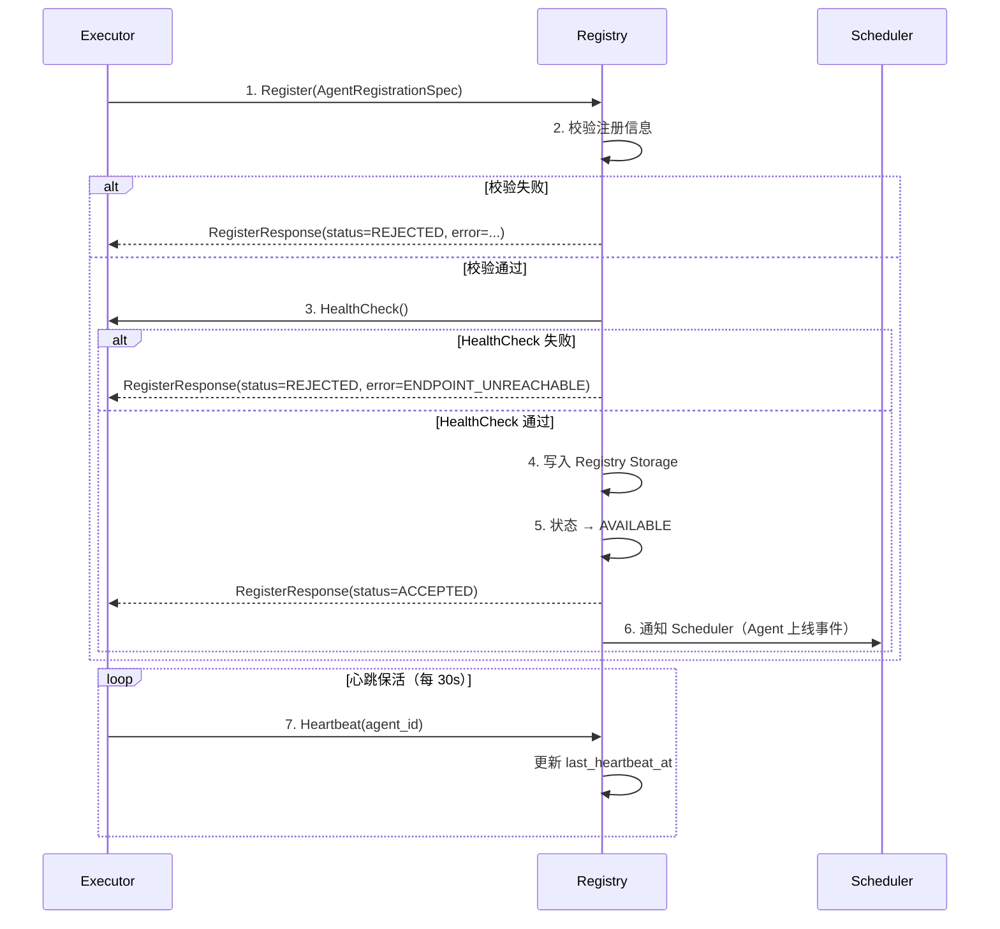
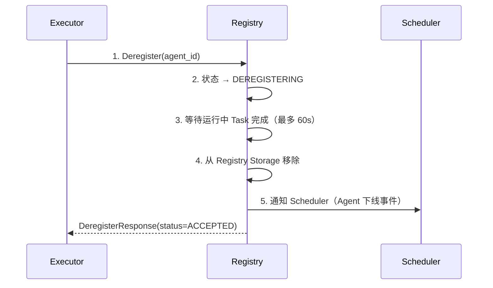
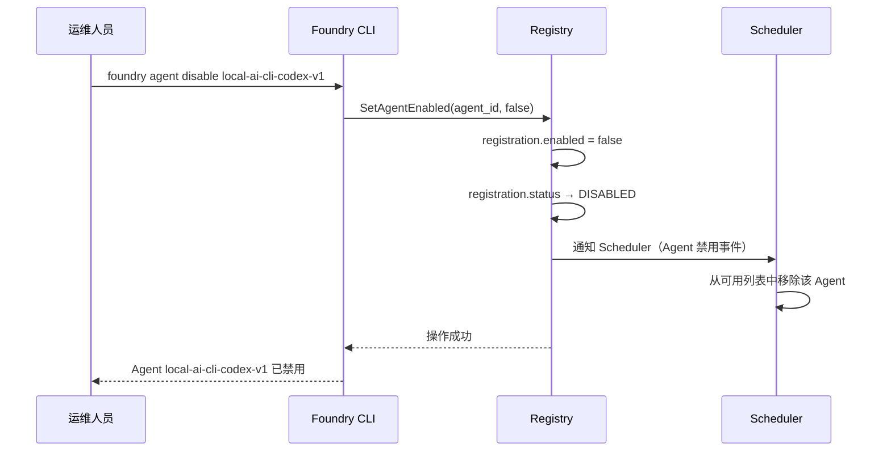

# Foundry v1 - Agent 注册与发现机制设计文档

| 属性 | 内容 |
|------|------|
| **文档标题** | Foundry v1 - Agent 注册与发现机制设计文档 |
| **文档作者** | Foundry Team |
| **文档日期** | 2026-05-05 |
| **文档版本** | v1.1 |
| **文档描述** | Foundry v1 Agent 注册规范、发现机制和配置管理方案设计，覆盖注册信息结构、注册/注销流程、多维度发现算法、负载均衡策略和动态启用/禁用机制 |

---

## 概述

本文档定义 Foundry v1 的 Agent 注册与发现机制，是 Agent Is Replaceable 原则的基础保障。Registry 是连接「Executor 实例」（Task 3）与「Scheduler 调度」（Task 7）的核心中间层——Scheduler 通过 Registry 查找可用 Executor，Executor 通过 Registry 声明自身存在。

本文档覆盖 FR-9（Agent 注册与发现机制设计），对应验收标准 AC-9。同时解决 Task 3 遗留的待决问题 OQ-3.2（gRPC Execute 的负载均衡策略）。

### 读者

- 软件架构师：理解 Registry 在系统中的定位和架构决策
- 一线开发者：根据注册规范实现 Agent 的注册和发现逻辑
- DevOps 工程师：理解 Agent 配置管理和动态启用/禁用机制
- 流程设计师：理解 Scheduler 如何通过 Registry 发现和选择 Agent

### 前置依赖

- [task_artifact_data_model.md](task_artifact_data_model.md)：Task/Artifact 数据模型、AgentType 枚举、ArtifactType 枚举、parameters 约定键
- [agent_executor_architecture.md](agent_executor_architecture.md)：Executor 统一接口（Execute/GetCapabilities/HealthCheck/Shutdown）、四种 Agent 类型接入规范、Capabilities 能力声明、GetCapabilitiesResponse 字段定义、Executor 配置结构、Scheduler 调度流程

---

## 设计动机

### 为什么需要独立的 Registry

Foundry v1 的核心协作模型要求「Agent Is Replaceable」——任意 Agent 都可被替换或禁用。这需要一个独立的注册中心来解耦 Executor 实例与 Scheduler：

| 没有 Registry | 有 Registry |
|--------------|-------------|
| Scheduler 硬编码 Executor 地址 | Scheduler 通过 Registry 动态发现 |
| 替换 Agent 需要修改 Scheduler 配置 | 替换 Agent 只需更新 Registry |
| 无法动态启用/禁用 Agent | 通过 Registry 状态管理实现动态控制 |
| 无法感知 Agent 健康状态 | Registry 通过 HealthCheck 持续监控 |

### 设计约束

| 约束来源 | 约束内容 |
|---------|---------|
| Flow First | Registry 的操作附着在 Executor 生命周期中（启动注册、关闭注销），不独立于流程存在 |
| Deterministic Over Smart | 发现算法基于确定性规则（类型→能力→标签→健康→负载），不依赖 AI 推理 |
| Artifact Over Conversation | Registry 数据是结构化的 AgentRegistration，不是无结构的描述文本 |
| Agent Is Replaceable | Registry 是 Agent 可替换性的基础——Scheduler 通过 Registry 发现 Agent，替换 Agent 只需更新 Registry |

---

## 详细设计

### 1. 架构概览

Registry 在 Foundry 中的位置：

```
┌──────────────────────────────────────────────────────────────┐
│                       Foundry Core                            │
│                                                               │
│  ┌──────────────┐     ┌──────────────┐     ┌─────────────┐  │
│  │  Scheduler    │────▶│   Registry    │◀────│  Executor   │  │
│  │              │     │              │     │  Instance    │  │
│  │ 1. 查询可用   │     │ AgentRegistration│  │              │  │
│  │    Executor  │     │ 列表 + 状态   │     │ 1. 启动注册   │  │
│  │ 2. 按规则匹配 │     │              │     │ 2. 心跳保活   │  │
│  │ 3. 选择最优   │     │ 发现算法      │     │ 3. 关闭注销   │  │
│  └──────────────┘     │ 负载均衡      │     └─────────────┘  │
│                        │ 配置管理      │                      │
│                        └──────────────┘                      │
│                                                               │
│  ┌──────────────────────────────────────────────────────┐    │
│  │              Registry Storage（内存 + 持久化）         │    │
│  │  ┌────────────┐  ┌────────────┐  ┌───────────────┐  │    │
│  │  │ Agent      │  │ Capability │  │ Configuration │  │    │
│  │  │ Registry   │  │ Registry   │  │ Store         │  │    │
│  │  └────────────┘  └────────────┘  └───────────────┘  │    │
│  └──────────────────────────────────────────────────────┘    │
└──────────────────────────────────────────────────────────────┘
```

**关键决策：Registry 作为 Foundry Core 内部组件**

- Registry 不作为独立微服务部署，而是 Foundry Core 的内部模块（`internal/registry/`）
- 原因：1) v1 规模下独立部署增加运维复杂度；2) Registry 与 Scheduler 紧密协作，进程内调用减少延迟；3) Agent 实例数量有限（预计 < 100），内存存储足够
- Registry 通过 gRPC 与 Executor 通信（HealthCheck），通过内存数据结构与 Scheduler 交互

---

### 2. Agent 注册规范

#### 2.1 注册信息结构

AgentRegistration 是 Registry 中存储的 Agent 完整信息，由两部分组成：**静态注册信息**（AgentRegistrationSpec，由 Executor 提供）和**运行时状态**（由 Registry 管理）。

##### 2.1.1 静态注册信息（AgentRegistrationSpec）

AgentRegistrationSpec 是 Executor 注册时提供的静态信息，描述 Agent 的能力和配置。

| 字段 | 类型 | 必填 | 约束 | 说明 |
|------|------|------|------|------|
| `agent_id` | `string` | 是 | 全局唯一，格式 `{type_prefix}-{name}-{version}` | Agent 实例唯一标识，由 Executor 配置指定 |
| `agent_type` | `AgentType` | 是 | 枚举值，非 UNSPECIFIED | Agent 执行模板类型 |
| `agent_version` | `string` | 是 | 语义化版本号（SemVer） | Agent 实现版本号，用于审计追溯 |
| `capabilities` | `repeated string` | 是 | 至少 1 个，值来自 v1 预定义能力清单或已注册的自定义能力 | Agent 能力声明列表 |
| `supported_artifact_types` | `repeated ArtifactType` | 是 | 至少 1 个 | 能产出的 Artifact 类型列表 |
| `max_concurrent_tasks` | `int32` | 是 | 范围 [1, 1000] | 最大并发执行数 |
| `labels` | `map<string, string>` | 否 | key/value 均为非空字符串 | 自定义标签，用于高级过滤 |
| `endpoint` | `string` | 是 | 合法 gRPC 地址（`host:port` 格式） | Executor gRPC Server 监听地址 |
| `parameters` | `map<string, string>` | 否 | key 非空 | Agent 特定参数（与 TaskSpec.parameters 约定键一致） |
| `resource_limits` | `ResourceLimits` | 是 | 非空 | 资源限制配置 |
| `network_mode` | `string` | 否 | 枚举：`bridge` / `none`，默认 `bridge` | 网络模式 |

##### 2.1.2 运行时状态（AgentRuntimeState）

AgentRuntimeState 由 Registry 管理，描述 Agent 的运行时状态，Executor 不感知也不设置这些字段。

| 字段 | 类型 | 必填 | 说明 |
|------|------|------|------|
| `status` | `AgentStatus` | 是 | Agent 运行时状态（见 AgentStatus 枚举） |
| `running_tasks` | `int32` | 是 | 当前运行中的 Task 数量，由心跳更新，用于负载均衡计算 |
| `registered_at` | `Timestamp` | 是 | 注册时间，由 Registry 在注册成功时生成 |
| `last_heartbeat_at` | `Timestamp` | 是 | 最近一次心跳时间，由 Registry 在收到心跳时更新 |
| `enabled` | `bool` | 是 | 是否启用（动态启用/禁用），默认 true |
| `config_source` | `string` | 是 | 配置来源标识（文件路径），由 Registry 在注册时填充 |

##### 2.1.3 完整注册信息（AgentRegistration）

AgentRegistration 是 AgentRegistrationSpec 和 AgentRuntimeState 的组合，是 Registry 内部使用的完整数据结构。

| 字段 | 类型 | 来源 | 说明 |
|------|------|------|------|
| `spec` | `AgentRegistrationSpec` | Executor 提供 | 静态注册信息 |
| `runtime` | `AgentRuntimeState` | Registry 管理 | 运行时状态 |

> **设计决策**：将 AgentRegistration 拆分为 Spec（静态）和 Runtime（动态）两部分，原因：1) RegisterRequest 只传递 Spec，运行时字段由 Registry 生成，职责边界清晰；2) running_tasks 是高频更新的动态数据，与静态注册信息分离便于独立管理；3) 符合 Deterministic Over Smart 原则——静态信息和动态状态的变更频率和生命周期不同，不应混合。

**agent_id 命名规范**：

| Agent 类型 | 前缀 | 示例 |
|-----------|------|------|
| `AGENT_TYPE_LOCAL_AI_CLI` | `local-ai-cli` | `local-ai-cli-codex-v1` |
| `AGENT_TYPE_REMOTE_API` | `remote-api` | `remote-api-openai-gpt4-v1` |
| `AGENT_TYPE_TRADITIONAL_CLI` | `traditional-cli` | `traditional-cli-gitleaks-v2` |
| `AGENT_TYPE_HUMAN_GATE` | `human-gate` | `human-gate-default-v1` |

> **设计决策**：agent_id 由 Executor 配置指定而非自动生成，原因：1) agent_id 是审计追溯的关键标识，自动生成的 ID 不具备可读性；2) 同一 Agent 的多次重启应使用相同 agent_id，便于审计关联；3) agent_id 的命名规范通过校验规则强制执行。

**AgentStatus 枚举**：

| 枚举值 | Protobuf 数值 | 说明 |
|--------|-------------|------|
| `AGENT_STATUS_UNSPECIFIED` | 0 | 占位值，不作为合法业务值使用 |
| `AGENT_STATUS_REGISTERING` | 1 | 注册中（启动阶段） |
| `AGENT_STATUS_AVAILABLE` | 2 | 可用（健康且未饱和） |
| `AGENT_STATUS_BUSY` | 3 | 忙碌（并发已饱和） |
| `AGENT_STATUS_UNHEALTHY` | 4 | 不健康（HealthCheck 失败） |
| `AGENT_STATUS_DISABLED` | 5 | 已禁用（管理员操作） |
| `AGENT_STATUS_DEREGISTERING` | 6 | 注销中（关闭阶段） |

**ResourceLimits 结构**（复用 Task 3 定义）：

| 字段 | 类型 | 必填 | 说明 |
|------|------|------|------|
| `max_artifact_size_bytes` | `int64` | 否 | 单个 Artifact 最大字节数 |
| `max_total_size_bytes` | `int64` | 否 | 本次执行所有 Artifact 总大小上限 |
| `cpu_limit` | `string` | 否 | CPU 限制（如 "2.0"） |
| `memory_limit_mb` | `int32` | 否 | 内存限制（MB） |
| `max_output_files` | `int32` | 否 | 最大产出文件数 |

#### 2.2 注册信息校验规则

Registry 在接收注册请求时执行以下校验：

| 校验项 | 规则 | 失败处理 |
|--------|------|---------|
| agent_id 唯一性 | 同一 agent_id 不能重复注册（除非先注销） | 拒绝注册，返回 `AGENT_ID_CONFLICT` |
| agent_id 命名规范 | 必须匹配 `{type_prefix}-{name}-{version}` 格式 | 拒绝注册，返回 `AGENT_ID_INVALID_FORMAT` |
| agent_type 一致性 | agent_id 前缀必须与 agent_type 对应 | 拒绝注册，返回 `AGENT_TYPE_MISMATCH` |
| capabilities 合法性 | 每个能力标识必须在 CapabilityRegistry 中已注册 | 拒绝注册，返回 `CAPABILITY_NOT_REGISTERED` |
| supported_artifact_types 非空 | 至少声明 1 个 ArtifactType | 拒绝注册，返回 `ARTIFACT_TYPES_EMPTY` |
| endpoint 可达性 | gRPC 地址格式合法，且 HealthCheck 可通过 | 拒绝注册，返回 `ENDPOINT_UNREACHABLE` |
| max_concurrent_tasks 范围 | [1, 1000] | 拒绝注册，返回 `INVALID_CONCURRENCY` |

> **设计决策**：注册时执行 endpoint 可达性校验（HealthCheck），原因：1) 避免注册不可用的 Executor 导致 Scheduler 调度失败；2) 注册失败时 Executor 可立即感知并重试；3) 符合 Deterministic Over Smart 原则——注册成功即保证可用。

#### 2.3 注册流程



**注册流程步骤说明**：

| 步骤 | 负责组件 | 说明 |
|------|---------|------|
| 1. 发起注册 | Executor | Executor 启动后，加载配置并向 Registry 发起注册（传递 AgentRegistrationSpec） |
| 2. 校验注册信息 | Registry | 执行 2.2 节定义的校验规则 |
| 3. 健康检查 | Registry → Executor | Registry 主动调用 Executor.HealthCheck() |
| 4. 写入存储 | Registry | 校验通过后写入 Registry Storage |
| 5. 状态更新 | Registry | 初始状态设为 AVAILABLE |
| 6. 通知 Scheduler | Registry → Scheduler | 通过事件通道通知 Scheduler 有新 Agent 上线 |
| 7. 心跳保活 | Executor → Registry | Executor 定期发送心跳，Registry 据此判断存活 |

#### 2.4 注销流程



**注销流程步骤说明**：

| 步骤 | 负责组件 | 说明 |
|------|---------|------|
| 1. 发起注销 | Executor | Executor 优雅关闭时主动注销 |
| 2. 状态更新 | Registry | 标记为 DEREGISTERING，Scheduler 不再分配新 Task |
| 3. 等待完成 | Registry | 等待该 Executor 上运行中的 Task 完成，最多 60s |
| 4. 移除记录 | Registry | 从 Registry Storage 中移除注册信息 |
| 5. 通知 Scheduler | Registry → Scheduler | 通过事件通道通知 Scheduler 有 Agent 下线 |

**异常注销（心跳超时）**：

当 Executor 未能按时发送心跳（超过 3 个心跳周期 = 90s），Registry 自动执行注销：

| 条件 | 处理 |
|------|------|
| 连续 3 次心跳未收到 | 状态 → UNHEALTHY |
| UNHEALTHY 持续 60s | 状态 → DEREGISTERING，自动注销 |
| 注销时仍有运行中 Task | 通知 Scheduler，Scheduler 触发 Task 超时处理 |

> **设计决策**：心跳超时采用「3 次未收到 → UNHEALTHY → 持续 60s → 注销」的两级策略，而非一次超时即注销。原因：1) 网络抖动可能导致偶发心跳丢失；2) UNHEALTHY 状态下 Scheduler 不再分配新 Task，但已分配的 Task 可继续执行；3) 给予 Executor 恢复机会，避免因短暂故障导致不必要的注销。

---

### 3. Agent 发现机制

#### 3.1 发现查询接口

Scheduler 通过 Registry 的查询接口发现可用 Agent：

```go
type RegistryQuery struct {
    AgentType              foundryv1.AgentType
    RequiredCapabilities   []string
    RequiredArtifactTypes  []foundryv1.ArtifactType
    LabelSelectors         map[string]string
    IncludeBusy            bool
}
```

| 查询字段 | 类型 | 必填 | 说明 |
|---------|------|------|------|
| `AgentType` | `AgentType` | 是 | 要求的 Agent 类型（精确匹配） |
| `RequiredCapabilities` | `[]string` | 否 | 要求的能力列表（子集匹配） |
| `RequiredArtifactTypes` | `[]ArtifactType` | 否 | 要求支持的 Artifact 类型列表（子集匹配） |
| `LabelSelectors` | `map[string]string` | 否 | 标签选择器（精确匹配 key=value） |
| `IncludeBusy` | `bool` | 否 | 是否包含忙碌状态的 Agent，默认 false |

#### 3.2 发现算法

发现算法按以下优先级逐步过滤和排序：

```
输入：RegistryQuery
输出：[]AgentRegistration（按优先级排序）

步骤 1：AgentType 精确匹配
  → 过滤：registration.spec.agent_type == query.AgentType
  → 结果集 R1

步骤 2：ArtifactType 子集匹配
  → 过滤：query.RequiredArtifactTypes ⊆ registration.spec.supported_artifact_types
  → 结果集 R2

步骤 3：Capabilities 子集匹配
  → 过滤：query.RequiredCapabilities ⊆ registration.spec.capabilities
  → 结果集 R3

步骤 4：LabelSelectors 精确匹配
  → 过滤：query.LabelSelectors 中每个 key-value 对 ∈ registration.spec.labels
  → 结果集 R4

步骤 5：状态过滤
  → 过滤：registration.runtime.status == AVAILABLE（或 IncludeBusy 时包含 BUSY）
  → 过滤：registration.runtime.enabled == true
  → 结果集 R5

步骤 6：负载均衡排序
  → 按 3.3 节策略排序
  → 输出最终结果
```

> **设计决策**：发现算法是确定性的——给定相同查询条件，返回相同的结果集和排序。这符合 Deterministic Over Smart 原则。唯一影响结果的是运行时状态（AVAILABLE/BUSY），这是不可避免的动态因素。

> **跨文档同步说明**：发现算法的过滤顺序与 Task 3 第 7.1 节 Scheduler 调度流程保持一致（AgentType → ArtifactType → Capabilities → 健康检查 → 并发 → Labels），便于后续编码实现时两个文档的描述可直接对应。

#### 3.3 负载均衡策略

> **解决 Task 3 待决问题 OQ-3.2：gRPC Execute 的负载均衡策略**

当多个 Executor 实例满足同一查询条件时，Scheduler 按以下策略选择：

| 策略 | 说明 | 适用场景 |
|------|------|---------|
| **最少并发优先**（默认） | 选择 `running_tasks / max_concurrent_tasks` 比值最小的 Executor | 通用场景，均衡负载 |
| **轮询** | 按注册顺序依次分配 | 同构 Executor 集群 |
| **随机** | 随机选择一个可用 Executor | 无状态场景 |

**v1 默认策略：最少并发优先**

```
排序规则：
1. runtime.running_tasks / spec.max_concurrent_tasks 升序（负载率低的优先）
2. 负载率相同时，按 runtime.registered_at 升序（先注册的优先）
3. 注册时间相同时，按 spec.agent_id 字典序升序
```

> **设计决策**：v1 默认使用最少并发优先策略，原因：1) 最直观的负载均衡方式；2) 避免某些 Executor 过载而其他空闲；3) 排序规则完全确定性，符合 Deterministic Over Smart 原则。轮询和随机策略作为配置选项保留，v1 不实现加权策略（需要运维手动配置权重，增加复杂度）。

**负载均衡配置**：

```yaml
# configs/foundry.yaml
scheduler:
  load_balance_strategy: "least_concurrent"  # least_concurrent | round_robin | random
```

#### 3.4 Capabilities 能力注册表

Capabilities 是开放列表，v1 预定义 8 种能力（见 Task 3 第 2.6 节）。新增能力标识需在 CapabilityRegistry 中注册，避免重复定义和命名冲突。

**CapabilityRegistry 结构**：

| 字段 | 类型 | 说明 |
|------|------|------|
| `capability_id` | `string` | 能力标识（snake_case 格式） |
| `description` | `string` | 能力描述 |
| `default_for_agent_types` | `repeated AgentType` | 默认具备此能力的 Agent 类型 |
| `registered_at` | `Timestamp` | 注册时间 |
| `registered_by` | `string` | 注册来源（`system` / `user:{agent_id}`） |

**v1 预注册能力清单**：

| capability_id | description | default_for_agent_types |
|--------------|-------------|----------------------|
| `ai_reasoning` | 具备 AI 推理能力，输出不确定 | LOCAL_AI_CLI, REMOTE_API |
| `tool_use` | 可调用外部工具（MCP、Function Calling） | — |
| `code_generation` | 可生成代码/补丁 | — |
| `code_review` | 可做代码评审 | — |
| `security_scan` | 可做安全扫描 | — |
| `deterministic` | 输出确定，相同输入相同结果 | TRADITIONAL_CLI |
| `approval` | 可做审批决策 | HUMAN_GATE |
| `notification` | 可发送通知（副作用型，无自然 Artifact 产出） | — |

**自定义能力注册流程**：

```
1. 管理员在配置文件中声明新能力
2. Foundry 启动时加载配置，注册到 CapabilityRegistry
3. registered_by = "system"
4. 后续 Agent 注册时可引用该能力标识
5. 引用未注册的能力标识 → 注册失败（CAPABILITY_NOT_REGISTERED）
```

自定义能力配置示例：

```yaml
# configs/capabilities.yaml
custom_capabilities:
  - capability_id: "database_query"
    description: "可执行数据库查询操作"
  - capability_id: "image_generation"
    description: "可生成图像内容"
```

> **设计决策**：自定义能力通过配置文件注册而非 API 动态注册，原因：1) v1 不提供管理 API，减少攻击面；2) 配置文件可审计、可版本控制；3) 能力注册是低频操作，不需要动态性；4) 符合 Deterministic Over Smart 原则——能力清单在启动时确定，运行时不变。

---

### 4. Agent 配置管理方案

#### 4.1 配置文件格式

Agent 配置使用 YAML 格式，每个 Agent 实例一个配置文件，存放在 `configs/agents/` 目录下。

**完整配置结构**：

```yaml
# configs/agents/local-ai-cli-codex.yaml
agent_type: AGENT_TYPE_LOCAL_AI_CLI
agent_id: "local-ai-cli-codex-v1"
agent_version: "1.0.0"
enabled: true
max_concurrent_tasks: 2
capabilities:
  - "ai_reasoning"
  - "code_generation"
  - "code_review"
supported_artifact_types:
  - ARTIFACT_TYPE_CODE_REVIEW_REPORT
  - ARTIFACT_TYPE_PATCH_DIFF
  - ARTIFACT_TYPE_DESIGN_PROPOSAL
  - ARTIFACT_TYPE_DOCUMENTATION
parameters:
  cli_command: "codex"
  model: "gpt-4"
  max_tokens: "8192"
execution:
  timeout_override_seconds: 600
  working_dir_template: "/workspaces/{task_id}"
network_mode: "bridge"
resource_limits:
  max_artifact_size_bytes: 10485760
  max_total_size_bytes: 52428800
  cpu_limit: "2.0"
  memory_limit_mb: 4096
  max_output_files: 10
labels:
  speed: "fast"
  gpu_required: "false"
endpoint: "localhost:50051"
```

**配置文件命名规范**：

| 规则 | 说明 | 示例 |
|------|------|------|
| 文件名 | `{agent_id}.yaml`，kebab-case | `local-ai-cli-codex-v1.yaml` |
| 目录 | `configs/agents/` | — |
| 编码 | UTF-8 | — |

**配置字段与 AgentRegistration 的映射**：

| 配置字段 | AgentRegistration 字段 | 说明 |
|---------|----------------------|------|
| `agent_type` | `agent_type` | 直接映射 |
| `agent_id` | `agent_id` | 直接映射 |
| `agent_version` | `agent_version` | 直接映射 |
| `enabled` | `enabled` | 直接映射，默认 true |
| `max_concurrent_tasks` | `max_concurrent_tasks` | 直接映射 |
| `capabilities` | `capabilities` | 直接映射 |
| `supported_artifact_types` | `supported_artifact_types` | 直接映射 |
| `parameters` | `parameters` | 直接映射 |
| `execution.timeout_override_seconds` | — | Executor 内部使用，不注册到 Registry |
| `execution.working_dir_template` | — | Executor 内部使用，不注册到 Registry |
| `network_mode` | `network_mode` | 直接映射 |
| `resource_limits` | `resource_limits` | 直接映射 |
| `labels` | `labels` | 直接映射 |
| `endpoint` | `endpoint` | 直接映射 |
| — | `status` | 运行时状态，由 Registry 管理 |
| — | `registered_at` | 注册时由 Registry 生成 |
| — | `last_heartbeat_at` | 心跳时由 Registry 更新 |
| — | `config_source` | 注册时由 Registry 填充（文件路径） |
| — | `running_tasks` | 运行时由心跳更新，Registry 管理 |

**Agent 类型专属配置映射**：

Task 3 定义了 RemoteApi 和 HumanGate 的专属配置，这些配置通过 `parameters` 字段映射到 AgentRegistrationSpec：

| Agent 类型 | 专属配置路径 | parameters 映射键 | 说明 |
|-----------|------------|------------------|------|
| RemoteApi | `api.auth.type` | `api_auth_type` | 认证类型（bearer_token/api_key/none） |
| RemoteApi | `api.auth.token_env` | `api_auth_token_env` | Token 环境变量名 |
| RemoteApi | `api.timeout_seconds` | `api_timeout_seconds` | API 调用超时 |
| RemoteApi | `api.max_retries` | `api_max_retries` | API 重试次数 |
| RemoteApi | `api.retry_backoff_ms` | `api_retry_backoff_ms` | 重试退避时间 |
| HumanGate | `gate.webhook_url` | `gate_webhook_url` | Gate 回调 URL |
| HumanGate | `gate.notify_channels` | `gate_notify_channels` | 通知渠道（逗号分隔） |
| HumanGate | `gate.timeout_seconds` | `gate_timeout_seconds` | Gate 等待超时 |
| HumanGate | `gate.escalation.enabled` | `gate_escalation_enabled` | 是否启用升级 |
| HumanGate | `gate.escalation.escalate_after_seconds` | `gate_escalate_after_seconds` | 升级触发时间 |
| HumanGate | `gate.escalation.escalation_target` | `gate_escalation_target` | 升级目标 |

> **设计决策**：Agent 类型专属配置通过 `parameters` map 传递到 Registry，而非在 AgentRegistrationSpec 中定义专属字段。原因：1) 保持 AgentRegistrationSpec 的通用性，不同 Agent 类型的专属配置不需要在 Protobuf 中定义独立字段；2) parameters 的约定键机制已在 Task 2 中建立，Registry 不解析 parameters 内容，只做透传；3) 符合 Agent Is Replaceable 原则——新增 Agent 类型不需要修改 AgentRegistrationSpec 结构。

#### 4.2 配置校验

配置文件加载时执行以下校验：

| 校验项 | 规则 | 失败处理 |
|--------|------|---------|
| 必填字段完整性 | agent_type, agent_id, agent_version, max_concurrent_tasks, endpoint 必须存在 | 加载失败，记录错误日志 |
| agent_id 格式 | 匹配 `{type_prefix}-{name}-{version}` | 加载失败，记录错误日志 |
| agent_type 合法性 | 必须是 AgentType 枚举的有效值（非 UNSPECIFIED） | 加载失败，记录错误日志 |
| capabilities 合法性 | 每个能力标识必须在 CapabilityRegistry 中已注册 | 加载失败，记录错误日志 |
| supported_artifact_types 非空 | 至少声明 1 个 ArtifactType | 加载失败，记录错误日志 |
| endpoint 格式 | 合法 `host:port` 格式 | 加载失败，记录错误日志 |
| enabled 默认值 | 未设置时默认为 true | — |

#### 4.3 动态启用/禁用

Agent 的动态启用/禁用通过修改 Registry 中 AgentRegistration 的 `enabled` 字段实现，无需重启系统。

**启用/禁用方式**：

| 方式 | 说明 | 适用场景 |
|------|------|---------|
| 配置文件 + 信号重载 | 修改 `enabled` 字段后发送 SIGHUP 信号 | 运维操作 |
| CLI 命令 | `foundry agent enable <agent_id>` / `foundry agent disable <agent_id>` | 交互式操作 |
| API 调用 | `PUT /api/v1/agents/{agent_id}/status` | 自动化脚本 |

> **设计决策**：v1 优先实现 CLI 命令方式，配置文件+信号重载作为备选。API 调用方式在 v2 考虑。原因：1) CLI 命令最直观，运维友好；2) 配置文件+信号重载需要 Executor 支持信号处理，增加实现复杂度；3) API 调用需要完整的认证鉴权机制，v1 不实现管理 API。

**禁用流程**：



**禁用约束**：

| 约束 | 说明 |
|------|------|
| 禁用不注销 | 禁用仅修改 enabled 和 status，不从 Registry 中移除注册信息 |
| 禁用后不再分配新 Task | Scheduler 发现算法步骤 5 过滤 enabled=false 的 Agent |
| 运行中 Task 不受影响 | 已分配的 Task 继续执行，不会被中断 |
| 禁用可逆 | 通过 enable 命令恢复，无需重新注册 |

**启用流程**：

```
1. CLI: foundry agent enable <agent_id>
2. Registry: registration.enabled = true
3. Registry: 执行 HealthCheck
   → 通过: registration.status → AVAILABLE
   → 失败: registration.status → UNHEALTHY（启用失败，提示运维）
4. 通知 Scheduler（Agent 启用事件）
```

> **设计决策**：启用时执行 HealthCheck，原因：1) Agent 可能长时间禁用，期间可能已崩溃；2) 启用不检查可用性会导致 Scheduler 分配到不可用的 Executor；3) 符合 Deterministic Over Smart 原则——启用成功即保证可用。

#### 4.4 配置热重载

v1 支持有限的配置热重载：

| 可热重载字段 | 说明 |
|------------|------|
| `enabled` | 动态启用/禁用 |
| `max_concurrent_tasks` | 调整并发上限 |
| `labels` | 更新标签 |

**Executor 侧热重载处理规范**：

当 Executor 收到 HeartbeatResponse 中 `config_changed=true` 时：

| 步骤 | Executor 行为 | 说明 |
|------|-------------|------|
| 1 | 读取 `updated_spec` 字段 | 获取变更后的静态配置 |
| 2 | 比较 `max_concurrent_tasks` | 如果变更，更新本地并发上限；超出新上限的运行中 Task 不受影响，但不再接受新 Task |
| 3 | 比较 `labels` | 如果变更，更新本地标签缓存（标签变更不影响已分配的 Task） |
| 4 | 忽略 `enabled` 字段 | enabled 由 Registry 管理，Executor 不需要处理；如果被禁用，Registry 不会再分配新 Task |
| 5 | 记录审计日志 | 记录配置热重载事件，包含变更前后的值 |

> **设计决策**：热重载只影响新 Task 的分配行为，不影响已运行中的 Task。原因：1) 运行中 Task 的行为已由 TaskSpec 确定，中途变更可能导致不确定行为；2) 符合 Deterministic Over Smart 原则——配置变更的生效边界清晰。

| 不可热重载字段 | 原因 | 修改方式 |
|--------------|------|---------|
| `agent_type` | 类型变更等同于替换 Agent | 注销 + 重新注册 |
| `agent_id` | ID 变更破坏审计追溯 | 注销 + 重新注册 |
| `endpoint` | 地址变更需重建 gRPC 连接 | 注销 + 重新注册 |
| `capabilities` | 能力变更影响调度匹配 | 注销 + 重新注册 |
| `supported_artifact_types` | 类型变更影响调度匹配 | 注销 + 重新注册 |
| `parameters` | 参数变更可能影响执行行为 | 重启 Executor |

> **设计决策**：v1 的配置热重载范围有限，核心标识字段（agent_type, agent_id, endpoint, capabilities, supported_artifact_types）变更需要注销+重新注册。原因：1) 这些字段的变更等同于替换了一个不同的 Agent；2) 热重载这些字段会导致正在执行的 Task 语义不一致；3) 符合 Deterministic Over Smart 原则——配置变更的边界清晰，不会产生不确定行为。

---

### 5. 心跳与健康检查

#### 5.1 心跳机制

Executor 通过定期心跳向 Registry 报告存活状态：

| 参数 | 值 | 说明 |
|------|---|------|
| 心跳间隔 | 30 秒 | Executor 每 30s 发送一次心跳 |
| 心跳超时 | 90 秒（3 个间隔） | 连续 3 次未收到心跳 → UNHEALTHY |
| 自动注销延迟 | 60 秒 | UNHEALTHY 持续 60s 后自动注销 |

**心跳请求**：

```protobuf
message HeartbeatRequest {
  string agent_id = 1;
  int32 running_tasks = 2;
}
```

| 字段 | 说明 |
|------|------|
| `agent_id` | Agent 实例标识 |
| `running_tasks` | 当前运行中的 Task 数量，用于负载均衡计算 |

**心跳响应**：

```protobuf
message HeartbeatResponse {
  bool acknowledged = 1;
  bool config_changed = 2;
  AgentRegistration updated_config = 3;
}
```

| 字段 | 说明 |
|------|------|
| `acknowledged` | 心跳是否被接受 |
| `config_changed` | 配置是否有变更（热重载通知） |
| `updated_config` | 变更后的配置（仅 config_changed=true 时有效） |

> **设计决策**：心跳请求中携带 `running_tasks` 字段，原因：1) 避免额外的查询请求获取负载信息；2) 心跳是定期操作，自然携带负载信息减少通信开销；3) Scheduler 可直接从 Registry 获取负载信息用于负载均衡。

#### 5.2 健康检查策略

Registry 对已注册的 Agent 执行主动健康检查：

| 触发条件 | 检查方式 | 处理 |
|---------|---------|------|
| 注册时 | 调用 Executor.HealthCheck() | 失败则拒绝注册 |
| 启用时 | 调用 Executor.HealthCheck() | 失败则标记 UNHEALTHY |
| 心跳超时 | 标记 UNHEALTHY | 60s 后自动注销 |
| 定期巡检（每 5 分钟） | 调用 Executor.HealthCheck() | 失败则标记 UNHEALTHY |

**定期巡检的目的**：即使 Executor 正常发送心跳，其 gRPC 服务可能已进入异常状态（如死锁）。定期巡检通过实际调用 HealthCheck 验证服务可用性。

---

### 6. Protobuf 定义

#### 6.1 registry.proto

> **接口分层设计**：Registry 暴露两类接口——gRPC 接口（给外部 Executor 进程调用）和 Go 内部接口（给同进程的 Scheduler/CLI 调用）。gRPC Service 只包含 Executor 需要远程调用的方法（Register/Deregister/Heartbeat），Scheduler 和 CLI 的操作通过 Go 接口直接调用。

```protobuf
syntax = "proto3";

package foundry.v1;

option go_package = "github.com/foundry/foundry/gen/foundry/v1";

import "google/protobuf/timestamp.proto";
import "foundry/v1/common.proto";

enum AgentStatus {
  AGENT_STATUS_UNSPECIFIED = 0;
  AGENT_STATUS_REGISTERING = 1;
  AGENT_STATUS_AVAILABLE = 2;
  AGENT_STATUS_BUSY = 3;
  AGENT_STATUS_UNHEALTHY = 4;
  AGENT_STATUS_DISABLED = 5;
  AGENT_STATUS_DEREGISTERING = 6;
}

message ResourceLimits {
  int64 max_artifact_size_bytes = 1;
  int64 max_total_size_bytes = 2;
  string cpu_limit = 3;
  int32 memory_limit_mb = 4;
  int32 max_output_files = 5;
}

message AgentRegistrationSpec {
  string agent_id = 1;
  AgentType agent_type = 2;
  string agent_version = 3;
  repeated string capabilities = 4;
  repeated ArtifactType supported_artifact_types = 5;
  int32 max_concurrent_tasks = 6;
  map<string, string> labels = 7;
  string endpoint = 8;
  map<string, string> parameters = 9;
  ResourceLimits resource_limits = 10;
  string network_mode = 11;
}

message AgentRuntimeState {
  AgentStatus status = 1;
  int32 running_tasks = 2;
  google.protobuf.Timestamp registered_at = 3;
  google.protobuf.Timestamp last_heartbeat_at = 4;
  bool enabled = 5;
  string config_source = 6;
}

message AgentRegistration {
  AgentRegistrationSpec spec = 1;
  AgentRuntimeState runtime = 2;
}

message RegisterRequest {
  AgentRegistrationSpec spec = 1;
}

message RegisterResponse {
  bool accepted = 1;
  string error_code = 2;
  string error_message = 3;
}

message DeregisterRequest {
  string agent_id = 1;
}

message DeregisterResponse {
  bool accepted = 1;
  string error_message = 2;
}

message HeartbeatRequest {
  string agent_id = 1;
  int32 running_tasks = 2;
}

message HeartbeatResponse {
  bool acknowledged = 1;
  bool config_changed = 2;
  AgentRegistrationSpec updated_spec = 3;
}

message DiscoverRequest {
  AgentType agent_type = 1;
  repeated string required_capabilities = 2;
  repeated ArtifactType required_artifact_types = 3;
  map<string, string> label_selectors = 4;
  bool include_busy = 5;
}

message DiscoverResponse {
  repeated AgentRegistration agents = 1;
}

message SetAgentEnabledRequest {
  string agent_id = 1;
  bool enabled = 2;
}

message SetAgentEnabledResponse {
  bool success = 1;
  string error_message = 2;
}

message CapabilityEntry {
  string capability_id = 1;
  string description = 2;
  repeated AgentType default_for_agent_types = 3;
  google.protobuf.Timestamp registered_at = 4;
  string registered_by = 5;
}

message ListCapabilitiesRequest {}

message ListCapabilitiesResponse {
  repeated CapabilityEntry capabilities = 1;
}

service ExecutorRegistry {
  rpc Register(RegisterRequest) returns (RegisterResponse);
  rpc Deregister(DeregisterRequest) returns (DeregisterResponse);
  rpc Heartbeat(HeartbeatRequest) returns (HeartbeatResponse);
}
```

> **设计决策**：gRPC Service 命名为 `ExecutorRegistry`（而非 `RegistryService`），且只包含 Executor 需要远程调用的 3 个方法。Discover、SetAgentEnabled、ListCapabilities 不暴露为 gRPC 接口，原因：1) Scheduler 与 Registry 在同一进程内，通过 Go 接口调用更高效；2) CLI 命令通过 Foundry Core 内部调用 Registry，不需要 gRPC；3) 减少外部可访问的 API 面积，降低安全风险。

> **设计决策**：HeartbeatResponse 中的 `updated_spec` 字段类型从 `AgentRegistration` 改为 `AgentRegistrationSpec`，原因：1) 心跳热重载只涉及静态配置变更（enabled/max_concurrent_tasks/labels），不涉及运行时状态；2) 运行时状态由 Registry 管理，不应回传给 Executor。

#### 6.2 Go 接口定义

```go
package registry

type Registry interface {
    Register(ctx context.Context, spec *foundryv1.AgentRegistrationSpec) (*foundryv1.RegisterResponse, error)
    Deregister(ctx context.Context, agentID string) (*foundryv1.DeregisterResponse, error)
    Heartbeat(ctx context.Context, agentID string, runningTasks int32) (*foundryv1.HeartbeatResponse, error)
    Discover(ctx context.Context, query *foundryv1.DiscoverRequest) (*foundryv1.DiscoverResponse, error)
    SetAgentEnabled(ctx context.Context, agentID string, enabled bool) (*foundryv1.SetAgentEnabledResponse, error)
    GetAgent(ctx context.Context, agentID string) (*foundryv1.AgentRegistration, error)
    ListAgents(ctx context.Context) ([]*foundryv1.AgentRegistration, error)
}

type CapabilityRegistry interface {
    RegisterCapability(ctx context.Context, entry *foundryv1.CapabilityEntry) error
    GetCapability(ctx context.Context, capabilityID string) (*foundryv1.CapabilityEntry, error)
    ListCapabilities(ctx context.Context) ([]*foundryv1.CapabilityEntry, error)
    IsRegistered(ctx context.Context, capabilityID string) bool
}
```

> **设计决策**：Go 接口 `Registry` 包含全部方法（包括 Discover/SetAgentEnabled/GetAgent/ListAgents），而 gRPC Service `ExecutorRegistry` 只包含 3 个远程方法。Scheduler 和 CLI 通过 Go 接口调用，Executor 通过 gRPC 调用。

---

### 7. 存储设计

#### 7.1 内存存储（主）

v1 使用内存存储作为 Registry 的主存储：

| 数据结构 | 说明 |
|---------|------|
| `map[string]*AgentRegistration` | agent_id → AgentRegistration（含 spec + runtime），O(1) 查找 |
| `map[AgentType][]string` | AgentType → agent_id 列表，按类型索引 |
| `map[string][]string` | capability_id → agent_id 列表，按能力索引 |
| `map[string]*CapabilityEntry` | capability_id → CapabilityEntry，能力注册表 |

**索引维护**：

- 注册时：更新所有索引
- 注销时：清除所有索引条目
- 状态变更时：更新 agent_id 索引中的 status 字段

#### 7.2 持久化存储（备）

Registry 数据在 Foundry 启动时从配置文件加载，运行时状态保存在内存中。为防止 Foundry 重启后丢失运行时状态，Registry 定期将快照写入磁盘：

| 参数 | 值 | 说明 |
|------|---|------|
| 快照间隔 | 60 秒 | 每 60s 写入一次快照 |
| 快照格式 | JSON | 人类可读，便于调试 |
| 快照路径 | `data/registry/snapshot.json` | — |
| 恢复策略 | 启动时加载快照 + 配置文件 | 快照中的状态与配置文件合并，配置文件优先 |

> **设计决策**：v1 使用内存存储 + 定期快照，而非数据库。原因：1) Agent 实例数量有限（预计 < 100），内存存储性能足够；2) Registry 数据可通过配置文件重建，不需要强持久化保证；3) 快照仅用于加速重启恢复，不是数据源——配置文件才是 Source of Truth。

**快照与配置文件的合并规则**：

| 场景 | 处理 |
|------|------|
| 快照中有，配置文件中也有 | 以配置文件为准（enabled 字段以快照为准，因为可能被动态修改） |
| 快照中有，配置文件中没有 | 该 Agent 已被移除，不恢复 |
| 快照中没有，配置文件中有 | 新增 Agent，执行注册流程 |
| 两者都有，但配置文件内容变更 | 以配置文件为准，触发重新注册 |

---

### 8. 事件通知机制

Registry 状态变更时通过事件通道通知 Scheduler：

| 事件类型 | 触发条件 | 携带数据 |
|---------|---------|---------|
| `AGENT_REGISTERED` | 新 Agent 注册成功 | agent_id, agent_type |
| `AGENT_DEREGISTERED` | Agent 注销完成 | agent_id |
| `AGENT_STATUS_CHANGED` | Agent 状态变更 | agent_id, old_status, new_status |
| `AGENT_ENABLED` | Agent 被启用 | agent_id |
| `AGENT_DISABLED` | Agent 被禁用 | agent_id |
| `AGENT_UNHEALTHY` | Agent 心跳超时 | agent_id |

**事件通道实现**：

```go
type RegistryEvent struct {
    EventType  string
    AgentID    string
    AgentType  foundryv1.AgentType
    OldStatus  foundryv1.AgentStatus
    NewStatus  foundryv1.AgentStatus
    Timestamp  time.Time
}

type EventBus interface {
    Publish(ctx context.Context, event RegistryEvent) error
    Subscribe(eventTypes []string) (<-chan RegistryEvent, error)
}
```

Scheduler 订阅 `AGENT_REGISTERED`、`AGENT_DEREGISTERED`、`AGENT_STATUS_CHANGED`、`AGENT_ENABLED`、`AGENT_DISABLED` 事件，实时更新本地缓存。

> **设计决策**：事件通知使用进程内通道（Go channel），而非消息队列。原因：1) Registry 和 Scheduler 在同一进程内，进程内通信最高效；2) v1 不需要跨进程事件分发；3) Go channel 天然支持多消费者和背压控制。

---

## 操作规范

### 1. Agent 注册操作流程

```
1. 编写 Agent 配置文件（configs/agents/{agent_id}.yaml）
2. 启动 Executor 进程
   a. 加载配置文件
   b. 初始化 gRPC Server
   c. 向 Registry 发起注册（gRPC Register）
   d. 注册成功 → 标记 healthy，开始接受 Task
   e. 注册失败 → 记录错误日志，退出进程
3. Executor 运行中
   a. 每 30s 发送心跳
   b. 接收并执行 Task
   c. 响应 HealthCheck
4. 关闭 Executor
   a. 标记 healthy = false
   b. 向 Registry 注销（gRPC Deregister）
   c. 等待运行中 Task 完成
   d. 关闭 gRPC Server
```

### 2. Agent 发现操作流程

```
1. Scheduler 接收到 Task
2. 构造 DiscoverRequest
   a. agent_type = Task.task_spec.agent_type
   b. required_capabilities = Task.task_spec.required_capabilities
   c. required_artifact_types = Task.task_spec.expected_artifact_types
   d. label_selectors = 从 Task.labels 提取（如有 agent-selector 前缀的标签）
3. 调用 Registry.Discover()
4. 获取排序后的 Agent 列表
5. 选择列表第一个 Agent
6. 发起 gRPC Execute(task)
```

### 3. Agent 动态禁用操作流程

```
1. 运维发现 Agent 异常
2. 执行 foundry agent disable <agent_id>
3. Registry 更新 Agent 状态为 DISABLED
4. Scheduler 收到事件，停止向该 Agent 分配新 Task
5. 运行中 Task 继续执行
6. 异常修复后，执行 foundry agent enable <agent_id>
7. Registry 执行 HealthCheck
8. HealthCheck 通过 → 状态恢复为 AVAILABLE
9. Scheduler 收到事件，恢复向该 Agent 分配 Task
```

### 4. 注册错误码定义

| 错误码 | 触发条件 | 严重级别 |
|--------|---------|---------|
| `AGENT_ID_CONFLICT` | agent_id 已被注册 | Error |
| `AGENT_ID_INVALID_FORMAT` | agent_id 不符合命名规范 | Error |
| `AGENT_TYPE_MISMATCH` | agent_id 前缀与 agent_type 不对应 | Error |
| `CAPABILITY_NOT_REGISTERED` | 引用了未注册的能力标识 | Error |
| `ARTIFACT_TYPES_EMPTY` | supported_artifact_types 为空 | Error |
| `ENDPOINT_UNREACHABLE` | HealthCheck 失败 | Error |
| `INVALID_CONCURRENCY` | max_concurrent_tasks 超出范围 | Error |
| `AGENT_NOT_FOUND` | 注销/禁用时 agent_id 不存在 | Error |
| `AGENT_NOT_AVAILABLE` | 启用时 HealthCheck 失败 | Warning |

---

## 约束与限制

| 编号 | 限制项 | 说明 |
|------|--------|------|
| L-4.1 | **v1 Registry 不支持分布式部署** | Registry 作为 Foundry Core 内部组件，不支持多实例部署；如果 Foundry Core 需要高可用，需在 Foundry Core 层面解决 |
| L-4.2 | **v1 不支持 Agent 自动发现** | Agent 必须通过配置文件显式注册，不支持基于网络广播或服务发现协议的自动注册 |
| L-4.3 | **v1 不支持 Agent 版本灰度** | 同一 agent_id 只能有一个版本在线，不支持按比例分配流量到不同版本 |
| L-4.4 | **v1 心跳不支持自定义间隔** | 心跳间隔固定 30s，不可配置 |
| L-4.5 | **v1 不支持 Agent 分组/命名空间** | 所有 Agent 在同一平面，不支持按项目/团队分组 |
| L-4.6 | **v1 快照恢复不保证状态一致性** | 快照是定期写入的，重启后可能丢失最近 60s 的状态变更；但配置文件是 Source of Truth，可通过配置文件重建完整状态 |

---

## 待决问题

| 编号 | 问题 | 需要解决的任务 | 说明 |
|------|------|-------------|------|
| OQ-4.1 | Registry 是否需要提供 gRPC 反射服务 | Task 7 | gRPC 反射允许客户端动态发现服务定义，便于调试；但生产环境可能需要禁用 |
| OQ-4.2 | Agent 注册是否需要认证 | Task 7 | v1 假设内网环境，注册不需要认证；如果 Foundry 暴露到公网，需要增加认证机制 |
| OQ-4.3 | 自定义 Artifact 类型的 Schema 注册机制 | Task 9 | Task 2 待决问题：ARTIFACT_TYPE_CUSTOM 类型的 Schema 注册机制需在一致性审查时与 Registry 的 CapabilityRegistry 统一设计 |

---

## 修订历史

| 版本 | 日期 | 修改内容 | 作者 |
|------|------|---------|------|
| v1.0 | 2026-05-05 | 初始版本：覆盖 Agent 注册规范（AgentRegistration 结构 + 校验规则 + 注册/注销流程）、发现机制（6 级过滤算法 + 3 种负载均衡策略 + CapabilityRegistry）、配置管理（YAML 格式 + 动态启用/禁用 + 热重载范围）、心跳与健康检查、存储设计（内存+快照）、事件通知机制；解决 Task 3 待决问题 OQ-3.2（负载均衡策略） | Foundry Team |
| v1.1 | 2026-05-05 | 评审修复：1) 拆分 AgentRegistration 为 AgentRegistrationSpec（静态）+ AgentRuntimeState（动态），RegisterRequest 只传递 Spec；2) 拆分 gRPC 接口（ExecutorRegistry，3 个方法）和 Go 内部接口（Registry，8 个方法）；3) 统一发现算法过滤顺序与 Task 3 一致（AgentType → ArtifactType → Capabilities）；4) 补充 Agent 类型专属配置映射表（RemoteApi/HumanGate → parameters 键）；5) 补充 Executor 侧热重载处理规范 | Foundry Team |
