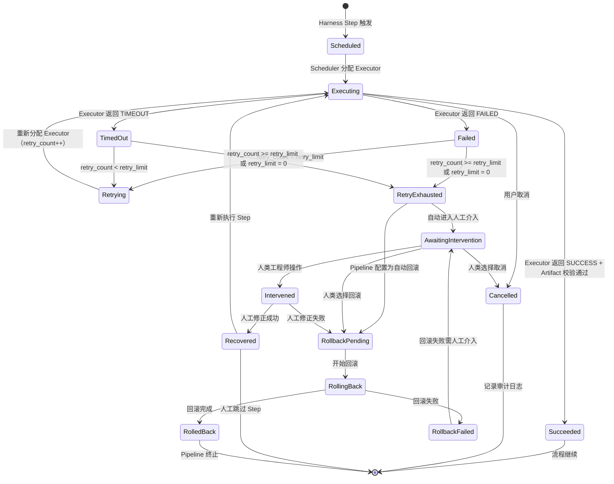
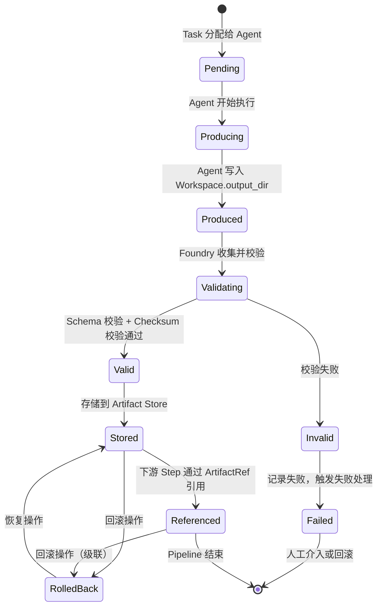

# Foundry v1 - 失败处理与人工介入机制设计文档

| 属性 | 内容 |
|------|------|
| **文档标题** | Foundry v1 - 失败处理与人工介入机制设计文档 |
| **文档作者** | Foundry Team |
| **文档日期** | 2026-05-05 |
| **文档版本** | v1.2 |
| **文档描述** | Foundry v1 失败检测规则、失败状态机、人工介入接口规范和回滚机制设计，覆盖 AC-6 和 AC-6.1 |

---

## 概述

本文档定义 Foundry v1 的失败处理与人工介入机制。在 Foundry 中，**失败是一等公民**——系统的价值在于管理失败，而不是避免失败。

本文档覆盖以下验收标准：
- **AC-6**：失败处理与人工介入机制设计文档（失败检测规则、失败状态机、人工介入接口规范）
- **AC-6.1**：回滚机制设计文档（回滚粒度、触发条件、回滚后状态、操作规范）
- **AC-7**：工程哲学遵循验证（失败处理设计符合四大工程哲学）

### 读者

- 软件架构师：理解失败处理的整体架构和状态机设计
- 一线开发者：根据失败检测规则和人工介入接口实现 Foundry Core 和 Executor
- DevOps 工程师：理解回滚机制和人工介入的操作流程
- 流程设计师：理解失败处理在 Pipeline/Stage/Step 中的附着方式

### 前置依赖

- [task_artifact_data_model.md](task_artifact_data_model.md)：Artifact 生命周期状态机（Pending→Producing→...→Failed）、ValidationResult 校验结果、校验错误码（10 个）、ArtifactRef 引用完整性约束、Task.timeout_seconds/retry_limit 字段
- [agent_executor_architecture.md](agent_executor_architecture.md)：Executor 接口错误处理契约、ExecutionStatus 枚举、Agent 执行失败模式、Scheduler 重试机制、Agent 执行生命周期状态机（12 个状态）
- [spec.md](../../.trae/specs/foundry-v1/spec.md)：FR-6（失败处理与人工介入）、FR-8（回滚机制）、NFR-4（失败是一等公民）

---

## 设计动机

### 为什么需要系统化的失败处理

Foundry 的核心协作模型是「多 Agent 分工并行」，四种 Agent 类型的执行方式差异巨大，失败场景各不相同：

| Agent 类型 | 典型失败场景 | 失败特征 |
|-----------|------------|---------|
| 本地 AI CLI | CLI 崩溃、输出格式错误、超时 | 子进程退出码非 0、Artifact 校验失败 |
| 远程 API | API 不可达、认证失败、速率限制 | HTTP 状态码、响应格式不符 |
| 传统 CLI | 命令不存在、退出码异常、输出文件缺失 | 退出码判定、文件系统错误 |
| 人类 Gate | 超时未响应、拒绝审批、回调格式错误 | 异步等待超时、人类决策 |

系统化失败处理的核心价值：

1. **可定位**：每种失败有明确的检测规则和错误码，可精确定位失败原因
2. **可复现**：失败状态机记录完整的转换路径，可复现失败场景
3. **可人工修正**：人工介入接口提供标准化的干预方式
4. **可回滚**：从任意失败点回退到已知安全状态，保证系统一致性

### 设计约束

| 约束来源 | 约束内容 |
|---------|---------|
| Flow First | 失败处理附着在 Pipeline/Stage/Step 中，由 Harness 掌握流程控制权；Agent 不决定"重试"或"跳过"——这些决策由 Scheduler 和 Pipeline 配置决定 |
| Deterministic Over Smart | 给定相同的失败输入，失败检测结果必须确定；失败处理路径必须明确定义，不依赖模型"判断" |
| Artifact Over Conversation | 失败信息通过结构化 Artifact（ARTIFACT_TYPE_ERROR_REPORT）表达，不使用无结构日志 |
| Agent Is Replaceable | 失败处理不依赖特定 Agent 类型的内部状态，通过统一的 ExecutionStatus 和错误码表达 |

---

## 详细设计

### 1. 失败检测规则

#### 1.1 检测维度总览

失败检测覆盖四个维度，每个维度有明确的判定条件：

| 检测维度 | 编号 | 判定条件 | 检测时机 | 负责组件 |
|---------|------|---------|---------|---------|
| 输出无效 | D-1 | Artifact 校验失败（Schema 不匹配、Checksum 不一致、类型不在 expected 中） | Foundry Core 校验阶段 | Foundry Core |
| 格式错误 | D-2 | Artifact 内容格式不符合 ContentFormat 声明 | Foundry Core 校验阶段 | Foundry Core |
| 超时 | D-3 | 执行时间超过 Task.timeout_seconds（或 Human Gate 的 gate.timeout_seconds） | Executor 执行阶段 | Executor + Scheduler |
| 人工中断 | D-4 | 用户通过 API/CLI 显式取消执行 | 任意阶段 | Scheduler |

#### 1.2 输出无效（D-1）

输出无效指 Agent 产出的 Artifact 未通过 Foundry Core 的校验。具体判定条件映射到 Task 2 定义的校验错误码：

| 校验错误码 | 严重级别 | 判定条件 | 失败处理策略 |
|-----------|---------|---------|------------|
| `SCHEMA_MISMATCH` | Error | Artifact 内容不符合对应类型的 JSON Schema | 触发失败处理 |
| `CHECKSUM_INVALID` | Error | 计算的 SHA-256 与 metadata.checksum 不一致 | 触发失败处理 |
| `TYPE_NOT_EXPECTED` | Error | artifact_type 不在 Task.expected_artifact_types 中 | 触发失败处理 |
| `CONTENT_EMPTY` | Error | content.data 和 content.file_path 均为空 | 触发失败处理 |
| `ARTIFACT_REF_INVALID` | Error | upstream_artifacts 中引用的 Artifact 不存在或状态为 Invalid | 触发失败处理 |
| `ARTIFACT_COUNT_EXCEEDS_MAX` | Warning | 同一 ArtifactType 产出数量超过 max_count | 记录警告，不阻塞 |
| `TYPE_NOT_PRODUCED` | Warning | expected_artifact_types 中的某个类型未被满足 | 记录警告，不阻塞 |
| `SIZE_EXCEEDS_LIMIT` | Warning | size_bytes 超过配置的最大限制 | 记录警告，不阻塞 |
| `ENCODING_MISMATCH` | Warning | 声明的 encoding 与实际内容编码不一致 | 记录警告，不阻塞 |
| `SCHEMA_REF_MISSING` | Warning | ARTIFACT_TYPE_CUSTOM 类型未提供 schema_ref | 记录警告，不阻塞 |

**判定规则**：任何 Error 级别的校验错误码出现时，Artifact 状态为 Invalid，触发失败处理。Warning 级别不触发失败处理，但记录在 ValidationResult.warnings 中。

#### 1.3 格式错误（D-2）

格式错误是输出无效的子集，特指 Artifact 内容格式不符合其 ContentFormat 声明：

| ContentFormat | 格式校验规则 | 校验失败处理 |
|--------------|------------|------------|
| `CONTENT_FORMAT_JSON` | 内容必须是合法 JSON | 标记 `SCHEMA_MISMATCH` |
| `CONTENT_FORMAT_YAML` | 内容必须是合法 YAML | 标记 `SCHEMA_MISMATCH` |
| `CONTENT_FORMAT_MARKDOWN` | 内容必须是合法 UTF-8 文本 | 标记 `ENCODING_MISMATCH` |
| `CONTENT_FORMAT_PLAINTEXT` | 内容必须是合法 UTF-8 文本 | 标记 `ENCODING_MISMATCH` |
| `CONTENT_FORMAT_BINARY` | 无格式校验（二进制内容） | — |
| `CONTENT_FORMAT_DIFF` | 内容必须符合统一差异格式（Unified Diff） | 标记 `SCHEMA_MISMATCH` |

> **设计决策**：格式错误（D-2）作为输出无效（D-1）的子集单独列出，原因：1) FR-6 明确要求覆盖"格式错误"场景；2) 格式校验在 Schema 校验之前执行，格式错误意味着连基本解析都失败，比 Schema 不匹配更严重；3) 格式校验失败时不需要尝试 Schema 校验，可直接标记为 Invalid。

#### 1.4 超时（D-3）

超时检测由 Executor 和 Scheduler 两层保障：

| 层级 | 超时值 | 检测方式 | 超时后行为 |
|------|--------|---------|-----------|
| Executor 内部 | `Task.timeout_seconds` | Executor 设置内部 deadline | 终止子进程/API 调用，返回 `EXECUTION_STATUS_TIMEOUT` |
| Scheduler | `Task.timeout_seconds + 30s` | gRPC context deadline | 收到 TIMEOUT 或 context 取消 |
| Human Gate | `gate.timeout_seconds`（独立配置） | Executor 内部计时 | 按 timeout_action 策略处理 |

**超时判定条件**：

```
if now - execution_start_time > Task.timeout_seconds:
    → D-3 超时检测触发
    → Executor 返回 EXECUTION_STATUS_TIMEOUT
    → Scheduler 记录超时事件
    → 根据 retry_limit 决定是否重试
```

**Human Gate 超时特殊处理**：

Human Gate 的超时独立于 Task.timeout_seconds（见 Task 3 第 2.3 节操作规范）。超时后的行为由 `timeout_action` 决定：

| timeout_action | 超时后行为 | ExecutionStatus |
|---------------|-----------|----------------|
| `approve` | 自动批准 | SUCCESS（构造 APPROVAL_RECORD） |
| `reject` | 自动拒绝 | FAILED |
| `escalate` | 通知升级目标，继续等待 | 继续等待（不触发超时） |
| `retry` | 重新通知，重置计时器 | 继续等待（最多 3 次） |

#### 1.5 人工中断（D-4）

人工中断指用户通过 Foundry API/CLI 显式取消正在执行的任务：

| 操作 | API | 效果 | ExecutionStatus |
|------|-----|------|----------------|
| 取消 Task | `POST /api/v1/tasks/{task_id}/cancel` | Scheduler 取消 gRPC context，Executor 终止执行 | CANCELLED |
| 取消 Pipeline | `POST /api/v1/pipelines/{pipeline_id}/cancel` | 取消 Pipeline 下所有正在执行的 Task | CANCELLED |
| 取消 Stage | `POST /api/v1/pipelines/{pipeline_id}/stages/{stage_id}/cancel` | 取消 Stage 下所有正在执行的 Task | CANCELLED |

**判定条件**：收到取消请求后，Scheduler 通过 gRPC context cancellation 通知 Executor，Executor 返回 `EXECUTION_STATUS_CANCELLED`。

**不重试原则**：CANCELLED 状态不触发重试（与 Task 3 重试机制一致）。

---

### 2. 失败状态机

#### 2.1 Step 执行失败状态机

失败状态机描述一个 Step 从正常执行到失败、人工介入、恢复或回滚的完整生命周期：



#### 2.2 状态定义

| 状态 | 触发条件 | 含义 | 后续可能 |
|------|---------|------|---------|
| Scheduled | Harness Step 触发 | Task 已创建，等待调度 | Executing |
| Executing | Executor 开始执行 | Agent 正在执行 Task | Succeeded / Failed / TimedOut / Cancelled |
| Succeeded | Artifact 校验通过 | Step 执行成功 | 流程继续 |
| Failed | Executor 返回 FAILED | Agent 执行失败 | Retrying / RetryExhausted |
| TimedOut | Executor 返回 TIMEOUT | Agent 执行超时 | Retrying / RetryExhausted |
| Cancelled | 用户取消 | 显式取消执行 | 终止 |
| Retrying | retry_limit 未耗尽 | 正在重试 | Executing |
| RetryExhausted | retry_limit 已耗尽 | 重试次数用尽 | AwaitingIntervention / RollbackPending |
| AwaitingIntervention | 自动/手动触发 | 等待人类工程师介入 | Intervened / RollbackPending / Cancelled |
| Intervened | 人类工程师完成操作 | 人工介入已完成 | Recovered / RollbackPending |
| Recovered | 人工修正成功 | Step 已恢复 | Executing / 流程继续 |
| RollbackPending | 触发回滚 | 等待回滚执行 | RollingBack |
| RollingBack | 回滚执行中 | 正在回滚 | RolledBack / RollbackFailed |
| RolledBack | 回滚完成 | 已回退到安全状态 | Pipeline 终止 |
| RollbackFailed | 回滚失败 | 回滚过程出错 | AwaitingIntervention |

#### 2.3 状态转换规则

| 转换 | 触发条件 | 决策者 | 审计记录 |
|------|---------|--------|---------|
| Failed → Retrying | `retry_count < retry_limit` | Scheduler（自动） | 记录重试次数和原因 |
| Failed → RetryExhausted | `retry_count >= retry_limit` 或 `retry_limit = 0` | Scheduler（自动） | 记录重试耗尽 |
| RetryExhausted → AwaitingIntervention | Pipeline 配置 `on_failure = human_intervention` | Pipeline 配置 | 记录进入人工介入 |
| RetryExhausted → RollbackPending | Pipeline 配置 `on_failure = auto_rollback` | Pipeline 配置 | 记录触发自动回滚 |
| AwaitingIntervention → Intervened | 人类工程师提交操作 | 人类工程师 | 记录操作类型和理由 |
| AwaitingIntervention → RollbackPending | 人类工程师选择回滚 | 人类工程师 | 记录回滚决策 |
| Intervened → Recovered | 人工修正后重新校验通过 | Foundry Core（自动） | 记录恢复结果 |
| Intervened → RollbackPending | 人工修正后校验仍失败 | Foundry Core（自动） | 记录修正失败 |
| Recovered → Executing | 人类选择重新执行 | 人类工程师 | 记录重新执行 |
| Recovered → 流程继续 | 人类选择跳过 Step | 人类工程师 | 记录跳过决策 |
| RollbackFailed → AwaitingIntervention | 回滚过程失败 | Foundry Core（自动） | 记录回滚失败原因 |

> **设计决策：失败处理路径由 Pipeline 配置决定，而非 Agent 决定。** 这符合 Flow First 原则——Agent 不拥有流程控制权。Pipeline Designer 在定义 Pipeline 时指定 `on_failure` 策略，Scheduler 和 Foundry Core 按配置执行。

#### 2.4 Pipeline 级别的失败策略

Pipeline 配置中定义失败处理策略，作用于 Pipeline / Stage / Step 三个层级：

```yaml
pipeline:
  on_failure: human_intervention  # Pipeline 级别默认策略
  stages:
    - stage_id: build
      on_failure: auto_rollback   # Stage 级别覆盖
      steps:
        - step_id: compile
          on_failure: retry_then_intervention  # Step 级别覆盖
          retry_limit: 3
```

**策略枚举**：

| 策略 | 含义 | 适用场景 |
|------|------|---------|
| `human_intervention` | 重试耗尽后进入人工介入 | 默认策略，适用于大多数场景 |
| `auto_rollback` | 重试耗尽后自动回滚 | 高风险场景，不允许人工介入延迟 |
| `retry_then_intervention` | 先重试，耗尽后人工介入 | 可恢复的失败场景 |
| `retry_then_rollback` | 先重试，耗尽后自动回滚 | 可恢复但高风险的场景 |
| `skip` | 标记失败但继续执行后续 Step | 非关键步骤 |

**策略优先级**：Step > Stage > Pipeline，低层级覆盖高层级。

#### 2.5 `on_failure` 策略与 `retry_limit` 的交互规则

`on_failure` 策略和 `Task.retry_limit` 是两个独立的配置项，交互规则如下：

| on_failure 策略 | retry_limit > 0 | retry_limit = 0 | 说明 |
|----------------|-----------------|-----------------|------|
| `human_intervention` | 先重试，耗尽后人工介入 | 直接人工介入 | `human_intervention` 不影响重试行为 |
| `auto_rollback` | 先重试，耗尽后自动回滚 | 直接自动回滚 | `auto_rollback` 不影响重试行为 |
| `retry_then_intervention` | 先重试，耗尽后人工介入 | 直接人工介入 | 语义与 `human_intervention` 相同，显式表达"先重试"意图 |
| `retry_then_rollback` | 先重试，耗尽后自动回滚 | 直接自动回滚 | 语义与 `auto_rollback` 相同，显式表达"先重试"意图 |
| `skip` | 先重试，耗尽后跳过 | 直接跳过 | `skip` 不影响重试行为 |

**核心原则**：`retry_limit` 控制重试次数，`on_failure` 控制重试耗尽后的行为。两者正交，互不覆盖。

#### 2.6 Intervention 存储方案

Intervention 记录存储在 Foundry Core 的 SQLite/PostgreSQL 数据库中（与审计日志和 Artifact Store 共享），独立的 `interventions` 表：

```sql
CREATE TABLE IF NOT EXISTS interventions (
    intervention_id TEXT PRIMARY KEY,
    pipeline_id TEXT NOT NULL,
    stage_id TEXT NOT NULL,
    step_id TEXT NOT NULL,
    task_id TEXT NOT NULL,
    status TEXT NOT NULL DEFAULT 'PENDING',
    failure_context_json TEXT NOT NULL,
    options_json TEXT NOT NULL,
    assigned_to TEXT,
    result_json TEXT,
    created_at DATETIME NOT NULL,
    resolved_at DATETIME
);

CREATE INDEX IF NOT EXISTS idx_interventions_pipeline_id ON interventions(pipeline_id);
CREATE INDEX IF NOT EXISTS idx_interventions_status ON interventions(status);
CREATE INDEX IF NOT EXISTS idx_interventions_assigned_to ON interventions(assigned_to);
CREATE INDEX IF NOT EXISTS idx_interventions_created_at ON interventions(created_at);
```

---

### 3. 人工介入接口规范

#### 3.1 介入方式

| 介入方式 | API | 说明 |
|---------|-----|------|
| 审批介入 | `POST /api/v1/interventions/{intervention_id}/approve` | 批准当前状态，继续流程 |
| 拒绝介入 | `POST /api/v1/interventions/{intervention_id}/reject` | 拒绝当前状态，触发回滚或终止 |
| 修正介入 | `POST /api/v1/interventions/{intervention_id}/correct` | 提交修正后的 Artifact，重新校验 |
| 回滚介入 | `POST /api/v1/interventions/{intervention_id}/rollback` | 选择回滚到安全状态 |
| 取消介入 | `POST /api/v1/interventions/{intervention_id}/cancel` | 取消整个 Pipeline |
| 跳过介入 | `POST /api/v1/interventions/{intervention_id}/skip` | 跳过当前 Step，继续后续流程 |

#### 3.2 Intervention 数据结构

```protobuf
message Intervention {
  string intervention_id = 1;
  string pipeline_id = 2;
  string stage_id = 3;
  string step_id = 4;
  string task_id = 5;
  InterventionStatus status = 6;
  FailureContext failure_context = 7;
  InterventionOptions options = 8;
  string assigned_to = 9;
  google.protobuf.Timestamp created_at = 10;
  google.protobuf.Timestamp resolved_at = 11;
  InterventionResult result = 12;
}
```

**InterventionStatus 枚举**：

| 枚举值 | Protobuf 数值 | 说明 |
|--------|-------------|------|
| `INTERVENTION_STATUS_UNSPECIFIED` | 0 | 占位值 |
| `INTERVENTION_STATUS_PENDING` | 1 | 等待人工介入 |
| `INTERVENTION_STATUS_APPROVED` | 2 | 已批准 |
| `INTERVENTION_STATUS_REJECTED` | 3 | 已拒绝 |
| `INTERVENTION_STATUS_CORRECTED` | 4 | 已修正 |
| `INTERVENTION_STATUS_ROLLED_BACK` | 5 | 已回滚 |
| `INTERVENTION_STATUS_CANCELLED` | 6 | 已取消 |
| `INTERVENTION_STATUS_SKIPPED` | 7 | 已跳过 |

**FailureContext 结构**（失败上下文，展示给人类工程师）：

```protobuf
message FailureContext {
  ExecutionStatus execution_status = 1;
  string error_message = 2;
  repeated ArtifactRef failed_artifact_refs = 3;
  ValidationResult validation_result = 4;
  int32 retry_count = 5;
  google.protobuf.Timestamp failed_at = 6;
  string executor_agent_id = 7;
}
```

> **设计决策**：FailureContext 使用 `ArtifactRef` 引用而非内联完整 `Artifact`，原因：1) 大型 Artifact（如 BUILD_OUTPUT 可达 50MB）内联会导致 Intervention 消息过大；2) 人类工程师需要查看详情时，通过 ArtifactRef 从 Artifact Store 查询；3) 与 Task 2 的 Context.upstream_artifacts 设计保持一致（引用而非内联）。

**InterventionOptions 结构**（可用操作选项）：

```protobuf
message InterventionOptions {
  bool can_approve = 1;
  bool can_reject = 2;
  bool can_correct = 3;
  bool can_rollback = 4;
  bool can_skip = 5;
  repeated string rollback_targets = 6;
}
```

> **设计决策**：InterventionOptions 由 Pipeline 配置和失败状态共同决定。例如，如果 Pipeline 配置 `on_failure = auto_rollback`，则 `can_rollback = true` 且 `can_approve = false`（自动回滚场景下不允许人工批准）。这确保了人工介入的操作范围受 Pipeline 配置约束，符合 Flow First 原则。

**InterventionResult 结构**（介入结果）：

```protobuf
message InterventionResult {
  InterventionStatus action = 1;
  string operator = 2;
  string justification = 3;
  repeated Artifact corrected_artifacts = 4;
  google.protobuf.Timestamp operated_at = 5;
}
```

#### 3.3 操作类型与状态变更规则

| 操作 | 前置状态 | 后置状态 | 条件 | 必须提供 |
|------|---------|---------|------|---------|
| approve | PENDING | APPROVED | `can_approve = true` | justification |
| reject | PENDING | REJECTED | `can_reject = true` | justification |
| correct | PENDING | CORRECTED | `can_correct = true` | corrected_artifacts + justification |
| rollback | PENDING | ROLLED_BACK | `can_rollback = true` | rollback_target + justification |
| cancel | PENDING | CANCELLED | 始终允许 | justification |
| skip | PENDING | SKIPPED | `can_skip = true` | justification |

**justification 必填原则**：所有人工介入操作必须提供 justification 文本（与 Human Gate 的 `require_justification` 约束一致），确保每次人工干预有据可查。

**correct 操作的 Artifact 校验**：

1. 人类工程师提交 corrected_artifacts
2. Foundry Core 对 corrected_artifacts 执行与原始 Artifact 相同的校验流程
3. 校验通过 → 状态变为 CORRECTED，Artifact 写入 Artifact Store
4. 校验失败 → 返回校验错误，状态保持 PENDING，人类工程师需重新提交

#### 3.4 介入通知机制

当 Step 进入 AwaitingIntervention 状态时，Foundry 通过配置的通知渠道发送介入请求：

| 通知渠道 | 配置方式 | 说明 |
|---------|---------|------|
| Slack | `slack: #channel` | 发送包含 Intervention 摘要和操作链接的消息 |
| Email | `email: user@company.com` | 发送包含 Intervention 详情的邮件 |
| Webhook | `webhook: https://...` | POST Intervention JSON 到指定 URL |
| Foundry CLI | `cli: foundry intervention list` | 通过 CLI 查看待处理介入 |

通知内容包含：
- Pipeline / Stage / Step 定位信息
- 失败原因摘要（error_message + validation_result）
- 可用操作选项（InterventionOptions）
- 操作链接（指向 Foundry API 或 Web UI）

#### 3.5 介入超时与升级

| 配置项 | 默认值 | 说明 |
|--------|--------|------|
| `intervention_timeout_seconds` | 86400（24h） | 介入等待超时 |
| `escalation_enabled` | false | 是否启用升级 |
| `escalate_after_seconds` | 14400（4h） | 升级触发时间 |
| `escalation_target` | — | 升级目标（如 tech-lead@company.com） |

介入超时后行为：

| 超时行为 | 条件 | 后续 |
|---------|------|------|
| 自动回滚 | Pipeline 配置 `intervention_timeout_action = rollback` | 进入 RollbackPending |
| 自动拒绝 | Pipeline 配置 `intervention_timeout_action = reject` | Pipeline 终止 |
| 升级 | `escalation_enabled = true` | 通知升级目标，重置计时器 |

---

### 4. 回滚机制

#### 4.1 回滚粒度

回滚粒度定义回滚操作的影响范围：

| 粒度 | 编号 | 影响范围 | 说明 |
|------|------|---------|------|
| Step 级回滚 | R-1 | 单个 Step | 回滚该 Step 产出的所有 Artifact，恢复上游 Artifact 引用 |
| Stage 级回滚 | R-2 | 一个 Stage 内所有 Step | 回滚该 Stage 内所有 Step 产出的 Artifact |
| Pipeline 级回滚 | R-3 | 整个 Pipeline | 回滚 Pipeline 内所有 Artifact，恢复到 Pipeline 执行前状态 |

**回滚粒度选择规则**：

| 失败位置 | 默认回滚粒度 | 可选回滚粒度 | 决策依据 |
|---------|------------|------------|---------|
| 单个 Step 失败 | R-1（Step 级） | R-2, R-3 | 失败影响仅限当前 Step 时，Step 级回滚足够 |
| Stage 内多个 Step 失败 | R-2（Stage 级） | R-3 | 同一 Stage 内多个 Step 失败，可能存在关联，Stage 级回滚更安全 |
| 关键 Step 失败 | R-3（Pipeline 级） | — | 关键 Step（如安全扫描、审批 Gate）失败，整个 Pipeline 应回滚 |

> **设计决策**：回滚粒度由 Pipeline 配置中的 `rollback_granularity` 字段决定，而非由 Agent 或 Foundry Core 自动判断。这符合 Deterministic Over Smart 原则——回滚范围是确定的配置项，不依赖运行时"智能判断"。

#### 4.2 回滚触发条件

| 触发条件 | 编号 | 触发方式 | 说明 |
|---------|------|---------|------|
| 自动回滚 | T-1 | Pipeline 配置 `on_failure = auto_rollback` | 重试耗尽后自动触发 |
| 人工回滚 | T-2 | 人类工程师通过介入接口选择回滚 | 人工介入时选择回滚操作 |
| 上游失败传播 | T-3 | 依赖当前 Step 产出的下游 Step 失败 | 下游失败时回滚到产出方 |
| 校验严重失败 | T-4 | Artifact 校验发现安全相关问题 | 如安全扫描发现高危漏洞 |

**触发优先级**：T-4 > T-1 > T-3 > T-2

- T-4（安全相关）最高优先级，无论 Pipeline 配置如何，安全校验失败必须触发回滚
- T-1（自动回滚）次之，按 Pipeline 配置执行
- T-3（上游失败传播）在下游 Step 失败时向上追溯
- T-2（人工回滚）由人类工程师决策

**T-4 判定规则**：

T-4 的触发不依赖运行时"智能判断"，而是通过以下确定性规则判定：

| 规则编号 | 判定条件 | 说明 |
|---------|---------|------|
| T-4-R1 | `ARTIFACT_TYPE_SECURITY_SCAN_REPORT` 类型的 Artifact 校验结果包含 Error 级别错误 | 安全扫描报告本身校验失败 |
| T-4-R2 | Artifact 校验错误码新增 `SECURITY_VULNERABILITY_DETECTED`（Error 级别） | 安全扫描发现高危漏洞，由 Executor 在 Artifact metadata.labels 中标记 `severity=critical` |
| T-4-R3 | Pipeline 配置中 Step 标记为 `critical_step = true` 且执行失败 | 关键步骤（如安全扫描、审批 Gate）失败，整个 Pipeline 应回滚 |

> **跨文档同步说明**：`SECURITY_VULNERABILITY_DETECTED` 为本文档新增的校验错误码，需同步添加到 Task 2 的校验错误码枚举和说明表中。

#### 4.3 回滚后状态定义

回滚完成后，系统进入确定的状态：

| 回滚粒度 | 回滚后状态 | Artifact Store | Workspace | 审计日志 |
|---------|-----------|---------------|-----------|---------|
| R-1（Step 级） | 当前 Step 标记为 RolledBack | 该 Step 产出的 Artifact 标记为 RolledBack（不删除） | 该 Step 的 Workspace 销毁 | 记录回滚操作 |
| R-2（Stage 级） | 当前 Stage 标记为 RolledBack | 该 Stage 内所有 Step 产出的 Artifact 标记为 RolledBack | 该 Stage 内所有 Workspace 销毁 | 记录回滚操作 |
| R-3（Pipeline 级） | 整个 Pipeline 标记为 RolledBack | Pipeline 内所有 Artifact 标记为 RolledBack | 所有 Workspace 销毁 | 记录回滚操作 |

**Artifact 的 RolledBack 状态**：

Artifact 不被物理删除，而是标记为 RolledBack 状态。这是出于以下考虑：

1. **可审计**：回滚后的 Artifact 仍然可查，审计日志可追溯完整的产出和回滚历史
2. **可恢复**：如果回滚决策错误，可以从 RolledBack 状态恢复 Artifact
3. **引用安全**：已标记为 RolledBack 的 Artifact 不能被新的 Task 引用（ArtifactRef 引用完整性约束）

> **设计决策**：Artifact 采用软删除（标记 RolledBack）而非硬删除，符合 Deterministic Over Smart 原则——回滚操作是确定性的状态变更，而非不可逆的数据销毁。

#### 4.4 回滚操作规范

```
回滚执行流程：

1. 确定回滚粒度（R-1/R-2/R-3）
   → 根据 Pipeline 配置和失败位置确定

2. 标记受影响的 Artifact
   → 将回滚范围内的所有 Artifact 状态标记为 RolledBack
   → 计算 checksum 确认 Artifact 未被篡改

3. 检查下游依赖
   → 查询是否有后续 Step 已引用了待回滚的 Artifact
   → 如果有 → 级联回滚（扩大回滚粒度）
   → 如果没有 → 继续当前粒度回滚

4. 销毁 Workspace
   → 清理回滚范围内的 Workspace
   → 释放资源

5. 记录审计日志
   → 记录回滚操作：粒度、范围、触发原因、操作者

6. 更新 Pipeline 状态
   → Pipeline 状态更新为 RolledBack（R-3）或继续执行（R-1/R-2 后人工决策）

7. 通知
   → 通知 Pipeline 相关人员回滚完成
```

**级联回滚规则**：

当回滚范围内的 Artifact 已被下游 Step 引用时，必须扩大回滚粒度：

```
if artifact.status == RolledBack:
    for each downstream_ref in artifact.downstream_references:
        if downstream_ref.step.status == Succeeded:
            → 扩大回滚粒度到包含 downstream_ref.step
            → 递归检查
```

级联回滚确保系统一致性——不会出现"上游 Artifact 已回滚但下游仍在使用"的不一致状态。

#### 4.5 回滚恢复

回滚后，人类工程师可以选择恢复：

| 恢复操作 | API | 条件 | 效果 |
|---------|-----|------|------|
| 恢复 Artifact | `POST /api/v1/artifacts/{artifact_id}/restore` | Artifact 状态为 RolledBack | Artifact 状态恢复为 Stored |
| 恢复 Step | `POST /api/v1/steps/{step_id}/restore` | Step 状态为 RolledBack | Step 重新进入 Executing |
| 恢复 Pipeline | `POST /api/v1/pipelines/{pipeline_id}/restore` | Pipeline 状态为 RolledBack | Pipeline 从失败点重新执行 |

恢复操作必须满足：
1. 恢复前检查引用完整性——上游 Artifact 必须处于 Valid/Stored 状态
2. 恢复后重新校验 Artifact——确保 Artifact 内容未被修改
3. 恢复操作必须提供 justification

---

### 5. 失败处理与 Artifact 生命周期

失败处理与 Task 2 定义的 Artifact 生命周期状态机紧密关联：

```
Artifact 生命周期（Task 2）:
  Pending → Producing → Produced → Validating → Valid → Stored → Referenced
                                               → Invalid → Failed
                                                                 ↓
                                                    失败处理（本文档）
                                                                 ↓
                                                   RolledBack（新增状态）
```

**Artifact 生命周期扩展**：在 Task 2 定义的 8 个状态基础上，新增 `RolledBack` 状态：

| 状态 | 触发条件 | 负责组件 |
|------|---------|---------|
| RolledBack | 回滚操作将 Artifact 标记为已回滚 | Foundry Core |

> **跨文档同步说明**：`RolledBack` 为本文档新增的 Artifact 生命周期状态，需同步添加到 Task 2 的 Artifact 生命周期状态机和状态说明表中。

完整的 Artifact 生命周期状态机：



---

### 6. 失败处理中的 Artifact 产出

#### 6.1 ERROR_REPORT Artifact

当 Step 执行失败时，Foundry Core 自动构造 `ARTIFACT_TYPE_ERROR_REPORT` 类型的 Artifact，记录失败详情：

```protobuf
message ErrorReportContent {
  string error_code = 1;
  string error_message = 2;
  ExecutionStatus execution_status = 3;
  ValidationResult validation_result = 4;
  int32 retry_count = 5;
  string executor_agent_id = 6;
  google.protobuf.Timestamp failed_at = 7;
  string failure_detection = 8;
}
```

| 字段 | 类型 | 说明 |
|------|------|------|
| `error_code` | `string` | 失败检测编号（D-1/D-2/D-3/D-4） |
| `error_message` | `string` | 人类可读的错误描述 |
| `execution_status` | `ExecutionStatus` | Executor 返回的执行状态 |
| `validation_result` | `ValidationResult` | Artifact 校验结果（D-1/D-2 场景） |
| `retry_count` | `int32` | 已重试次数 |
| `executor_agent_id` | `string` | 执行该 Task 的 Executor 标识 |
| `failed_at` | `Timestamp` | 失败时间 |
| `failure_detection` | `string` | 失败检测维度（D-1/D-2/D-3/D-4） |

#### 6.2 ERROR_REPORT 的生命周期

ERROR_REPORT Artifact 的生命周期与普通 Artifact 不同：

1. 由 Foundry Core 自动构造（非 Agent 产出）
2. 不经过 Validating 状态（Foundry Core 保证其格式正确）
3. 直接写入 Artifact Store，状态为 Stored
4. 可被审计查询引用
5. 回滚时标记为 RolledBack（与其他 Artifact 一致）

**ERROR_REPORT 与标准 Artifact 结构的映射**：

| Artifact 字段 | ERROR_REPORT 取值 | 说明 |
|--------------|------------------|------|
| `artifact_id` | UUID v4 | 自动生成 |
| `artifact_type` | `ARTIFACT_TYPE_ERROR_REPORT` | 固定值 |
| `content.content_format` | `CONTENT_FORMAT_JSON` | ErrorReportContent 序列化为 JSON |
| `content.data` | `ErrorReportContent` 的 JSON 序列化字节 | 内联存储，不使用 file_path |
| `content.encoding` | `CONTENT_ENCODING_UTF8` | JSON 文本 |
| `metadata.producer_agent_id` | `foundry-core` | 标识为 Foundry Core 产出 |
| `metadata.producer_agent_type` | — | 不适用（非 Agent 产出） |
| `metadata.pipeline_id` / `stage_id` / `step_id` | 从失败 Task 的 Context 中提取 | 保持溯源一致 |
| `metadata.checksum` | SHA-256 of `content.data` | 与普通 Artifact 一致 |
| `upstream_artifacts` | 空 | ERROR_REPORT 不引用上游 Artifact |

---

## 接口定义

### 1. Protobuf 定义

#### 1.1 intervention.proto

```protobuf
syntax = "proto3";

package foundry.v1;

option go_package = "github.com/foundry/foundry/gen/foundry/v1";

import "google/protobuf/timestamp.proto";
import "foundry/v1/common.proto";
import "foundry/v1/artifact.proto";

enum InterventionStatus {
  INTERVENTION_STATUS_UNSPECIFIED = 0;
  INTERVENTION_STATUS_PENDING = 1;
  INTERVENTION_STATUS_APPROVED = 2;
  INTERVENTION_STATUS_REJECTED = 3;
  INTERVENTION_STATUS_CORRECTED = 4;
  INTERVENTION_STATUS_ROLLED_BACK = 5;
  INTERVENTION_STATUS_CANCELLED = 6;
  INTERVENTION_STATUS_SKIPPED = 7;
}

enum RollbackGranularity {
  ROLLBACK_GRANULARITY_UNSPECIFIED = 0;
  ROLLBACK_GRANULARITY_STEP = 1;
  ROLLBACK_GRANULARITY_STAGE = 2;
  ROLLBACK_GRANULARITY_PIPELINE = 3;
}

enum OnFailureStrategy {
  ON_FAILURE_STRATEGY_UNSPECIFIED = 0;
  ON_FAILURE_STRATEGY_HUMAN_INTERVENTION = 1;
  ON_FAILURE_STRATEGY_AUTO_ROLLBACK = 2;
  ON_FAILURE_STRATEGY_RETRY_THEN_INTERVENTION = 3;
  ON_FAILURE_STRATEGY_RETRY_THEN_ROLLBACK = 4;
  ON_FAILURE_STRATEGY_SKIP = 5;
}

message Intervention {
  string intervention_id = 1;
  string pipeline_id = 2;
  string stage_id = 3;
  string step_id = 4;
  string task_id = 5;
  InterventionStatus status = 6;
  FailureContext failure_context = 7;
  InterventionOptions options = 8;
  string assigned_to = 9;
  google.protobuf.Timestamp created_at = 10;
  google.protobuf.Timestamp resolved_at = 11;
  InterventionResult result = 12;
}

message FailureContext {
  ExecutionStatus execution_status = 1;
  string error_message = 2;
  repeated ArtifactRef failed_artifact_refs = 3;
  ValidationResult validation_result = 4;
  int32 retry_count = 5;
  google.protobuf.Timestamp failed_at = 6;
  string executor_agent_id = 7;
}

message InterventionOptions {
  bool can_approve = 1;
  bool can_reject = 2;
  bool can_correct = 3;
  bool can_rollback = 4;
  bool can_skip = 5;
  repeated string rollback_targets = 6;
}

message InterventionResult {
  InterventionStatus action = 1;
  string operator = 2;
  string justification = 3;
  repeated Artifact corrected_artifacts = 4;
  google.protobuf.Timestamp operated_at = 5;
}

message ErrorReportContent {
  string error_code = 1;
  string error_message = 2;
  ExecutionStatus execution_status = 3;
  ValidationResult validation_result = 4;
  int32 retry_count = 5;
  string executor_agent_id = 6;
  google.protobuf.Timestamp failed_at = 7;
  string failure_detection = 8;
}
```

### 2. Go 结构体定义

```go
package failure

type Intervention struct {
    InterventionID string             `json:"intervention_id" validate:"required,uuid4"`
    PipelineID     string             `json:"pipeline_id" validate:"required"`
    StageID        string             `json:"stage_id" validate:"required"`
    StepID         string             `json:"step_id" validate:"required"`
    TaskID         string             `json:"task_id" validate:"required,uuid4"`
    Status         InterventionStatus `json:"status" validate:"required"`
    FailureContext *FailureContext     `json:"failure_context" validate:"required"`
    Options        *InterventionOptions `json:"options" validate:"required"`
    AssignedTo     string             `json:"assigned_to,omitempty"`
    CreatedAt      time.Time          `json:"created_at" validate:"required"`
    ResolvedAt     *time.Time         `json:"resolved_at,omitempty"`
    Result         *InterventionResult `json:"result,omitempty"`
}

type FailureContext struct {
    ExecutionStatus foundryv1.ExecutionStatus `json:"execution_status" validate:"required"`
    ErrorMessage    string                    `json:"error_message" validate:"required"`
    FailedArtifactRefs []*foundryv1.ArtifactRef `json:"failed_artifact_refs,omitempty"`
    ValidationResult *foundryv1.ValidationResult `json:"validation_result,omitempty"`
    RetryCount      int32                     `json:"retry_count"`
    FailedAt        time.Time                 `json:"failed_at" validate:"required"`
    ExecutorAgentID string                    `json:"executor_agent_id" validate:"required"`
}

type InterventionOptions struct {
    CanApprove    bool     `json:"can_approve"`
    CanReject     bool     `json:"can_reject"`
    CanCorrect    bool     `json:"can_correct"`
    CanRollback   bool     `json:"can_rollback"`
    CanSkip       bool     `json:"can_skip"`
    RollbackTargets []string `json:"rollback_targets,omitempty"`
}

type InterventionResult struct {
    Action             InterventionStatus   `json:"action" validate:"required"`
    Operator           string               `json:"operator" validate:"required"`
    Justification      string               `json:"justification" validate:"required"`
    CorrectedArtifacts []*foundryv1.Artifact `json:"corrected_artifacts,omitempty"`
    OperatedAt         time.Time            `json:"operated_at" validate:"required"`
}
```

### 3. JSON Schema 定义

#### 3.1 intervention.schema.json

```json
{
  "$schema": "http://json-schema.org/draft-07/schema#",
  "$id": "https://foundry.dev/schemas/intervention.schema.json",
  "title": "Intervention",
  "description": "Foundry v1 Intervention 数据模型 JSON Schema",
  "type": "object",
  "required": ["intervention_id", "pipeline_id", "stage_id", "step_id", "task_id", "status", "failure_context", "options", "created_at"],
  "additionalProperties": false,
  "properties": {
    "intervention_id": {
      "type": "string",
      "format": "uuid",
      "description": "介入唯一标识"
    },
    "pipeline_id": {
      "type": "string",
      "minLength": 1,
      "description": "所属 Pipeline 标识"
    },
    "stage_id": {
      "type": "string",
      "minLength": 1,
      "description": "所属 Stage 标识"
    },
    "step_id": {
      "type": "string",
      "minLength": 1,
      "description": "所属 Step 标识"
    },
    "task_id": {
      "type": "string",
      "format": "uuid",
      "description": "关联的 Task 标识"
    },
    "status": {
      "$ref": "#/definitions/InterventionStatus"
    },
    "failure_context": {
      "$ref": "#/definitions/FailureContext"
    },
    "options": {
      "$ref": "#/definitions/InterventionOptions"
    },
    "assigned_to": {
      "type": "string",
      "description": "分配给的人类工程师标识"
    },
    "created_at": {
      "type": "string",
      "format": "date-time",
      "description": "介入创建时间"
    },
    "resolved_at": {
      "type": "string",
      "format": "date-time",
      "description": "介入解决时间"
    },
    "result": {
      "$ref": "#/definitions/InterventionResult"
    }
  },
  "definitions": {
    "InterventionStatus": {
      "type": "string",
      "enum": [
        "INTERVENTION_STATUS_PENDING",
        "INTERVENTION_STATUS_APPROVED",
        "INTERVENTION_STATUS_REJECTED",
        "INTERVENTION_STATUS_CORRECTED",
        "INTERVENTION_STATUS_ROLLED_BACK",
        "INTERVENTION_STATUS_CANCELLED",
        "INTERVENTION_STATUS_SKIPPED"
      ]
    },
    "FailureContext": {
      "type": "object",
      "required": ["execution_status", "error_message", "failed_at", "executor_agent_id"],
      "additionalProperties": false,
      "properties": {
        "execution_status": {
          "type": "string",
          "enum": ["SUCCESS", "FAILED", "TIMEOUT", "CANCELLED"]
        },
        "error_message": {
          "type": "string",
          "minLength": 1
        },
        "failed_artifact_refs": {
          "type": "array",
          "items": {
            "type": "object"
          }
        },
        "validation_result": {
          "type": "object"
        },
        "retry_count": {
          "type": "integer",
          "minimum": 0
        },
        "failed_at": {
          "type": "string",
          "format": "date-time"
        },
        "executor_agent_id": {
          "type": "string",
          "minLength": 1
        }
      }
    },
    "InterventionOptions": {
      "type": "object",
      "required": ["can_approve", "can_reject", "can_correct", "can_rollback", "can_skip"],
      "additionalProperties": false,
      "properties": {
        "can_approve": { "type": "boolean" },
        "can_reject": { "type": "boolean" },
        "can_correct": { "type": "boolean" },
        "can_rollback": { "type": "boolean" },
        "can_skip": { "type": "boolean" },
        "rollback_targets": {
          "type": "array",
          "items": { "type": "string", "minLength": 1 }
        }
      }
    },
    "InterventionResult": {
      "type": "object",
      "required": ["action", "operator", "justification", "operated_at"],
      "additionalProperties": false,
      "properties": {
        "action": {
          "$ref": "#/definitions/InterventionStatus"
        },
        "operator": {
          "type": "string",
          "minLength": 1
        },
        "justification": {
          "type": "string",
          "minLength": 1
        },
        "corrected_artifacts": {
          "type": "array",
          "items": { "type": "object" }
        },
        "operated_at": {
          "type": "string",
          "format": "date-time"
        }
      }
    }
  }
}
```

---

## 操作规范

### 1. 失败检测流程

```
1. Executor 返回 ExecuteResponse
2. Foundry Core 检查 ExecutionStatus
   a. SUCCESS → 进入 Artifact 校验流程（可能触发 D-1/D-2）
   b. FAILED → Executor 已报告执行失败，直接分类为执行失败
   c. TIMEOUT → D-3 分类（超时）
   d. CANCELLED → D-4 分类（人工中断）

3. Artifact 校验流程（SUCCESS 时）
   a. 格式校验（D-2）：检查 ContentFormat 是否与内容匹配
   b. Schema 校验（D-1）：检查 JSON Schema 是否匹配
   c. Checksum 校验（D-1）：计算 SHA-256 并比对
   d. 类型校验（D-1）：检查 artifact_type 是否在 expected_artifact_types 中
   e. 引用校验（D-1）：检查 upstream_artifacts 引用完整性

4. 校验结果判定
   a. 所有 Error 级别校验通过 → Artifact 状态为 Valid
   b. 存在 Error 级别校验失败 → Artifact 状态为 Invalid，触发失败处理（D-1/D-2）
   c. 存在 Warning 级别 → Artifact 状态为 Valid，记录 Warning
```

### 2. 重试流程

```
1. Step 执行失败（FAILED/TIMEOUT）
2. 检查 retry_count < retry_limit
   a. 是 → retry_count++，等待 5 秒，重新分配 Executor
   b. 否 → 进入 RetryExhausted 状态
3. 重试使用独立 Workspace（不共享状态）
4. 重试可能分配不同的 Executor 实例（Agent Is Replaceable）
5. 每次重试记录审计日志
```

### 3. 人工介入流程

```
1. Step 进入 AwaitingIntervention 状态
2. Foundry Core 创建 Intervention 记录
3. intervention_id 通过 SubmitTaskResponse 返回给 Harness Step Plugin（Plugin 可将其写入环境变量或日志供运维查询）
4. 发送介入通知（Slack/Email/Webhook）
5. 等待人类工程师操作
6. 人类工程师通过 API 提交操作
   a. approve → Step 标记为 Succeeded，流程继续
   b. reject → Step 标记为 Failed，Pipeline 终止
   c. correct → 校验修正后的 Artifact，通过则 Step 恢复
   d. rollback → 进入回滚流程
   e. cancel → Pipeline 终止
   f. skip → Step 标记为 Skipped，流程继续
6. 记录 InterventionResult
7. 写入审计日志
```

### 4. 回滚流程

```
1. 确定回滚粒度（Step/Stage/Pipeline）
2. 查询回滚范围内的所有 Artifact
3. 检查下游依赖（级联回滚判断）
4. 标记 Artifact 为 RolledBack
5. 销毁 Workspace
6. 更新 Pipeline/Stage/Step 状态
7. 记录审计日志
8. 发送回滚通知
```

---

## 约束与限制

| 编号 | 限制项 | 说明 |
|------|--------|------|
| L-5.1 | **v1 不支持部分回滚** | 回滚操作作用于完整的 Step/Stage/Pipeline，不支持回滚单个 Artifact |
| L-5.2 | **v1 不支持跨 Pipeline 回滚** | 回滚范围限定在单个 Pipeline 内，不涉及跨 Pipeline 的 Artifact |
| L-5.3 | **v1 介入通知为尽力投递** | 通知发送失败不阻塞失败处理流程，介入记录仍可在 Foundry CLI/API 中查询 |
| L-5.4 | **v1 不支持自动修正** | correct 操作必须由人类工程师提交，Foundry Core 不自动修正 Artifact |
| L-5.5 | **v1 回滚不支持选择性保留** | 回滚范围内的所有 Artifact 都被标记为 RolledBack，不支持选择性保留部分 Artifact |
| L-5.6 | **级联回滚深度限制** | 级联回滚最大深度为 10 层，超过则终止回滚并进入 AwaitingIntervention |
| L-5.7 | **介入超时默认 24 小时** | 超时后按 Pipeline 配置的 `intervention_timeout_action` 处理 |

---

## 待决问题

| 编号 | 问题 | 需要解决的任务 | 说明 |
|------|------|-------------|------|
| OQ-5.1 | Artifact Store 是否支持 RolledBack 状态的物理清理 | 编码阶段 | 审计持久化方案已确定（SQLite/PostgreSQL），RolledBack Artifact 的保留策略和物理清理机制需在编码阶段定义 |
| OQ-5.2 | ~~回滚操作的原子性保障~~ | ~~Task 7~~ | ✅ 已解决：v1 回滚通过 Harness Step Plugin 执行，单 Step 内操作天然原子；跨 Step 回滚由 Foundry Core 串行执行，详见 harness_integration.md |
| OQ-5.3 | ~~介入操作的 Web UI 形态~~ | ~~Task 7~~ | ✅ 已解决：v1 通过 Foundry CLI + Web Hook 回调执行介入操作，不提供 Web UI，详见 harness_integration.md |
| OQ-5.4 | Executor Metrics 的资源级指标 | 编码阶段 | v1 的 ExecutionMetrics 仅含时间维度，资源级指标（内存峰值、网络 I/O）可在编码阶段增加 |

**跨文档同步说明**：

| 同步项 | 目标文档 | 说明 |
|--------|---------|------|
| Artifact 生命周期新增 `RolledBack` 状态 | Task 2（task_artifact_data_model.md） | 需同步添加到 Artifact 生命周期状态机和状态说明表中 |
| 校验错误码新增 `SECURITY_VULNERABILITY_DETECTED` | Task 2（task_artifact_data_model.md） | 需同步添加到校验错误码枚举和说明表中 |
| `InterventionStatus`、`RollbackGranularity`、`OnFailureStrategy` 枚举 | Task 2（task_artifact_data_model.md） | 需在 common.proto 或 intervention.proto 中注册 |
| `intervention.proto` 新增 proto 文件 | Task 1（tech_stack_and_architecture.md） | 需反映到项目目录结构 proto/ 目录中 |
| `ExecutionStatus` 移至 `common.proto` | Task 3（agent_executor_architecture.md） | `ExecutionStatus` 被 executor.proto / audit.proto / intervention.proto 共用，应移至 common.proto |

---

## 修订历史

| 版本 | 日期 | 修改内容 | 作者 |
|------|------|---------|------|
| v1.0 | 2026-05-05 | 初始版本：覆盖失败检测规则（4 种场景）、失败状态机（15 个状态）、人工介入接口规范（6 种操作）、回滚机制（3 种粒度 + 4 种触发条件 + 级联回滚）、Artifact 生命周期扩展（RolledBack 状态）、ERROR_REPORT Artifact 定义 | Foundry Team |
| v1.1 | 2026-05-05 | 评审修复：B-5.1 修正状态机 Retrying→RetryExhausted 转换逻辑；B-5.2 修正失败检测流程 D-1/D-2 触发时机；B-5.3 补充 ErrorReportContent 与标准 Artifact 结构映射；S-5.1 新增 T-4 判定规则和 SECURITY_VULNERABILITY_DETECTED 错误码；S-5.2 新增 Intervention 存储方案（interventions 表）；S-5.3 新增 on_failure 与 retry_limit 交互规则；S-5.4 FailureContext 改用 ArtifactRef 引用；S-5.5 完善跨文档同步声明；OQ-5.1 解决任务修正为编码阶段 | Foundry Team |
| v1.2 | 2026-05-06 | 一致性审查修正：1) OQ-5.2/5.3 标记为已解决（Task 7 已解决）；2) 人工介入流程补充 intervention_id 通过 SubmitTaskResponse 返回给 Plugin 的说明 | Foundry Team |
