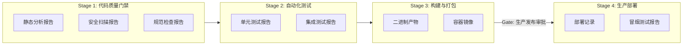
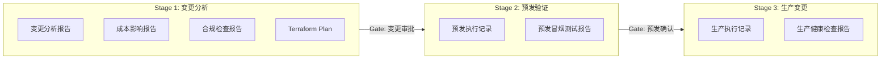
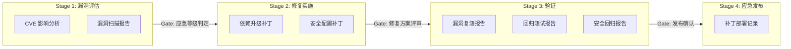
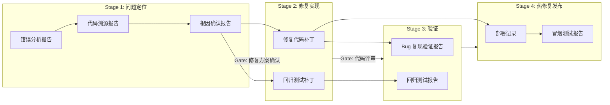

# Foundry v1 - 可复用流程模板设计文档

| 属性 | 内容 |
|------|------|
| **文档标题** | Foundry v1 - 可复用流程模板设计文档 |
| **文档作者** | Foundry Team |
| **文档日期** | 2026-05-06 |
| **文档版本** | v1.2 |
| **文档描述** | Foundry v1 可复用流程模板规范定义，包含模板格式、参数化机制和 5 个完整流程模板实例 |

---

## 概述

本文档定义 Foundry v1 的可复用流程模板规范，包含：

1. **模板格式规范**：Pipeline 模板的 YAML 定义格式、参数化机制、复用方式
2. **模板实例**：5 个完整的流程模板，覆盖研发、发布、基础设施、安全治理、应急响应五类 DevOps 核心场景

本文档覆盖 FR-10（可复用流程模板），对应验收标准 AC-8。

### 读者

- DevOps 工程师：根据模板定义 Harness Pipeline
- 软件架构师：理解 Foundry 编排模式
- 一线开发者：理解 Agent 在流程中的角色

### 前置依赖

- [harness_integration.md](harness_integration.md)：Pipeline/Stage/Step 映射关系、Step 插件配置方式
- [task_artifact_data_model.md](task_artifact_data_model.md)：Task/Artifact 结构、ArtifactRef 引用传递流程
- [agent_executor_architecture.md](agent_executor_architecture.md)：四种 Agent 类型、Capabilities 能力声明、Artifact 流转路径
- [pipeline_scenarios.md](../pipeline_scenarios.md)：6 个场景模板作为场景选择输入

---

## 设计动机

### 为什么需要流程模板

Foundry 的核心价值是**显式建模软件研发流程**。流程模板是这一价值的直接体现：

1. **降低使用门槛**：用户无需从零设计 Pipeline，基于模板快速启动
2. **沉淀最佳实践**：将经过验证的流程模式固化为可复用模板
3. **保障一致性**：相同类型的研发活动使用统一的流程规范
4. **验证架构可行性**：模板是 Foundry 架构设计的端到端验证

### 场景选择

从 [pipeline_scenarios.md](../pipeline_scenarios.md) 的 6 个场景中选择 5 个：

| 选择 | 场景 | 选择理由 |
|------|------|---------|
| 模板 1 | 功能开发全流程 | AI Agent 参与最多（4 种 Agent 类型全部涉及）、人类 Gate 最多（4 个）、Artifact 流转路径最完整，最能体现 Foundry 编排 AI Agent 的核心能力 |
| 模板 2 | 代码提交到生产发布 | 最经典的 CI/CD 场景，传统 CLI Agent 为主，自动化程度最高，与模板 1 形成对比，验证 Foundry 对非 AI 场景的支持 |
| 模板 3 | 基础设施变更 | DevOps IaC 核心场景，体现 plan→review→apply 模式，破坏性变更需 CTO 审批，auto_rollback 使用 Terraform Destroy |
| 模板 4 | 安全漏洞应急响应 | DevOps 安全治理核心场景，强调速度+审计+人类全程把控，Remote API Agent 与 Local AI CLI 协作，审计不可跳过 |
| 模板 5 | 生产故障应急响应 | DevOps 最紧急场景，AI 根因分析→人工确认→自动修复→回归验证，体现 Foundry 对紧急场景的编排能力 |

### 设计约束

| 约束来源 | 约束内容 |
|---------|---------|
| Artifact Over Conversation | 每个 Step 的输入输出必须是结构化 Artifact，禁止无结构文本传递 |
| Flow First | 流程控制权由 Harness 掌握，Agent 不拥有流程控制权 |
| Deterministic Over Smart | 给定相同参数，模板产出的 Pipeline 定义必须确定 |
| Agent Is Replaceable | 模板中的 Agent 通过 agent_type + capabilities 匹配，不硬编码特定 Agent 实例 |

---

## 详细设计

### 1. 模板格式规范

#### 1.1 模板 YAML 结构

流程模板使用 YAML 格式定义，与 Harness Pipeline YAML 结构对齐，增加 Foundry 特有的扩展字段。

```yaml
# 模板元数据
template:
  name: string           # 模板名称（必填）
  version: string        # 模板版本（语义化版本，必填）
  description: string    # 模板描述（必填）
  category: string       # 场景分类（必填）：feature_development / ci_cd / bug_fix / security / infrastructure / tech_debt
  author: string         # 模板作者（必填）

# 参数定义
parameters:
  - name: string         # 参数名（必填，snake_case）
    type: string         # 参数类型（必填）：string / int / bool / enum
    required: bool       # 是否必填（默认 false）
    default: any         # 默认值
    description: string  # 参数说明（必填）
    enum_values: [...]   # 枚举值列表（type=enum 时必填）

# Pipeline 定义
pipeline:
  name: string           # Pipeline 名称（支持参数引用：${param_name}）
  identifier: string     # Pipeline 标识（必填，kebab-case）
  trigger: string        # 触发条件描述

  stages:
    - name: string       # Stage 名称
      identifier: string # Stage 标识（必填，kebab-case）
      parallel: bool     # Stage 内 Step 是否并行（默认 false）
      steps:
        - name: string   # Step 名称
          identifier: string  # Step 标识（必填，kebab-case）
          agent_type: string  # Agent 类型枚举值（必填）
          required_capabilities: [...]  # 要求的 Agent 能力列表
          task_spec:     # TaskSpec 定义
            description: string  # 任务描述（支持参数引用）
            expected_artifact_types: [...]  # 期望的 Artifact 类型
            expected_artifact_counts: [...]  # Artifact 数量约束（可选）
            parameters: map    # Agent 特定参数
          on_failure: string   # OnFailureStrategy 枚举值
          retry_limit: int     # 重试次数
          timeout_seconds: int # 超时时间

      gate:              # 人工介入 Gate（可选）
        name: string     # Gate 名称
        agent_type: AGENT_TYPE_HUMAN_GATE  # 固定值
        gate_type: string    # approval / review / correction
        timeout_action: string  # approve / reject / escalate
        approver: string  # 审批人角色描述
        input_artifacts: [...]  # 审批人需查看的 Artifact 类型列表
```

#### 1.2 参数引用机制

模板参数使用 `${param_name}` 语法引用，在实例化时替换：

| 引用位置 | 示例 | 说明 |
|---------|------|------|
| Pipeline 名称 | `name: 功能开发 - ${feature_name}` | 参数化 Pipeline 名称 |
| Task 描述 | `description: "实现 ${feature_name} 功能"` | 参数化任务描述 |
| Agent 参数 | `cli_command: ${ai_cli_command}` | 参数化 Agent 配置 |
| 超时时间 | `timeout_seconds: ${test_timeout}` | 参数化超时配置 |
| on_failure | `on_failure: ${failure_strategy}` | 参数化失败策略 |

> **注意**：`${param_name}` 语法与 Harness 内置变量（如 `${COMMIT_SHA}`）使用相同格式。模板参数在实例化时优先替换；未匹配的 `${...}` 保留为 Harness 变量，由 Harness 运行时替换。

#### 1.3 模板实例化流程

```
1. 用户选择模板
2. 用户填写参数（必填参数未填写时报错）
3. Foundry 替换模板中的参数引用
4. Foundry 校验实例化后的 Pipeline 定义（JSON Schema 校验）
5. 校验通过 → 生成 Harness Pipeline YAML
6. 校验失败 → 返回参数错误
```

---

### 2. 模板 1：功能开发全流程

> AI Agent 主导的完整研发流程。4 种 Agent 类型全部参与，4 个人类 Gate，5 个 Stage，Artifact 流转路径最完整。

#### 2.1 模板元数据

```yaml
template:
  name: 功能开发全流程
  version: 1.0.0
  description: 从需求到交付的完整研发流程，AI Agent 参与需求分析、技术设计和编码实现，人类把关需求确认、设计评审、代码评审和测试确认
  category: feature_development
  author: Foundry Team
```

#### 2.2 参数定义

```yaml
parameters:
  - name: feature_name
    type: string
    required: true
    description: 功能名称，用于 Pipeline 命名和 Task 描述

  - name: feature_description
    type: string
    required: true
    description: 功能需求的自然语言描述

  - name: repo_url
    type: string
    required: true
    description: 代码仓库地址

  - name: repo_branch
    type: string
    required: false
    default: main
    description: 代码分支

  - name: ai_cli_command
    type: string
    required: false
    default: codex
    description: 本地 AI CLI 工具命令

  - name: test_command
    type: string
    required: false
    default: go test ./...
    description: 单元测试执行命令

  - name: lint_command
    type: string
    required: false
    default: golangci-lint run
    description: 代码规范检查命令

  - name: test_timeout
    type: int
    required: false
    default: 600
    description: 测试执行超时时间（秒）

  - name: failure_strategy
    type: enum
    required: false
    default: human_intervention
    enum_values: [human_intervention, auto_rollback, retry_then_intervention, retry_then_rollback, skip]
    description: 默认失败处理策略
```

#### 2.3 Pipeline 定义

```yaml
pipeline:
  name: 功能开发 - ${feature_name}
  identifier: feature-development
  trigger: 产品经理提交需求单

  stages:
    # ─── Stage 1：需求分析 ───
    - name: 需求分析
      identifier: requirement-analysis
      parallel: false
      steps:
        - name: 需求文档解析
          identifier: parse-requirement
          agent_type: AGENT_TYPE_LOCAL_AI_CLI
          required_capabilities: [ai_reasoning, code_generation]
          task_spec:
            description: "解析以下需求描述，产出结构化需求规格文档：${feature_description}"
            expected_artifact_types: [ARTIFACT_TYPE_DESIGN_PROPOSAL]
            expected_artifact_counts:
              - artifact_type: ARTIFACT_TYPE_DESIGN_PROPOSAL
                min_count: 1
                max_count: 1
            parameters:
              cli_command: ${ai_cli_command}
              model: default
          on_failure: human_intervention
          retry_limit: 1
          timeout_seconds: 300

        - name: 需求可行性评估
          identifier: assess-feasibility
          agent_type: AGENT_TYPE_LOCAL_AI_CLI
          required_capabilities: [ai_reasoning]
          task_spec:
            description: "基于需求规格文档，评估功能 '${feature_name}' 的技术可行性，识别风险和依赖"
            expected_artifact_types: [ARTIFACT_TYPE_DESIGN_PROPOSAL]
            expected_artifact_counts:
              - artifact_type: ARTIFACT_TYPE_DESIGN_PROPOSAL
                min_count: 1
                max_count: 1
            parameters:
              cli_command: ${ai_cli_command}
          on_failure: human_intervention
          retry_limit: 0
          timeout_seconds: 300

      gate:
        name: 需求确认
        agent_type: AGENT_TYPE_HUMAN_GATE
        gate_type: approval
        timeout_action: reject
        approver: 产品经理 + 技术负责人
        input_artifacts: [ARTIFACT_TYPE_DESIGN_PROPOSAL]

    # ─── Stage 2：技术设计 ───
    - name: 技术设计
      identifier: technical-design
      parallel: false
      steps:
        - name: 技术方案设计
          identifier: design-solution
          agent_type: AGENT_TYPE_LOCAL_AI_CLI
          required_capabilities: [ai_reasoning, code_generation]
          task_spec:
            description: "基于已确认的需求规格，设计功能 '${feature_name}' 的技术实现方案"
            expected_artifact_types: [ARTIFACT_TYPE_DESIGN_PROPOSAL]
            expected_artifact_counts:
              - artifact_type: ARTIFACT_TYPE_DESIGN_PROPOSAL
                min_count: 1
                max_count: 1
            parameters:
              cli_command: ${ai_cli_command}
          on_failure: human_intervention
          retry_limit: 1
          timeout_seconds: 600

        - name: 接口契约定义
          identifier: define-api-contract
          agent_type: AGENT_TYPE_LOCAL_AI_CLI
          required_capabilities: [ai_reasoning, code_generation]
          task_spec:
            description: "基于技术方案，定义功能 '${feature_name}' 的 API 接口契约（请求/响应格式、错误码）"
            expected_artifact_types: [ARTIFACT_TYPE_DESIGN_PROPOSAL]
            expected_artifact_counts:
              - artifact_type: ARTIFACT_TYPE_DESIGN_PROPOSAL
                min_count: 1
                max_count: 1
            parameters:
              cli_command: ${ai_cli_command}
          on_failure: human_intervention
          retry_limit: 0
          timeout_seconds: 300

        - name: 影响范围分析
          identifier: analyze-impact
          agent_type: AGENT_TYPE_LOCAL_AI_CLI
          required_capabilities: [ai_reasoning]
          task_spec:
            description: "分析功能 '${feature_name}' 对现有代码库的影响范围，识别需要修改的模块和潜在风险"
            expected_artifact_types: [ARTIFACT_TYPE_DESIGN_PROPOSAL]
            expected_artifact_counts:
              - artifact_type: ARTIFACT_TYPE_DESIGN_PROPOSAL
                min_count: 1
                max_count: 1
            parameters:
              cli_command: ${ai_cli_command}
          on_failure: human_intervention
          retry_limit: 0
          timeout_seconds: 300

      gate:
        name: 设计评审
        agent_type: AGENT_TYPE_HUMAN_GATE
        gate_type: review
        timeout_action: reject
        approver: 架构师
        input_artifacts: [ARTIFACT_TYPE_DESIGN_PROPOSAL]

    # ─── Stage 3：编码实现 ───
    - name: 编码实现
      identifier: coding
      parallel: false
      steps:
        - name: 核心代码编写
          identifier: write-code
          agent_type: AGENT_TYPE_LOCAL_AI_CLI
          required_capabilities: [ai_reasoning, code_generation, tool_use]
          task_spec:
            description: "根据技术方案和接口契约，实现功能 '${feature_name}' 的核心代码"
            expected_artifact_types: [ARTIFACT_TYPE_PATCH_DIFF]
            expected_artifact_counts:
              - artifact_type: ARTIFACT_TYPE_PATCH_DIFF
                min_count: 1
                max_count: 3
            parameters:
              cli_command: ${ai_cli_command}
          on_failure: human_intervention
          retry_limit: 1
          timeout_seconds: 900

        - name: 单元测试编写
          identifier: write-tests
          agent_type: AGENT_TYPE_LOCAL_AI_CLI
          required_capabilities: [ai_reasoning, code_generation]
          task_spec:
            description: "为功能 '${feature_name}' 编写单元测试代码，覆盖核心逻辑和边界条件"
            expected_artifact_types: [ARTIFACT_TYPE_PATCH_DIFF]
            expected_artifact_counts:
              - artifact_type: ARTIFACT_TYPE_PATCH_DIFF
                min_count: 1
                max_count: 2
            parameters:
              cli_command: ${ai_cli_command}
          on_failure: human_intervention
          retry_limit: 0
          timeout_seconds: 600

        - name: 代码自检
          identifier: lint-check
          agent_type: AGENT_TYPE_TRADITIONAL_CLI
          required_capabilities: [deterministic]
          task_spec:
            description: "执行代码规范检查"
            expected_artifact_types: [ARTIFACT_TYPE_STATIC_ANALYSIS_REPORT]
            expected_artifact_counts:
              - artifact_type: ARTIFACT_TYPE_STATIC_ANALYSIS_REPORT
                min_count: 1
                max_count: 1
            parameters:
              command: ${lint_command}
              exit_codes: "0,1"
          on_failure: human_intervention
          retry_limit: 0
          timeout_seconds: 120

      gate:
        name: 代码评审
        agent_type: AGENT_TYPE_HUMAN_GATE
        gate_type: review
        timeout_action: reject
        approver: 高级开发工程师
        input_artifacts: [ARTIFACT_TYPE_PATCH_DIFF, ARTIFACT_TYPE_STATIC_ANALYSIS_REPORT]

    # ─── Stage 4：验证测试 ───
    - name: 验证测试
      identifier: verification
      parallel: true
      steps:
        - name: 单元测试执行
          identifier: run-unit-tests
          agent_type: AGENT_TYPE_TRADITIONAL_CLI
          required_capabilities: [deterministic]
          task_spec:
            description: "执行功能 '${feature_name}' 的单元测试"
            expected_artifact_types: [ARTIFACT_TYPE_TEST_REPORT]
            expected_artifact_counts:
              - artifact_type: ARTIFACT_TYPE_TEST_REPORT
                min_count: 1
                max_count: 1
            parameters:
              command: ${test_command}
          on_failure: auto_rollback
          retry_limit: 0
          timeout_seconds: ${test_timeout}

        - name: 集成测试执行
          identifier: run-integration-tests
          agent_type: AGENT_TYPE_TRADITIONAL_CLI
          required_capabilities: [deterministic]
          task_spec:
            description: "执行功能 '${feature_name}' 的集成测试"
            expected_artifact_types: [ARTIFACT_TYPE_TEST_REPORT]
            expected_artifact_counts:
              - artifact_type: ARTIFACT_TYPE_TEST_REPORT
                min_count: 1
                max_count: 1
            parameters:
              command: ${test_command}
          on_failure: auto_rollback
          retry_limit: 0
          timeout_seconds: ${test_timeout}

      gate:
        name: 测试结果确认
        agent_type: AGENT_TYPE_HUMAN_GATE
        gate_type: approval
        timeout_action: approve
        approver: 开发者
        input_artifacts: [ARTIFACT_TYPE_TEST_REPORT]

    # ─── Stage 5：交付 ───
    - name: 交付
      identifier: delivery
      parallel: false
      steps:
        - name: 变更日志生成
          identifier: generate-changelog
          agent_type: AGENT_TYPE_LOCAL_AI_CLI
          required_capabilities: [ai_reasoning, code_generation]
          task_spec:
            description: "根据需求规格和代码变更，生成功能 '${feature_name}' 的变更日志"
            expected_artifact_types: [ARTIFACT_TYPE_DOCUMENTATION]
            expected_artifact_counts:
              - artifact_type: ARTIFACT_TYPE_DOCUMENTATION
                min_count: 1
                max_count: 1
            parameters:
              cli_command: ${ai_cli_command}
          on_failure: skip
          retry_limit: 0
          timeout_seconds: 120

        - name: 产物归档
          identifier: archive-artifacts
          agent_type: AGENT_TYPE_TRADITIONAL_CLI
          required_capabilities: [deterministic]
          task_spec:
            description: "将功能 '${feature_name}' 的所有产物归档打包"
            expected_artifact_types: [ARTIFACT_TYPE_BUILD_OUTPUT]
            expected_artifact_counts:
              - artifact_type: ARTIFACT_TYPE_BUILD_OUTPUT
                min_count: 1
                max_count: 1
            parameters:
              command: "tar czf release-package.tar.gz -C ${output_dir} ."
          on_failure: human_intervention
          retry_limit: 1
          timeout_seconds: 60
```

#### 2.4 Artifact 流转路径

```mermaid
graph LR
    subgraph Stage1[Stage 1: 需求分析]
        R1[需求规格文档] --> R2[可行性报告]
    end

    subgraph Stage2[Stage 2: 技术设计]
        R2 --> D1[技术方案]
        D1 --> D2[接口契约]
        D1 --> D3[影响分析]
    end

    subgraph Stage3[Stage 3: 编码实现]
        D2 --> C1[代码补丁]
        D2 --> C2[测试补丁]
        C1 --> C3[Lint 报告]
    end

    subgraph Stage4[Stage 4: 验证测试]
        C1 --> T1[单元测试报告]
        C2 --> T2[集成测试报告]
    end

    subgraph Stage5[Stage 5: 交付]
        R1 --> V1[变更日志]
        C1 --> V2[产物归档]
    end

    Stage1 -->|Gate: 需求确认| Stage2
    Stage2 -->|Gate: 设计评审| Stage3
    Stage3 -->|Gate: 代码评审| Stage4
    Stage4 -->|Gate: 测试确认| Stage5
```



#### 2.5 失败处理策略

| 失败场景 | 触发 Step | on_failure | 处理行为 |
|---------|----------|------------|---------|
| AI 产出的需求规格不完整 | parse-requirement | human_intervention | Gate 退回，人类批注补充点，AI 修正后重新提交 |
| 技术方案被架构师否决 | design-solution | human_intervention | Gate 退回，附修改意见，AI 重新设计 |
| 代码评审不通过 | write-code | human_intervention | Gate 退回，附评审意见，AI 修正代码 |
| 单元测试失败 | run-unit-tests | auto_rollback | 回滚到 Stage 3，通知 AI Agent 修复代码 |
| 集成测试失败 | run-integration-tests | auto_rollback | 回滚到 Stage 3，通知 AI Agent 修复代码 |
| Lint 检查不通过 | lint-check | human_intervention | 通知开发者决定是否修正 |
| 变更日志生成失败 | generate-changelog | skip | 跳过，不影响交付 |

---

### 3. 模板 2：代码提交到生产发布

> 传统 CI/CD 场景。自动化程度最高，传统 CLI Agent 为主，1 个人类 Gate，4 个 Stage。

#### 3.1 模板元数据

```yaml
template:
  name: 代码提交到生产发布
  version: 1.0.0
  description: 从代码提交到生产部署的经典 CI/CD 流程，传统 CLI Agent 为主，自动化程度最高，生产发布前需人工审批
  category: ci_cd
  author: Foundry Team
```

#### 3.2 参数定义

```yaml
parameters:
  - name: repo_url
    type: string
    required: true
    description: 代码仓库地址

  - name: repo_branch
    type: string
    required: false
    default: main
    description: 代码分支

  - name: static_analysis_command
    type: string
    required: false
    default: sonar-scanner
    description: 静态代码分析命令

  - name: security_scan_command
    type: string
    required: false
    default: trivy fs .
    description: 安全漏洞扫描命令

  - name: lint_command
    type: string
    required: false
    default: golangci-lint run
    description: 代码规范检查命令

  - name: test_command
    type: string
    required: false
    default: go test ./...
    description: 测试执行命令

  - name: build_command
    type: string
    required: false
    default: go build -o app ./cmd/app
    description: 编译构建命令

  - name: docker_build_command
    type: string
    required: false
    default: docker build -t app:${COMMIT_SHA} .
    description: Docker 镜像构建命令（${COMMIT_SHA} 为 Harness 内置变量，运行时自动替换为 Git Commit SHA）

  - name: deploy_command
    type: string
    required: false
    default: argocd app sync app
    description: 部署命令

  - name: smoke_test_command
    type: string
    required: false
    default: newman run smoke-tests.json
    description: 冒烟测试命令

  - name: test_timeout
    type: int
    required: false
    default: 600
    description: 测试执行超时时间（秒）

  - name: build_timeout
    type: int
    required: false
    default: 900
    description: 构建执行超时时间（秒）
```

#### 3.3 Pipeline 定义

```yaml
pipeline:
  name: CI/CD - ${repo_url}
  identifier: ci-cd-deploy
  trigger: 开发者 git push 到 ${repo_branch} 分支

  stages:
    # ─── Stage 1：代码质量门禁 ───
    - name: 代码质量门禁
      identifier: quality-gate
      parallel: true
      steps:
        - name: 静态代码分析
          identifier: static-analysis
          agent_type: AGENT_TYPE_TRADITIONAL_CLI
          required_capabilities: [deterministic]
          task_spec:
            description: "执行静态代码分析，产出代码质量报告"
            expected_artifact_types: [ARTIFACT_TYPE_STATIC_ANALYSIS_REPORT]
            expected_artifact_counts:
              - artifact_type: ARTIFACT_TYPE_STATIC_ANALYSIS_REPORT
                min_count: 1
                max_count: 1
            parameters:
              command: ${static_analysis_command}
          on_failure: retry_then_intervention
          retry_limit: 2
          timeout_seconds: 300

        - name: 安全漏洞扫描
          identifier: security-scan
          agent_type: AGENT_TYPE_REMOTE_API
          required_capabilities: [security_scan]
          task_spec:
            description: "扫描代码依赖中的安全漏洞"
            expected_artifact_types: [ARTIFACT_TYPE_SECURITY_SCAN_REPORT]
            expected_artifact_counts:
              - artifact_type: ARTIFACT_TYPE_SECURITY_SCAN_REPORT
                min_count: 1
                max_count: 1
            parameters:
              api_endpoint: ${security_scan_command}
          on_failure: retry_then_intervention
          retry_limit: 2
          timeout_seconds: 300

        - name: 代码规范检查
          identifier: lint-check
          agent_type: AGENT_TYPE_TRADITIONAL_CLI
          required_capabilities: [deterministic]
          task_spec:
            description: "执行代码规范检查"
            expected_artifact_types: [ARTIFACT_TYPE_STATIC_ANALYSIS_REPORT]
            expected_artifact_counts:
              - artifact_type: ARTIFACT_TYPE_STATIC_ANALYSIS_REPORT
                min_count: 1
                max_count: 1
            parameters:
              command: ${lint_command}
              exit_codes: "0,1"
          on_failure: human_intervention
          retry_limit: 0
          timeout_seconds: 120

    # ─── Stage 2：自动化测试 ───
    - name: 自动化测试
      identifier: automated-testing
      parallel: true
      steps:
        - name: 单元测试
          identifier: unit-test
          agent_type: AGENT_TYPE_TRADITIONAL_CLI
          required_capabilities: [deterministic]
          task_spec:
            description: "执行单元测试并收集覆盖率数据"
            expected_artifact_types: [ARTIFACT_TYPE_TEST_REPORT]
            expected_artifact_counts:
              - artifact_type: ARTIFACT_TYPE_TEST_REPORT
                min_count: 1
                max_count: 1
            parameters:
              command: ${test_command}
          on_failure: auto_rollback
          retry_limit: 0
          timeout_seconds: ${test_timeout}

        - name: 集成测试
          identifier: integration-test
          agent_type: AGENT_TYPE_TRADITIONAL_CLI
          required_capabilities: [deterministic]
          task_spec:
            description: "执行集成测试"
            expected_artifact_types: [ARTIFACT_TYPE_TEST_REPORT]
            expected_artifact_counts:
              - artifact_type: ARTIFACT_TYPE_TEST_REPORT
                min_count: 1
                max_count: 1
            parameters:
              command: ${test_command}
          on_failure: auto_rollback
          retry_limit: 0
          timeout_seconds: ${test_timeout}

    # ─── Stage 3：构建与打包 ───
    - name: 构建与打包
      identifier: build
      parallel: true
      steps:
        - name: 编译打包
          identifier: compile
          agent_type: AGENT_TYPE_TRADITIONAL_CLI
          required_capabilities: [deterministic]
          task_spec:
            description: "编译项目并打包二进制产物"
            expected_artifact_types: [ARTIFACT_TYPE_BUILD_OUTPUT]
            expected_artifact_counts:
              - artifact_type: ARTIFACT_TYPE_BUILD_OUTPUT
                min_count: 1
                max_count: 1
            parameters:
              command: ${build_command}
          on_failure: retry_then_intervention
          retry_limit: 1
          timeout_seconds: ${build_timeout}

        - name: 容器镜像构建
          identifier: docker-build
          agent_type: AGENT_TYPE_TRADITIONAL_CLI
          required_capabilities: [deterministic]
          task_spec:
            description: "构建 Docker 容器镜像"
            expected_artifact_types: [ARTIFACT_TYPE_BUILD_OUTPUT]
            expected_artifact_counts:
              - artifact_type: ARTIFACT_TYPE_BUILD_OUTPUT
                min_count: 1
                max_count: 1
            parameters:
              command: ${docker_build_command}
          on_failure: retry_then_intervention
          retry_limit: 1
          timeout_seconds: ${build_timeout}

      gate:
        name: 生产发布审批
        agent_type: AGENT_TYPE_HUMAN_GATE
        gate_type: approval
        timeout_action: reject
        approver: 技术负责人
        input_artifacts: [ARTIFACT_TYPE_STATIC_ANALYSIS_REPORT, ARTIFACT_TYPE_SECURITY_SCAN_REPORT, ARTIFACT_TYPE_TEST_REPORT, ARTIFACT_TYPE_BUILD_OUTPUT]

    # ─── Stage 4：生产部署 ───
    - name: 生产部署
      identifier: deploy
      parallel: false
      steps:
        - name: 部署到生产环境
          identifier: deploy-prod
          agent_type: AGENT_TYPE_TRADITIONAL_CLI
          required_capabilities: [deterministic]
          task_spec:
            description: "将构建产物部署到生产环境"
            expected_artifact_types: [ARTIFACT_TYPE_EXECUTION_RECORD]
            expected_artifact_counts:
              - artifact_type: ARTIFACT_TYPE_EXECUTION_RECORD
                min_count: 1
                max_count: 1
            parameters:
              command: ${deploy_command}
          on_failure: auto_rollback
          retry_limit: 0
          timeout_seconds: 300

        - name: 生产冒烟测试
          identifier: smoke-test
          agent_type: AGENT_TYPE_TRADITIONAL_CLI
          required_capabilities: [deterministic]
          task_spec:
            description: "执行生产环境冒烟测试"
            expected_artifact_types: [ARTIFACT_TYPE_TEST_REPORT]
            expected_artifact_counts:
              - artifact_type: ARTIFACT_TYPE_TEST_REPORT
                min_count: 1
                max_count: 1
            parameters:
              command: ${smoke_test_command}
          on_failure: auto_rollback
          retry_limit: 0
          timeout_seconds: 180
```

#### 3.4 Artifact 流转路径



#### 3.5 失败处理策略

| 失败场景 | 触发 Step | on_failure | 处理行为 |
|---------|----------|------------|---------|
| 静态分析超时 | static-analysis | retry_then_intervention | 最多重试 2 次，仍失败则人工介入 |
| 安全扫描发现漏洞 | security-scan | retry_then_intervention | 最多重试 2 次（排除临时服务不可用），仍失败则人工介入 |
| Lint 检查不通过 | lint-check | human_intervention | 通知开发者修正 |
| 单元测试失败 | unit-test | auto_rollback | 回滚到 Stage 2 之前，通知开发者修复 |
| 集成测试失败 | integration-test | auto_rollback | 回滚到 Stage 2 之前，通知开发者修复 |
| 构建失败 | compile / docker-build | retry_then_intervention | 最多重试 1 次（可能是临时网络问题），仍失败则人工介入 |
| 冒烟测试失败 | smoke-test | auto_rollback | 回滚部署，通知运维回退版本 |

---

### 4. 模板 3：基础设施变更

> IaC 核心场景。强调变更影响评估 + 分级审批 + 自动回滚。破坏性变更需要 CTO 级别审批，Terraform Apply 失败自动触发 Destroy 回滚。

#### 4.1 模板元数据

```yaml
template:
  name: 基础设施变更
  version: 1.0.0
  description: Terraform/Pulumi 配置变更流程，包含变更分析、分级审批、预发验证和生产变更，破坏性变更需 CTO 审批
  category: infrastructure
  author: Foundry Team
```

#### 4.2 参数定义

```yaml
parameters:
  - name: infra_repo_url
    type: string
    required: true
    description: 基础设施代码仓库地址

  - name: infra_branch
    type: string
    required: false
    default: main
    description: 配置分支

  - name: ai_cli_command
    type: string
    required: false
    default: codex
    description: 本地 AI CLI 工具命令（用于配置 Diff 分析和成本影响评估）

  - name: terraform_command
    type: string
    required: false
    default: terraform
    description: Terraform 命令路径

  - name: working_dir
    type: string
    required: false
    default: .
    description: Terraform 工作目录

  - name: target_environment
    type: enum
    required: true
    enum_values: [staging, production]
    description: 目标部署环境

  - name: smoke_test_command
    type: string
    required: false
    default: "terraform output -json | jq '.endpoints.value' | xargs -I{} curl -sf {}/health"
    description: 冒烟测试命令

  - name: health_check_command
    type: string
    required: false
    default: "curl -sf https://api.example.com/health"
    description: 生产环境健康检查命令

  - name: plan_timeout
    type: int
    required: false
    default: 300
    description: Terraform Plan 超时时间（秒）

  - name: apply_timeout
    type: int
    required: false
    default: 900
    description: Terraform Apply 超时时间（秒）
```

#### 4.3 Pipeline 定义

```yaml
pipeline:
  name: 基础设施变更 - ${target_environment}
  identifier: infrastructure-change
  trigger: Terraform / Pulumi 配置变更提交

  stages:
    # ─── Stage 1：变更分析 ───
    - name: 变更分析
      identifier: change-analysis
      parallel: true
      steps:
        - name: 配置 Diff 分析
          identifier: analyze-config-diff
          agent_type: AGENT_TYPE_LOCAL_AI_CLI
          required_capabilities: [ai_reasoning]
          task_spec:
            description: "分析基础设施配置变更内容，识别变更类型（创建/修改/删除）和影响范围"
            expected_artifact_types: [ARTIFACT_TYPE_DESIGN_PROPOSAL]
            expected_artifact_counts:
              - artifact_type: ARTIFACT_TYPE_DESIGN_PROPOSAL
                min_count: 1
                max_count: 1
            parameters:
              cli_command: ${ai_cli_command}
          on_failure: human_intervention
          retry_limit: 0
          timeout_seconds: 300

        - name: 成本影响评估
          identifier: assess-cost-impact
          agent_type: AGENT_TYPE_LOCAL_AI_CLI
          required_capabilities: [ai_reasoning]
          task_spec:
            description: "基于配置变更，评估对云资源成本的影响（增减金额、资源数量变化）"
            expected_artifact_types: [ARTIFACT_TYPE_DESIGN_PROPOSAL]
            expected_artifact_counts:
              - artifact_type: ARTIFACT_TYPE_DESIGN_PROPOSAL
                min_count: 1
                max_count: 1
            parameters:
              cli_command: ${ai_cli_command}
          on_failure: human_intervention
          retry_limit: 0
          timeout_seconds: 300

        - name: 合规性检查
          identifier: compliance-check
          agent_type: AGENT_TYPE_TRADITIONAL_CLI
          required_capabilities: [deterministic]
          task_spec:
            description: "使用 Open Policy Agent 检查配置变更是否符合合规策略"
            expected_artifact_types: [ARTIFACT_TYPE_STATIC_ANALYSIS_REPORT]
            expected_artifact_counts:
              - artifact_type: ARTIFACT_TYPE_STATIC_ANALYSIS_REPORT
                min_count: 1
                max_count: 1
            parameters:
              command: "opa eval --data policy/ --input tfplan.json data.terraform.deny"
          on_failure: human_intervention
          retry_limit: 0
          timeout_seconds: 120

        - name: Terraform Plan
          identifier: terraform-plan
          agent_type: AGENT_TYPE_TRADITIONAL_CLI
          required_capabilities: [deterministic]
          task_spec:
            description: "执行 Terraform Plan，产出执行计划"
            expected_artifact_types: [ARTIFACT_TYPE_BUILD_OUTPUT]
            expected_artifact_counts:
              - artifact_type: ARTIFACT_TYPE_BUILD_OUTPUT
                min_count: 1
                max_count: 1
            parameters:
              command: "${terraform_command} plan -out=tfplan -input=false -no-color"
              working_dir: ${working_dir}
          on_failure: human_intervention
          retry_limit: 1
          timeout_seconds: ${plan_timeout}

      gate:
        name: 变更审批
        agent_type: AGENT_TYPE_HUMAN_GATE
        gate_type: approval
        timeout_action: reject
        approver: 运维负责人 + 架构师（破坏性变更需 CTO）
        input_artifacts: [ARTIFACT_TYPE_DESIGN_PROPOSAL, ARTIFACT_TYPE_STATIC_ANALYSIS_REPORT, ARTIFACT_TYPE_BUILD_OUTPUT]

    # ─── Stage 2：预发验证 ───
    - name: 预发验证
      identifier: staging-verification
      parallel: false
      steps:
        - name: 预发环境变更
          identifier: staging-apply
          agent_type: AGENT_TYPE_TRADITIONAL_CLI
          required_capabilities: [deterministic]
          task_spec:
            description: "在预发环境执行 Terraform Apply"
            expected_artifact_types: [ARTIFACT_TYPE_EXECUTION_RECORD]
            expected_artifact_counts:
              - artifact_type: ARTIFACT_TYPE_EXECUTION_RECORD
                min_count: 1
                max_count: 1
            parameters:
              command: "${terraform_command} apply -auto-approve tfplan"
              working_dir: ${working_dir}
          on_failure: auto_rollback
          retry_limit: 0
          timeout_seconds: ${apply_timeout}

        - name: 预发环境冒烟测试
          identifier: staging-smoke-test
          agent_type: AGENT_TYPE_TRADITIONAL_CLI
          required_capabilities: [deterministic]
          task_spec:
            description: "验证预发环境基础设施变更后服务正常"
            expected_artifact_types: [ARTIFACT_TYPE_TEST_REPORT]
            expected_artifact_counts:
              - artifact_type: ARTIFACT_TYPE_TEST_REPORT
                min_count: 1
                max_count: 1
            parameters:
              command: ${smoke_test_command}
          on_failure: auto_rollback
          retry_limit: 0
          timeout_seconds: 120

      gate:
        name: 预发验证确认
        agent_type: AGENT_TYPE_HUMAN_GATE
        gate_type: approval
        timeout_action: reject
        approver: 运维工程师
        input_artifacts: [ARTIFACT_TYPE_EXECUTION_RECORD, ARTIFACT_TYPE_TEST_REPORT]

    # ─── Stage 3：生产变更 ───
    - name: 生产变更
      identifier: production-change
      parallel: false
      steps:
        - name: 生产环境变更
          identifier: prod-apply
          agent_type: AGENT_TYPE_TRADITIONAL_CLI
          required_capabilities: [deterministic]
          task_spec:
            description: "在生产环境执行 Terraform Apply"
            expected_artifact_types: [ARTIFACT_TYPE_EXECUTION_RECORD]
            expected_artifact_counts:
              - artifact_type: ARTIFACT_TYPE_EXECUTION_RECORD
                min_count: 1
                max_count: 1
            parameters:
              command: "${terraform_command} apply -auto-approve tfplan"
              working_dir: ${working_dir}
          on_failure: auto_rollback
          retry_limit: 0
          timeout_seconds: ${apply_timeout}

        - name: 生产环境健康检查
          identifier: prod-health-check
          agent_type: AGENT_TYPE_TRADITIONAL_CLI
          required_capabilities: [deterministic]
          task_spec:
            description: "验证生产环境变更后服务健康"
            expected_artifact_types: [ARTIFACT_TYPE_TEST_REPORT]
            expected_artifact_counts:
              - artifact_type: ARTIFACT_TYPE_TEST_REPORT
                min_count: 1
                max_count: 1
            parameters:
              command: ${health_check_command}
          on_failure: auto_rollback
          retry_limit: 0
          timeout_seconds: 60
```

#### 4.4 Artifact 流转路径



#### 4.5 失败处理策略

| 失败场景 | 触发 Step | on_failure | 处理行为 |
|---------|----------|------------|---------|
| AI 变更分析不完整 | analyze-config-diff | human_intervention | 通知运维人工分析 |
| 合规检查不通过 | compliance-check | human_intervention | 通知运维修正配置 |
| Terraform Plan 失败 | terraform-plan | human_intervention | 通知运维排查配置错误 |
| 预发 Apply 失败 | staging-apply | auto_rollback | 自动 Terraform Destroy 回滚预发 |
| 预发冒烟测试失败 | staging-smoke-test | auto_rollback | 回滚预发变更，通知运维排查 |
| 生产 Apply 失败 | prod-apply | auto_rollback | 自动 Terraform Destroy 回滚生产 |
| 生产健康检查失败 | prod-health-check | auto_rollback | 回滚生产变更，通知运维 |

---

### 5. 模板 4：安全漏洞应急响应

> 安全治理核心场景。高优先级，强调速度+审计+人类全程把控。审计记录不可跳过，即使 P0 场景。Remote API Agent（安全扫描）与 Local AI CLI（补丁生成）协作。3 个人类 Gate 确保关键节点有人类确认。

#### 5.1 模板元数据

```yaml
template:
  name: 安全漏洞应急响应
  version: 1.0.0
  description: 安全漏洞应急响应流程，从漏洞评估到补丁发布的完整流程，强调速度、审计和人类全程把控，审计记录不可跳过
  category: security
  author: Foundry Team
```

#### 5.2 参数定义

```yaml
parameters:
  - name: cve_id
    type: string
    required: true
    description: CVE 编号（如 CVE-2026-12345）

  - name: cve_description
    type: string
    required: true
    description: CVE 漏洞描述

  - name: repo_url
    type: string
    required: true
    description: 受影响代码仓库地址

  - name: repo_branch
    type: string
    required: false
    default: main
    description: 代码分支

  - name: ai_cli_command
    type: string
    required: false
    default: codex
    description: 本地 AI CLI 工具命令

  - name: security_scan_command
    type: string
    required: false
    default: trivy fs .
    description: 安全漏洞扫描命令

  - name: security_regression_command
    type: string
    required: false
    default: "zap-cli quick-scan -t https://staging.example.com"
    description: 安全回归测试命令

  - name: test_command
    type: string
    required: false
    default: go test ./...
    description: 回归测试执行命令

  - name: deploy_command
    type: string
    required: false
    default: argocd app sync app
    description: 补丁部署命令

  - name: scan_timeout
    type: int
    required: false
    default: 300
    description: 安全扫描超时时间（秒）
```

#### 5.3 Pipeline 定义

```yaml
pipeline:
  name: 安全应急 - ${cve_id}
  identifier: security-incident
  trigger: 安全扫描发现 CRITICAL 漏洞 / 收到 CVE 通报

  stages:
    # ─── Stage 1：漏洞评估 ───
    - name: 漏洞评估
      identifier: vulnerability-assessment
      parallel: true
      steps:
        - name: 漏洞影响分析
          identifier: analyze-cve-impact
          agent_type: AGENT_TYPE_LOCAL_AI_CLI
          required_capabilities: [ai_reasoning]
          task_spec:
            description: "分析 CVE ${cve_id} 详情，评估对当前系统的影响范围和严重程度：${cve_description}"
            expected_artifact_types: [ARTIFACT_TYPE_DESIGN_PROPOSAL]
            expected_artifact_counts:
              - artifact_type: ARTIFACT_TYPE_DESIGN_PROPOSAL
                min_count: 1
                max_count: 1
            parameters:
              cli_command: ${ai_cli_command}
          on_failure: human_intervention
          retry_limit: 0
          timeout_seconds: 300

        - name: 漏洞范围扫描
          identifier: scan-vulnerability-scope
          agent_type: AGENT_TYPE_REMOTE_API
          required_capabilities: [security_scan]
          task_spec:
            description: "扫描代码库中受 ${cve_id} 影响的依赖和组件"
            expected_artifact_types: [ARTIFACT_TYPE_SECURITY_SCAN_REPORT]
            expected_artifact_counts:
              - artifact_type: ARTIFACT_TYPE_SECURITY_SCAN_REPORT
                min_count: 1
                max_count: 1
            parameters:
              api_endpoint: ${security_scan_command}
          on_failure: retry_then_intervention
          retry_limit: 2
          timeout_seconds: ${scan_timeout}

      gate:
        name: 应急等级判定
        agent_type: AGENT_TYPE_HUMAN_GATE
        gate_type: approval
        timeout_action: escalate
        approver: 安全负责人
        input_artifacts: [ARTIFACT_TYPE_DESIGN_PROPOSAL, ARTIFACT_TYPE_SECURITY_SCAN_REPORT]

    # ─── Stage 2：修复实施 ───
    - name: 修复实施
      identifier: remediation
      parallel: true
      steps:
        - name: 依赖升级/补丁应用
          identifier: upgrade-dependency
          agent_type: AGENT_TYPE_LOCAL_AI_CLI
          required_capabilities: [ai_reasoning, code_generation, tool_use]
          task_spec:
            description: "根据 CVE ${cve_id} 修复方案，升级受影响依赖到安全版本或应用补丁"
            expected_artifact_types: [ARTIFACT_TYPE_PATCH_DIFF]
            expected_artifact_counts:
              - artifact_type: ARTIFACT_TYPE_PATCH_DIFF
                min_count: 1
                max_count: 2
            parameters:
              cli_command: ${ai_cli_command}
          on_failure: human_intervention
          retry_limit: 1
          timeout_seconds: 600

        - name: 安全配置加固
          identifier: harden-security-config
          agent_type: AGENT_TYPE_LOCAL_AI_CLI
          required_capabilities: [ai_reasoning, code_generation]
          task_spec:
            description: "根据 CVE ${cve_id} 建议，加固相关安全配置（如添加 WAF 规则、收紧权限）"
            expected_artifact_types: [ARTIFACT_TYPE_PATCH_DIFF]
            expected_artifact_counts:
              - artifact_type: ARTIFACT_TYPE_PATCH_DIFF
                min_count: 1
                max_count: 1
            parameters:
              cli_command: ${ai_cli_command}
          on_failure: human_intervention
          retry_limit: 0
          timeout_seconds: 300

      gate:
        name: 修复方案评审
        agent_type: AGENT_TYPE_HUMAN_GATE
        gate_type: review
        timeout_action: reject
        approver: 安全工程师
        input_artifacts: [ARTIFACT_TYPE_PATCH_DIFF]

    # ─── Stage 3：验证 ───
    - name: 验证
      identifier: verification
      parallel: true
      steps:
        - name: 漏洞复测
          identifier: rescan-vulnerability
          agent_type: AGENT_TYPE_REMOTE_API
          required_capabilities: [security_scan]
          task_spec:
            description: "复测修复后的代码/镜像，确认 ${cve_id} 漏洞已消除"
            expected_artifact_types: [ARTIFACT_TYPE_SECURITY_SCAN_REPORT]
            expected_artifact_counts:
              - artifact_type: ARTIFACT_TYPE_SECURITY_SCAN_REPORT
                min_count: 1
                max_count: 1
            parameters:
              api_endpoint: ${security_scan_command}
          on_failure: human_intervention
          retry_limit: 1
          timeout_seconds: ${scan_timeout}

        - name: 回归测试
          identifier: regression-test
          agent_type: AGENT_TYPE_TRADITIONAL_CLI
          required_capabilities: [deterministic]
          task_spec:
            description: "执行完整回归测试，确认修复未引入新问题"
            expected_artifact_types: [ARTIFACT_TYPE_TEST_REPORT]
            expected_artifact_counts:
              - artifact_type: ARTIFACT_TYPE_TEST_REPORT
                min_count: 1
                max_count: 1
            parameters:
              command: ${test_command}
          on_failure: auto_rollback
          retry_limit: 0
          timeout_seconds: 600

        - name: 安全回归测试
          identifier: security-regression
          agent_type: AGENT_TYPE_TRADITIONAL_CLI
          required_capabilities: [deterministic]
          task_spec:
            description: "执行安全回归测试，确认修复未引入新的安全风险"
            expected_artifact_types: [ARTIFACT_TYPE_SECURITY_SCAN_REPORT]
            expected_artifact_counts:
              - artifact_type: ARTIFACT_TYPE_SECURITY_SCAN_REPORT
                min_count: 1
                max_count: 1
            parameters:
              command: ${security_regression_command}
          on_failure: human_intervention
          retry_limit: 0
          timeout_seconds: 300

      gate:
        name: 发布确认
        agent_type: AGENT_TYPE_HUMAN_GATE
        gate_type: approval
        timeout_action: reject
        approver: 安全负责人
        input_artifacts: [ARTIFACT_TYPE_SECURITY_SCAN_REPORT, ARTIFACT_TYPE_TEST_REPORT]

    # ─── Stage 4：应急发布 ───
    - name: 应急发布
      identifier: emergency-release
      parallel: false
      steps:
        - name: 安全补丁发布
          identifier: deploy-security-patch
          agent_type: AGENT_TYPE_TRADITIONAL_CLI
          required_capabilities: [deterministic]
          task_spec:
            description: "将安全补丁部署到生产环境"
            expected_artifact_types: [ARTIFACT_TYPE_EXECUTION_RECORD]
            expected_artifact_counts:
              - artifact_type: ARTIFACT_TYPE_EXECUTION_RECORD
                min_count: 1
                max_count: 1
            parameters:
              command: ${deploy_command}
          on_failure: auto_rollback
          retry_limit: 0
          timeout_seconds: 300
```

#### 5.4 Artifact 流转路径



#### 5.5 失败处理策略

| 失败场景 | 触发 Step | on_failure | 处理行为 |
|---------|----------|------------|---------|
| AI 影响分析不完整 | analyze-cve-impact | human_intervention | 安全负责人人工评估 |
| 漏洞扫描服务不可用 | scan-vulnerability-scope | retry_then_intervention | 最多重试 2 次，仍失败则人工介入 |
| 依赖升级失败 | upgrade-dependency | human_intervention | 通知安全工程师手动升级 |
| 漏洞复测仍存在 | rescan-vulnerability | human_intervention | 修复不彻底，回滚到 Stage 2 |
| 回归测试失败 | regression-test | auto_rollback | 修复引入新问题，回滚补丁 |
| 安全回归发现新漏洞 | security-regression | human_intervention | 升级处理，开启新的应急流程 |
| 补丁部署失败 | deploy-security-patch | auto_rollback | 自动回滚部署，通知运维 |

> **强制审计**：全流程审计记录不可跳过，即使 P0 场景。每个 Step 的执行记录和 Gate 的审批记录必须写入审计日志。

---

### 6. 模板 5：生产故障应急响应

> DevOps 最紧急场景。AI 根因分析→人工确认→自动修复→回归验证。强调快速定位+精准修复+安全回滚。

#### 6.1 模板元数据

```yaml
template:
  name: 生产故障应急响应
  version: 1.0.0
  description: 生产环境故障应急响应流程，AI 辅助根因分析和修复代码生成，人类确认修复方案，自动回归验证
  category: bug_fix
  author: Foundry Team
```

#### 6.2 参数定义

```yaml
parameters:
  - name: incident_id
    type: string
    required: true
    description: 故障编号

  - name: incident_description
    type: string
    required: true
    description: 故障描述（含错误日志、复现步骤、影响范围）

  - name: repo_url
    type: string
    required: true
    description: 受影响代码仓库地址

  - name: repo_branch
    type: string
    required: false
    default: main
    description: 代码分支

  - name: ai_cli_command
    type: string
    required: false
    default: codex
    description: 本地 AI CLI 工具命令

  - name: test_command
    type: string
    required: false
    default: go test ./...
    description: 回归测试执行命令

  - name: deploy_command
    type: string
    required: false
    default: argocd app sync app
    description: 热修复部署命令

  - name: rollback_command
    type: string
    required: false
    default: argocd app rollback app
    description: 回滚部署命令（供 Foundry Core 在 auto_rollback 时调用，不在 Step 的 task_spec 中直接引用）

  - name: smoke_test_command
    type: string
    required: false
    default: newman run smoke-tests.json
    description: 冒烟测试命令

  - name: test_timeout
    type: int
    required: false
    default: 600
    description: 测试执行超时时间（秒）
```

#### 6.3 Pipeline 定义

```yaml
pipeline:
  name: 故障应急 - ${incident_id}
  identifier: incident-response
  trigger: 生产故障告警 / 人工上报

  stages:
    # ─── Stage 1：问题定位 ───
    - name: 问题定位
      identifier: root-cause-analysis
      parallel: false
      steps:
        - name: 错误日志分析
          identifier: analyze-error-logs
          agent_type: AGENT_TYPE_LOCAL_AI_CLI
          required_capabilities: [ai_reasoning]
          task_spec:
            description: "分析故障 ${incident_id} 的错误日志，定位可能原因：${incident_description}"
            expected_artifact_types: [ARTIFACT_TYPE_DESIGN_PROPOSAL]
            expected_artifact_counts:
              - artifact_type: ARTIFACT_TYPE_DESIGN_PROPOSAL
                min_count: 1
                max_count: 1
            parameters:
              cli_command: ${ai_cli_command}
          on_failure: human_intervention
          retry_limit: 0
          timeout_seconds: 300

        - name: 代码溯源
          identifier: trace-code
          agent_type: AGENT_TYPE_LOCAL_AI_CLI
          required_capabilities: [ai_reasoning, tool_use]
          task_spec:
            description: "基于错误分析结果，在代码库中溯源故障根因，定位相关代码模块"
            expected_artifact_types: [ARTIFACT_TYPE_DESIGN_PROPOSAL]
            expected_artifact_counts:
              - artifact_type: ARTIFACT_TYPE_DESIGN_PROPOSAL
                min_count: 1
                max_count: 1
            parameters:
              cli_command: ${ai_cli_command}
          on_failure: human_intervention
          retry_limit: 0
          timeout_seconds: 300

        - name: 根因确认
          identifier: confirm-root-cause
          agent_type: AGENT_TYPE_LOCAL_AI_CLI
          required_capabilities: [ai_reasoning]
          task_spec:
            description: "综合错误分析和代码溯源结果，确认故障根因并给出修复建议"
            expected_artifact_types: [ARTIFACT_TYPE_DESIGN_PROPOSAL]
            expected_artifact_counts:
              - artifact_type: ARTIFACT_TYPE_DESIGN_PROPOSAL
                min_count: 1
                max_count: 1
            parameters:
              cli_command: ${ai_cli_command}
          on_failure: human_intervention
          retry_limit: 0
          timeout_seconds: 300

      gate:
        name: 修复方案确认
        agent_type: AGENT_TYPE_HUMAN_GATE
        gate_type: approval
        timeout_action: escalate
        approver: 开发负责人
        input_artifacts: [ARTIFACT_TYPE_DESIGN_PROPOSAL]

    # ─── Stage 2：修复实现 ───
    - name: 修复实现
      identifier: fix-implementation
      parallel: false
      steps:
        - name: 修复代码编写
          identifier: write-fix-code
          agent_type: AGENT_TYPE_LOCAL_AI_CLI
          required_capabilities: [ai_reasoning, code_generation, tool_use]
          task_spec:
            description: "根据确认的修复方案，编写故障 ${incident_id} 的修复代码"
            expected_artifact_types: [ARTIFACT_TYPE_PATCH_DIFF]
            expected_artifact_counts:
              - artifact_type: ARTIFACT_TYPE_PATCH_DIFF
                min_count: 1
                max_count: 2
            parameters:
              cli_command: ${ai_cli_command}
          on_failure: human_intervention
          retry_limit: 1
          timeout_seconds: 600

        - name: 回归测试用例编写
          identifier: write-regression-tests
          agent_type: AGENT_TYPE_LOCAL_AI_CLI
          required_capabilities: [ai_reasoning, code_generation]
          task_spec:
            description: "为故障 ${incident_id} 编写回归测试用例，确保修复有效且不引入新问题"
            expected_artifact_types: [ARTIFACT_TYPE_PATCH_DIFF]
            expected_artifact_counts:
              - artifact_type: ARTIFACT_TYPE_PATCH_DIFF
                min_count: 1
                max_count: 1
            parameters:
              cli_command: ${ai_cli_command}
          on_failure: human_intervention
          retry_limit: 0
          timeout_seconds: 300

      gate:
        name: 修复代码评审
        agent_type: AGENT_TYPE_HUMAN_GATE
        gate_type: review
        timeout_action: reject
        approver: 高级开发工程师
        input_artifacts: [ARTIFACT_TYPE_PATCH_DIFF]

    # ─── Stage 3：验证 ───
    - name: 验证
      identifier: verification
      parallel: true
      steps:
        - name: Bug 复现验证
          identifier: verify-bug-fixed
          agent_type: AGENT_TYPE_TRADITIONAL_CLI
          required_capabilities: [deterministic]
          task_spec:
            description: "验证故障 ${incident_id} 已修复（原始 Bug 不再复现）"
            expected_artifact_types: [ARTIFACT_TYPE_TEST_REPORT]
            expected_artifact_counts:
              - artifact_type: ARTIFACT_TYPE_TEST_REPORT
                min_count: 1
                max_count: 1
            parameters:
              command: ${test_command}
          on_failure: auto_rollback
          retry_limit: 0
          timeout_seconds: ${test_timeout}

        - name: 回归测试
          identifier: regression-test
          agent_type: AGENT_TYPE_TRADITIONAL_CLI
          required_capabilities: [deterministic]
          task_spec:
            description: "执行回归测试，确认修复未引入新问题"
            expected_artifact_types: [ARTIFACT_TYPE_TEST_REPORT]
            expected_artifact_counts:
              - artifact_type: ARTIFACT_TYPE_TEST_REPORT
                min_count: 1
                max_count: 1
            parameters:
              command: ${test_command}
          on_failure: auto_rollback
          retry_limit: 0
          timeout_seconds: ${test_timeout}

    # ─── Stage 4：热修复发布 ───
    - name: 热修复发布
      identifier: hotfix-release
      parallel: false
      steps:
        - name: 热修复部署
          identifier: deploy-hotfix
          agent_type: AGENT_TYPE_TRADITIONAL_CLI
          required_capabilities: [deterministic]
          task_spec:
            description: "将修复代码部署到生产环境"
            expected_artifact_types: [ARTIFACT_TYPE_EXECUTION_RECORD]
            expected_artifact_counts:
              - artifact_type: ARTIFACT_TYPE_EXECUTION_RECORD
                min_count: 1
                max_count: 1
            parameters:
              command: ${deploy_command}
          on_failure: auto_rollback
          retry_limit: 0
          timeout_seconds: 300

        - name: 生产冒烟测试
          identifier: prod-smoke-test
          agent_type: AGENT_TYPE_TRADITIONAL_CLI
          required_capabilities: [deterministic]
          task_spec:
            description: "验证生产环境修复后服务正常"
            expected_artifact_types: [ARTIFACT_TYPE_TEST_REPORT]
            expected_artifact_counts:
              - artifact_type: ARTIFACT_TYPE_TEST_REPORT
                min_count: 1
                max_count: 1
            parameters:
              command: ${smoke_test_command}
          on_failure: auto_rollback
          retry_limit: 0
          timeout_seconds: 180
```

#### 6.4 Artifact 流转路径



#### 6.5 失败处理策略

| 失败场景 | 触发 Step | on_failure | 处理行为 |
|---------|----------|------------|---------|
| AI 根因定位错误 | confirm-root-cause | human_intervention | Gate 退回，人类指出正确方向，AI 重新分析 |
| 修复代码引入新问题 | write-fix-code | human_intervention | Gate 退回，附评审意见，AI 修正代码 |
| Bug 复现验证失败 | verify-bug-fixed | auto_rollback | 回滚修复代码，通知 AI 修正 |
| 回归测试失败 | regression-test | auto_rollback | 修复引入回归，回滚修复代码 |
| 热修复部署失败 | deploy-hotfix | auto_rollback | 自动回滚到修复前版本，通知运维 |
| 冒烟测试失败 | prod-smoke-test | auto_rollback | 回滚部署，通知运维回退版本 |

---

## 操作规范

### 1. 模板使用流程

```
1. 用户通过 Foundry CLI 列出可用模板
   $ foundry template list

2. 用户选择模板并查看参数说明
   $ foundry template show feature-development

3. 用户填写参数并实例化模板
   $ foundry template instantiate feature-development \
       --param feature_name=用户认证 \
       --param feature_description="实现 JWT 用户认证功能" \
       --param repo_url=https://github.com/org/repo.git

4. Foundry 校验参数并生成 Pipeline 定义
5. Foundry 将 Pipeline 定义推送到 Harness
6. Harness 按流程执行
```

### 2. 模板扩展规范

新增流程模板时，必须遵循以下规范：

| 规范项 | 要求 |
|--------|------|
| 文件位置 | `configs/templates/` 目录下，文件名与 template.identifier 一致 |
| 格式 | 符合模板 YAML 结构规范（见 1.1 节） |
| 参数化 | 所有项目特定的值必须参数化，不硬编码 |
| Agent 匹配 | 使用 agent_type + required_capabilities 匹配，不硬编码 agent_id |
| Artifact 声明 | 每个 Step 必须声明 expected_artifact_types 和 expected_artifact_counts |
| 失败策略 | 每个 Step 必须声明 on_failure 策略 |
| Gate 位置 | Gate 出现在"不可逆"操作之前 |

### 3. 模板与 Harness Pipeline 的映射

模板实例化后，按 [harness_integration.md](harness_integration.md) 的映射规则转换为 Harness Pipeline YAML：

| 模板元素 | Harness 元素 | 映射方式 |
|---------|-------------|---------|
| pipeline | Pipeline | 直接映射 |
| stage | Stage | 直接映射 |
| step | Plugin Step | 每个 Step 对应一个 Foundry Step Plugin 容器 |
| gate | Foundry 内部处理 | 不使用 Harness Approval Step，由 Foundry CLI 操作 |
| on_failure | Harness failure strategy | 统一设为 MarkAsFailure，由 Foundry 内部管理 |

---

## 约束与限制

1. **v1 提供 5 个模板**：功能开发全流程、代码提交到生产发布、基础设施变更、安全漏洞应急响应、生产故障应急响应，其他场景模板（如技术债务治理）在后续版本中逐步补充
2. **模板不支持条件分支**：v1 模板为线性流程，不支持 if/else 条件分支（如"如果安全扫描发现 CRITICAL 漏洞则走应急流程"）
3. **模板不支持子流程调用**：v1 不支持模板嵌套或子流程调用
4. **Gate 不使用 Harness Approval Step**：人工介入通过 Foundry CLI 操作，不使用 Harness 原生 Approval Step
5. **模板参数不支持复杂类型**：参数仅支持 string/int/bool/enum 四种基本类型
6. **模板实例化不自动推送到 Harness**：v1 需手动将生成的 Pipeline YAML 推送到 Harness

---

## 待决问题

| 问题 | 解决任务 | 说明 |
|------|----------|------|
| 模板存储位置与版本管理 | 编码阶段 | 模板文件存储在 configs/templates/ 还是数据库中，版本管理策略待定 |
| 模板参数的 JSON Schema 校验 | 编码阶段 | 参数类型和约束的 JSON Schema 定义，支持 CLI 自动补全和校验 |
| 模板与 Harness Pipeline YAML 的自动转换 | 编码阶段 | 模板实例化后自动生成 Harness Pipeline YAML 的转换器实现 |
| 更多场景模板 | v2 | 技术债务治理等场景模板 |

---

## 修订历史

| 版本 | 日期 | 修改内容 | 作者 |
|------|------|---------|------|
| v1.0 | 2026-05-06 | 初始版本：模板格式规范 + 2 个完整流程模板（功能开发全流程 + 代码提交到生产发布） | Foundry Team |
| v1.1 | 2026-05-06 | 新增 3 个 DevOps 核心场景模板：模板 3 基础设施变更（IaC plan→review→apply 模式，破坏性变更 CTO 审批，Terraform Destroy 自动回滚）、模板 4 安全漏洞应急响应（Remote API + Local AI CLI 协作，审计不可跳过）、模板 5 生产故障应急响应（AI 根因分析→人工确认→自动修复→回归验证） | Foundry Team |
| v1.2 | 2026-05-06 | 评审修正：B-01 模板 3 补充 ai_cli_command 参数定义；B-02 模板 5 rollback_command 补充使用说明（供 Foundry Core 在 auto_rollback 时调用）；B-03 模板 4 Stage 3/4 之间增加"发布确认"Gate（安全场景不可逆操作前需人类确认）；B-04 模板 1 测试结果确认 Gate timeout_action 改为 approve（低风险操作超时自动通过示例）；S-01 模板 2 docker_build_command 说明 COMMIT_SHA 为 Harness 内置变量；S-02 参数引用机制补充 Harness 内置变量优先级说明 | Foundry Team |
