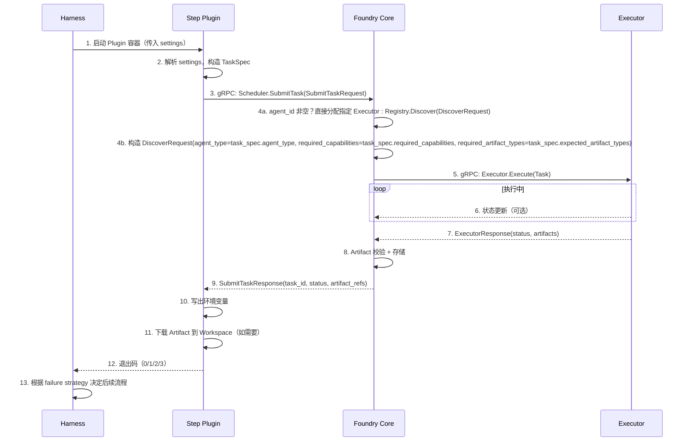

# Foundry v1 - Harness 集成方案设计文档

| 属性 | 内容 |
|------|------|
| **文档标题** | Foundry v1 - Harness 集成方案设计文档 |
| **文档作者** | Foundry Team |
| **文档日期** | 2026-05-05 |
| **文档版本** | v1.1 |
| **文档描述** | Foundry v1 与 Harness 的集成方案设计，覆盖 Harness 版本选型、Step 插件集成、概念映射、流程控制权归属、通信架构和生命周期管理 |

---

## 概述

本文档定义 Foundry v1 与 Harness 的集成方案。Harness 是 Foundry 的流程引擎——负责 Pipeline/Stage/Step/Gate 的执行调度，Foundry 负责 Agent 抽象、Task/Artifact 规范和调度执行。两者通过松耦合方式集成，边界清晰：Harness 不理解 Agent 语义，Foundry 不控制流程执行。

本文档覆盖 FR-4（Harness 集成方案设计），对应验收标准 AC-4 和 AC-7。同时解决 PROGRESS.md 中追踪的 7 个待决问题（OQ-3.1、OQ-3.3、OQ-3.5、OQ-4.1、OQ-4.2、OQ-5.2、OQ-5.3、OQ-6.4）。

### 读者

- 软件架构师：理解 Foundry 与 Harness 的边界和集成架构
- DevOps 工程师：理解 Harness Pipeline 配置和 Step 插件部署
- 一线开发者：理解如何编写 Foundry Step 插件和配置 Pipeline
- 流程设计师：理解 Pipeline/Stage/Step 映射规则和流程模板设计

### 前置依赖

- [tech_stack_and_architecture.md](tech_stack_and_architecture.md)：gRPC 通信架构三层设计、容器化插件模型、Foundry CLI 与 Harness 通信方式
- [agent_executor_architecture.md](agent_executor_architecture.md)：Executor 统一接口、Agent 调度方式
- [failure_handling_and_human_intervention.md](failure_handling_and_human_intervention.md)：失败状态机、人工介入接口
- [audit_scheme.md](audit_scheme.md)：审计日志结构、查询接口

---

## 设计动机

### 为什么需要 Harness

Foundry 的核心原则是 Flow First——一切行为必须附着在流程中，Agent 不拥有流程控制权。Harness 作为流程引擎提供了：

| 能力 | 说明 |
|------|------|
| Pipeline 编排 | 支持 Pipeline/Stage/Step 三级结构，支持串行/并行/条件分支 |
| 流程控制权 | 流程执行、暂停、恢复、取消由 Harness 控制 |
| 容器化 Step | Step 在容器中执行，天然隔离 |
| Plugin 机制 | 支持自定义 Docker 镜像作为 Plugin Step |
| 变量传递 | 支持 Stage/Step 间变量传递（`<+step.artifacts.*>`） |
| 审计日志 | 内置 Pipeline 执行历史和日志查看 |
| Gate 机制 | 支持 Approval Step 作为 Gate |

### 集成边界

```
┌─────────────────────────────────────────────────────────────┐
│                      Harness                                │
│  ┌──────────┐  ┌──────────┐  ┌──────────┐  ┌───────────┐  │
│  │ Pipeline  │  │  Stage   │  │  Step    │  │ Approval  │  │
│  │ 编排      │  │  调度    │  │  执行    │  │ Gate      │  │
│  └──────────┘  └──────────┘  └────┬─────┘  └───────────┘  │
│                                   │                         │
│  ┌────────────────────────────────┼──────────────────────┐ │
│  │        Plugin Step (Docker)    │                      │ │
│  │  ┌─────────────────────────────▼──────────────────┐   │ │
│  │  │           Foundry Step Plugin                   │   │ │
│  │  │  ┌──────────┐  ┌──────────┐  ┌──────────────┐  │   │ │
│  │  │  │ Foundry  │  │  gRPC   │  │  Artifact    │  │   │ │
│  │  │  │ CLI      │──│ Client  │──│  Store       │  │   │ │
│  │  │  └──────────┘  └──────────┘  └──────────────┘  │   │ │
│  │  └────────────────────────────────────────────────┘   │ │
│  └───────────────────────────────────────────────────────┘ │
│                                   │                         │
└───────────────────────────────────┼─────────────────────────┘
                                    │ gRPC
                    ┌───────────────▼───────────────────┐
                    │         Foundry Core               │
                    │  ┌──────────┐  ┌──────────────┐   │
                    │  │Scheduler │  │  Registry     │   │
                    │  │          │  │              │   │
                    │  └────┬─────┘  └──────────────┘   │
                    │       │                            │
                    │  ┌────▼─────────────────────┐     │
                    │  │    Executor (gRPC)        │     │
                    │  └──────────────────────────┘     │
                    │  ┌──────────┐  ┌──────────────┐   │
                    │  │ Audit    │  │  Failure     │   │
                    │  │ Service  │  │  Handler     │   │
                    │  └──────────┘  └──────────────┘   │
                    └────────────────────────────────────┘
```

**关键边界**：

| 边界 | Harness 负责 | Foundry 负责 |
|------|-------------|-------------|
| 流程 | Pipeline/Stage/Step/Gate 执行调度 | — |
| Agent | — | Agent 抽象、Task/Artifact 规范、调度执行 |
| 审计 | Pipeline 执行历史（Step 级别日志） | Agent 执行审计（Artifact 级别详情） |
| 变量 | Stage/Step 间变量传递 | — |
| 失败 | Step 失败标记、重试策略 | 失败检测、状态机、人工介入、回滚 |

---

## 详细设计

### 1. Harness 版本选型

#### 1.1 选型结论

**选择 Harness SaaS（当前最新版本）+ 容器化 Plugin Step 集成方式。**

#### 1.2 选型理由

| 评估维度 | Harness SaaS | Harness Self-Managed | 说明 |
|---------|-------------|---------------------|------|
| Plugin Step 支持 | ✅ 完整支持 | ✅ 完整支持 | 两者均支持容器化 Plugin Step |
| 运维成本 | 低（Harness 托管） | 高（需自行部署维护） | v1 优先降低运维成本 |
| 版本更新 | 自动更新 | 手动更新 | SaaS 自动获取最新特性 |
| 网络访问 | 需要公网访问 Foundry Core | 可内网部署 | v1 假设 Foundry Core 可被 Harness Delegate 访问 |
| 成本 | SaaS 订阅 | 基础设施 + 许可证 | 根据团队规模评估 |

> **设计决策**：v1 选择 Harness SaaS，原因：1) Plugin Step 是核心集成机制，SaaS 和 Self-Managed 均支持；2) SaaS 降低运维成本，v1 团队可专注于 Foundry 核心功能；3) Foundry Step Plugin 通过 Docker 镜像分发，不依赖特定 Harness 部署方式；4) 如果后续需要 Self-Managed，Plugin Step 可无缝迁移。

#### 1.3 关键特性依赖

Foundry 集成依赖以下 Harness 特性：

| 特性 | 最低版本要求 | 说明 |
|------|------------|------|
| Plugin Step | Harness CI/CD 通用 | 容器化自定义 Step，Docker 镜像作为执行单元 |
| Containerized Step | Harness CD 通用 | Step 在容器中运行，天然隔离 |
| Step Group | Harness CD 通用 | 将多个 Step 分组，对应 Foundry Stage |
| Approval Step | Harness CD 通用 | 人工审批 Gate |
| Variable Expression | Harness 通用 | `<+step.artifacts.*>` 变量传递 |
| Delegate | Harness 通用 | 在目标基础设施上执行任务 |

---

### 2. 概念映射

#### 2.1 核心概念映射表

| Foundry 概念 | Harness 概念 | 映射关系 | 说明 |
|-------------|-------------|---------|------|
| Pipeline | Pipeline | 1:1 | Foundry Pipeline 直接映射为 Harness Pipeline |
| Stage | Stage | 1:1 | Foundry Stage 直接映射为 Harness Stage |
| Step | Step（Plugin Step） | 1:1 | Foundry Step 映射为 Harness Plugin Step |
| Gate | Approval Step | 1:1 | Foundry Gate 映射为 Harness Approval Step |
| Task | Plugin Step 输入 | 嵌入 | Foundry Task 作为 Plugin Step 的输入参数 |
| Artifact | Plugin Step 输出 + Artifact Store | 1:N | Foundry Artifact 通过 Plugin Step 写入 Artifact Store，Harness 通过变量表达式引用 |
| Context | Harness Variable + Plugin 输入 | 拆分 | Foundry Context 拆分为 Harness 变量（流程上下文）和 Plugin 输入（任务上下文） |
| Workspace | Harness Workspace | 1:1 | 共享工作目录，Step 间通过文件系统传递数据 |
| on_failure | Harness Step Strategy | 映射 | Foundry on_failure 策略映射为 Harness Step 的 failure strategy |

#### 2.2 映射规则

**Pipeline 映射**：

```yaml
# Harness Pipeline YAML
pipeline:
  name: "<foundry_pipeline_id>"
  identifier: "<foundry_pipeline_id>"
  stages:
    - stage:
        name: "<foundry_stage_id>"
        identifier: "<foundry_stage_id>"
        type: Custom
        spec:
          execution:
            steps:
              - step:
                  type: Plugin
                  name: "<foundry_step_id>"
                  identifier: "<foundry_step_id>"
                  spec:
                    image: "foundry/step-plugin:<version>"
                    settings:
                      foundry_core_endpoint: "<+env.FOUNDRY_CORE_ENDPOINT>"
                      agent_id: "<agent_id>"
                      task_spec: |
                        <task_spec_json>
```

**Gate 映射**：

```yaml
# Foundry Gate → Harness Approval Step
- step:
    type: HarnessApproval
    name: "<gate_id>"
    identifier: "<gate_id>"
    spec:
      approvalMessage: "Foundry Gate: <gate_description>"
      approvers:
        userGroups: ["<approver_group>"]
      minimumApprovals: 1
```

#### 2.3 边界情况处理

| 边界情况 | 处理方式 | 说明 |
|---------|---------|------|
| Foundry Step 超时 | Harness Step timeout + Foundry Executor timeout 双重控制 | Harness Step timeout 应大于 Foundry Executor timeout |
| Foundry Step 重试 | Harness failure strategy + Foundry retry 机制协同 | Harness 层面不重试，由 Foundry 内部重试 |
| Foundry Gate 超时 | Harness Approval timeout | Approval Step 自带超时机制 |
| Artifact 过大 | 不通过 Harness 变量传递，直接写入 Artifact Store | Harness 变量有大小限制 |
| 并行 Step | Harness Stage 内并行 Step Group | Harness 原生支持并行执行 |

> **设计决策**：重试由 Foundry 内部处理而非 Harness 层面，原因：1) Foundry 有完整的重试状态机（Retrying→Executing），Harness 不理解 Agent 语义；2) Harness 重试会重新创建 Step 容器，导致 Foundry 侧状态不一致；3) 符合 Flow First 原则——流程控制权在 Harness，但重试是 Agent 执行层面的行为，由 Foundry 管理。

---

### 3. Step 插件集成方案

#### 3.1 Foundry Step Plugin 架构

Foundry Step Plugin 是一个 Docker 镜像，作为 Harness Plugin Step 运行。它是 Harness 与 Foundry Core 之间的桥梁。

```
┌────────────────────────────────────────────────────┐
│            Foundry Step Plugin (Docker)             │
│                                                     │
│  ┌─────────────────────────────────────────────┐   │
│  │              Entry Point (shell)             │   │
│  │  1. 读取 Harness settings                    │   │
│  │  2. 初始化 Foundry CLI 配置                  │   │
│  │  3. 调用 foundry step execute                │   │
│  │  4. 写出 Harness 变量                        │   │
│  │  5. 退出码映射                               │   │
│  └─────────────────────────────────────────────┘   │
│                                                     │
│  ┌──────────────┐  ┌──────────────┐  ┌──────────┐ │
│  │ Foundry CLI  │  │  gRPC Client │  │ Artifact │ │
│  │              │  │              │  │ Uploader │ │
│  └──────┬───────┘  └──────┬───────┘  └──────────┘ │
│         │                 │                         │
└─────────┼─────────────────┼─────────────────────────┘
          │                 │ gRPC
          │     ┌───────────▼──────────────┐
          │     │      Foundry Core        │
          └─────│  Scheduler → Executor    │
                └──────────────────────────┘
```

#### 3.2 Plugin 输入参数

| 参数 | 类型 | 必填 | 说明 |
|------|------|------|------|
| `foundry_core_endpoint` | `string` | 是 | Foundry Core gRPC 地址（`host:port` 格式） |
| `agent_id` | `string` | 是 | 目标 Agent ID |
| `task_spec` | `string` (JSON) | 是 | TaskSpec JSON 字符串 |
| `context_pipeline_id` | `string` | 否 | 当前 Pipeline ID（来自 Harness 变量） |
| `context_stage_id` | `string` | 否 | 当前 Stage ID（来自 Harness 变量） |
| `context_step_id` | `string` | 否 | 当前 Step ID（来自 Harness 变量） |
| `artifact_store_endpoint` | `string` | 否 | Artifact Store 地址（默认与 foundry_core_endpoint 相同） |
| `timeout_seconds` | `int` | 否 | Step 超时时间（默认 600s） |
| `retry_limit` | `int` | 否 | 重试次数（默认 0，由 Foundry 内部管理） |
| `on_failure` | `string` | 否 | 失败策略（retry/intervene/fail，默认 fail） |

#### 3.3 Plugin 输出

| 输出 | 类型 | 说明 |
|------|------|------|
| 退出码 | `int` | 0=成功，1=失败，2=超时，3=人工介入等待 |
| `FOUNDRY_TASK_ID` | 环境变量 | Foundry 分配的 Task ID |
| `FOUNDRY_ARTIFACT_REFS` | 环境变量 | Artifact 引用列表（JSON 数组） |
| `FOUNDRY_EXECUTION_STATUS` | 环境变量 | 执行状态（SUCCESS/FAILED/TIMEOUT/CANCELLED） |
| Artifact 文件 | 文件系统 | Artifact 写入 Harness Workspace 共享目录 |

**退出码映射**：

| Foundry ExecutionStatus | Plugin 退出码 | Harness Step 状态 |
|------------------------|-------------|-----------------|
| SUCCESS | 0 | Success |
| FAILED | 1 | Failed |
| TIMEOUT | 2 | Failed |
| CANCELLED | 3 (自定义) | Failed |

> **退出码语义说明**：退出码 3 仅用于 CANCELLED 状态（用户显式取消执行）。人工介入操作（approve/skip）后 Step 恢复成功，退出码为 0；人工介入操作（reject/cancel/rollback）后 Step 最终失败，退出码为 1。人工介入等待期间 Plugin 仍在运行（SubmitTask 阻塞），不产生退出码。

> **设计决策**：Plugin 退出码不包含流程控制指令（如 skip_next_step），原因：1) 违反 Flow First 原则——流程控制权属于 Harness；2) Plugin 只能返回执行结果，不能决定流程走向；3) 流程走向由 Harness Pipeline YAML 中的 failure strategy 和条件表达式决定。

#### 3.4 Plugin 执行流程



**步骤说明**：

| 步骤 | 负责组件 | 说明 |
|------|---------|------|
| 1. 启动容器 | Harness | Harness 创建 Plugin 容器，注入 settings |
| 2. 解析 settings | Plugin | Plugin 解析输入参数，构造 TaskSpec |
| 3. 提交 Task | Plugin → Foundry Core | 通过 gRPC 调用 Scheduler.SubmitTask（含 TaskSpec + agent_id + Pipeline 上下文） |
| 4. 发现 Agent | Foundry Core | agent_id 非空时直接分配指定 Executor；否则通过 Registry.Discover(DiscoverRequest) 查找匹配的 Executor，DiscoverRequest 从 TaskSpec 提取 agent_type、required_capabilities、expected_artifact_types |
| 5. 执行 Task | Foundry Core → Executor | gRPC 调用 Executor.Execute |
| 6. 状态更新 | Executor → Foundry Core | 可选的中间状态更新 |
| 7. 返回结果 | Executor → Foundry Core | 返回 ExecutionStatus 和 Artifact |
| 8. 校验存储 | Foundry Core | Artifact 格式校验 + 写入 Artifact Store |
| 9. 返回响应 | Foundry Core → Plugin | 返回 task_id、status、artifact_refs |
| 10. 写出变量 | Plugin | 将结果写入环境变量供后续 Step 引用 |
| 11. 下载 Artifact | Plugin | 将 Artifact 下载到 Workspace 供后续 Step 使用 |
| 12. 退出 | Plugin → Harness | 根据执行状态返回退出码 |
| 13. 流程决策 | Harness | 根据 failure strategy 决定重试/跳过/失败 |

#### 3.5 Plugin Docker 镜像规范

```dockerfile
FROM golang:1.22-alpine AS builder
WORKDIR /app
COPY go.mod go.sum ./
RUN go mod download
COPY . .
RUN CGO_ENABLED=0 go build -o /foundry-step-plugin ./cmd/step-plugin/

FROM alpine:3.19
RUN apk --no-cache add ca-certificates
COPY --from=builder /foundry-step-plugin /usr/local/bin/
COPY entrypoint.sh /usr/local/bin/
RUN chmod +x /usr/local/bin/entrypoint.sh
ENTRYPOINT ["/usr/local/bin/entrypoint.sh"]
```

**镜像命名规范**：

| 规则 | 说明 | 示例 |
|------|------|------|
| 镜像名 | `foundry/step-plugin` | — |
| 标签 | 语义化版本号 | `foundry/step-plugin:v1.0.0` |
| 最新标签 | `latest`（开发用） | `foundry/step-plugin:latest` |

---

### 4. 流程控制权归属

#### 4.1 控制权矩阵

| 控制权 | 归属 | 说明 |
|--------|------|------|
| Pipeline 启动/停止 | Harness | 用户通过 Harness UI/API 控制 |
| Stage 串行/并行 | Harness | Pipeline YAML 定义 |
| Step 执行顺序 | Harness | Stage YAML 定义 |
| Step 超时 | Harness | Step timeout 配置 |
| Step 失败后流程走向 | Harness | failure strategy 配置 |
| Gate 审批 | Harness | Approval Step |
| Agent 选择 | Foundry | Registry 发现 + Scheduler 调度 |
| Task 执行 | Foundry | Executor 执行 |
| Artifact 校验 | Foundry | 格式/Schema 校验 |
| 重试决策 | Foundry | retry_limit + 状态机 |
| 人工介入操作 | Foundry | Intervention 接口 |

#### 4.2 Flow First 原则验证

| 验证项 | 结果 | 说明 |
|--------|------|------|
| Agent 不拥有流程控制权 | ✅ | Executor 只返回 Artifact + ExecutionStatus，不返回流程控制指令 |
| 流程独立于 Agent 运行 | ✅ | Pipeline YAML 可独立编写和验证，不依赖特定 Agent |
| 流程可独立测试 | ✅ | Pipeline 可用 mock Agent 测试，无需真实 Executor |

---

### 5. 通信架构

#### 5.1 三层通信架构

复用 Task 1 定义的 gRPC 通信三层架构：

| 层次 | 通信方式 | 说明 |
|------|---------|------|
| Harness → Step Plugin | Docker 容器启动 + 环境变量 | Harness 启动 Plugin 容器，通过 settings 注入参数 |
| Step Plugin → Foundry Core | gRPC | Plugin 通过 gRPC 调用 Foundry Core 的 Scheduler 服务 |
| Foundry Core → Executor | gRPC | Foundry Core 通过 gRPC 调用 Executor 的 Execute 方法 |

#### 5.2 网络拓扑

```
┌──────────────────────────────────────────────────────┐
│                    Harness SaaS                       │
│  ┌──────────────────────────────────────────────────┐│
│  │  Harness Delegate (K8s Pod)                      ││
│  │  ┌────────────────────────────────────────────┐  ││
│  │  │  Foundry Step Plugin (Container)           │  ││
│  │  │  ┌──────────────┐  ┌────────────────────┐  │  ││
│  │  │  │ Foundry CLI  │  │  gRPC Client       │  │  ││
│  │  │  └──────┬───────┘  └────────┬───────────┘  │  ││
│  │  └─────────┼───────────────────┼──────────────┘  ││
│  └────────────┼───────────────────┼─────────────────┘│
└───────────────┼───────────────────┼──────────────────┘
                │                   │
                │    gRPC (TLS)     │
                │                   │
┌───────────────▼───────────────────▼──────────────────┐
│              Foundry Core (K8s Deployment)            │
│  ┌──────────────┐  ┌──────────────┐  ┌────────────┐ │
│  │  Scheduler   │  │  Registry    │  │  Audit     │ │
│  └──────┬───────┘  └──────────────┘  └────────────┘ │
│         │ gRPC                                        │
│  ┌──────▼──────────────────────────────────────────┐ │
│  │  Executor Pod (per Agent)                        │ │
│  └─────────────────────────────────────────────────┘ │
└──────────────────────────────────────────────────────┘
```

#### 5.3 网络要求

| 连接 | 协议 | 方向 | 说明 |
|------|------|------|------|
| Harness Delegate → Foundry Core | gRPC (TLS) | 出站 | Delegate 需能访问 Foundry Core 的 gRPC 端口 |
| Foundry Core → Executor | gRPC (TLS) | 出站 | Foundry Core 需能访问 Executor 的 gRPC 端口 |
| Step Plugin → Artifact Store | HTTP(S) | 出站 | Plugin 需能访问 Artifact Store |

> **设计决策**：Foundry Core 部署在 K8s 集群内，Harness Delegate 通过 gRPC 访问。原因：1) Foundry Core 是内部服务，不暴露到公网；2) Harness Delegate 可部署在同一 K8s 集群内，通过 Service 访问；3) gRPC + TLS 保证通信安全。

#### 5.4 gRPC 反射服务

> 解决 OQ-4.1：Registry 是否需要提供 gRPC 反射服务

**结论**：v1 不提供 gRPC 反射服务。

| 场景 | 是否需要反射 | 说明 |
|------|------------|------|
| 生产环境 | 不需要 | 客户端（Step Plugin）已知 proto 定义，不需要动态发现 |
| 调试环境 | 可选 | 可使用 `grpcurl` + proto 文件手动调试，不需要反射 |
| 开发环境 | 可选 | 开发时可用 `grpcui` 等工具，但不作为生产特性 |

---

### 6. Agent 注册认证

> 解决 OQ-4.2：Agent 注册是否需要认证

**结论**：v1 不要求 Agent 注册认证，但要求网络层隔离。

| 层面 | v1 方案 | 说明 |
|------|--------|------|
| 网络隔离 | Foundry Core 部署在内网 K8s 集群 | 只有 Harness Delegate 和运维人员可访问 |
| gRPC 传输安全 | TLS 加密 | 防止窃听和篡改 |
| 注册认证 | 不要求 | 假设内网环境可信 |
| 执行认证 | 不要求 | Executor 调用不需要 token |

**v2 考虑**：

| 方案 | 说明 |
|------|------|
| mTLS 双向认证 | Executor 和 Foundry Core 互相验证证书 |
| Token 认证 | 注册时提供 pre-shared token |
| RBAC | 不同 Agent 有不同权限 |

---

### 7. 失败处理与 Harness 协同

#### 7.1 失败处理分工

| 失败场景 | Foundry 处理 | Harness 处理 |
|---------|-------------|-------------|
| Executor 返回 FAILED | 状态机管理（Retrying→RetryExhausted） | Step 标记 Failed |
| Executor 返回 TIMEOUT | 状态机管理 | Step 标记 Failed |
| Artifact 校验失败 | 状态机管理（D-1/D-2 检测） | Step 标记 Failed |
| 重试耗尽 | 触发 on_failure 策略 | Step 最终状态 Failed |
| 人工介入 | Intervention 接口 | Approval Step |
| 回滚 | Foundry 回滚机制 | Harness 不感知回滚 |

#### 7.2 Harness Failure Strategy 配置

Foundry Step 的 Harness failure strategy 配置：

```yaml
failureStrategies:
  - onFailure:
      errors:
        - AllErrors
      action:
        type: MarkAsFailure
```

> **设计决策**：Harness failure strategy 统一设为 `MarkAsFailure`（不重试），原因：1) 重试由 Foundry 内部管理，Harness 不理解 Agent 语义；2) Harness 重试会重新创建 Step 容器，导致 Foundry 侧状态不一致；3) Foundry 的 on_failure 策略（retry/intervene/fail）在 Foundry Core 内部执行，不需要 Harness 参与。

#### 7.3 人工介入与 Harness Approval 的协同

> 解决 OQ-5.3：介入操作的 Web UI 形态

**v1 方案**：人工介入通过 Foundry CLI 命令操作，不依赖 Web UI。

| 介入操作 | Foundry CLI 命令 | Harness 侧效果 |
|---------|-----------------|---------------|
| approve | `foundry intervention approve <id>` | Step Plugin 退出码 0，Step Success |
| reject | `foundry intervention reject <id>` | Step Plugin 退出码 1，Step Failed |
| correct | `foundry intervention correct <id> --file <path>` | Step Plugin 退出码 0，Step Success |
| rollback | `foundry intervention rollback <id> --granularity step` | Step Plugin 退出码 1，Step Failed（回滚在 Foundry 侧执行） |
| cancel | `foundry intervention cancel <id>` | Step Plugin 退出码 1，Step Failed（cancel 视为拒绝/失败） |
| skip | `foundry intervention skip <id>` | Step Plugin 退出码 0，Step Success |

**Step Plugin 介入等待机制**：

```
1. Plugin 调用 Scheduler.SubmitTask
2. Foundry Core 检测到失败，创建 Intervention
3. SubmitTask 阻塞等待（长轮询或 gRPC streaming）
4. 运维通过 Foundry CLI 执行介入操作
5. Intervention 状态变更，SubmitTask 返回最终结果
6. Plugin 根据结果返回退出码
```

> **设计决策**：v1 人工介入不使用 Harness Approval Step，原因：1) Harness Approval 不理解 Foundry 的 6 种介入操作；2) Foundry 介入操作需要与 Artifact Store 和回滚机制联动；3) 介入操作通过 Foundry CLI 执行，保持操作入口统一。如果未来需要 Web UI，可在 Foundry CLI 基础上封装。

---

### 8. 审计与 Harness 日志的协同

#### 8.1 双层审计

> 解决 OQ-6.4：Agent stdout/stderr 的审计存储

| 层面 | Harness 日志 | Foundry 审计 |
|------|-------------|-------------|
| 粒度 | Step 级别 | Agent 执行级别 |
| 内容 | stdout/stderr | Task 输入/输出/上下文/Artifact |
| 存储 | Harness 日志系统 | Foundry Audit Store |
| 查询 | Harness UI | Foundry CLI/API |
| 保留策略 | Harness 配置 | Foundry 配置（90天） |

**Agent stdout/stderr 处理**：

| 场景 | 处理方式 | 说明 |
|------|---------|------|
| Executor stdout/stderr | 写入 Harness 日志 | Harness 自动捕获容器 stdout/stderr |
| Executor stdout/stderr 审计 | 不写入 Foundry Audit Store | stdout/stderr 是调试信息，不是结构化 Artifact |
| Artifact 内容 | 写入 Foundry Audit Store | Artifact 是结构化输出，需要审计 |

> **设计决策**：Agent stdout/stderr 不写入 Foundry Audit Store，原因：1) stdout/stderr 是非结构化调试信息，违反 Artifact Over Conversation 原则；2) 审计关注的是结构化的输入/输出/上下文，不是调试日志；3) Harness 已提供 Step 级别日志查看，无需重复存储。

---

### 9. 回滚与 Harness 的协同

> 解决 OQ-5.2：回滚操作的原子性保障

#### 9.1 回滚执行方式

| 回滚粒度 | Foundry 执行 | Harness 侧效果 |
|---------|-------------|---------------|
| Step | Foundry 回滚该 Step 的 Artifact | 当前 Step Failed，后续 Step 可读取回滚后的状态 |
| Stage | Foundry 回滚该 Stage 所有 Step 的 Artifact | 当前 Stage Failed |
| Pipeline | Foundry 回滚整个 Pipeline 所有 Artifact | Pipeline Failed |

#### 9.2 回滚原子性

**v1 方案**：回滚操作通过 Artifact 状态标记实现，不物理删除。

| 步骤 | 说明 |
|------|------|
| 1 | 将目标 Artifact 的 lifecycle_state 标记为 RolledBack |
| 2 | 如果有前置 Artifact（回滚目标），将其 lifecycle_state 标记为 Active |
| 3 | 记录审计日志（回滚操作、操作人、回滚粒度） |

> **设计决策**：v1 回滚通过状态标记而非物理删除实现，原因：1) 状态标记是原子操作（单字段更新），物理删除涉及多个 Artifact 文件，难以保证原子性；2) 保留回滚前的 Artifact 便于审计追溯；3) 符合 Deterministic Over Smart 原则——回滚操作的结果是确定的。

---

### 10. Executor 启动前脚本

> 解决 OQ-3.1：Executor 是否支持自定义启动前脚本（initContainer）

**结论**：v1 不支持 initContainer。

| 场景 | v1 方案 | 说明 |
|------|--------|------|
| 环境准备 | Executor Docker 镜像内置 | 在镜像构建时完成环境准备 |
| 依赖安装 | Executor 镜像内置 | 在镜像构建时安装依赖 |
| 配置初始化 | Executor 启动时读取配置文件 | 通过 ConfigMap 挂载 |

**v2 考虑**：如果需要 initContainer 支持，可在 Executor Pod Spec 中添加 initContainers 字段。

---

### 11. Artifact 自动触发

> 解决 OQ-3.3：Artifact 产出后是否自动触发下游 Step

**结论**：v1 不支持 Artifact 自动触发下游 Step。

| 原因 | 说明 |
|------|------|
| Flow First | 流程由 Harness Pipeline YAML 定义，不应由 Artifact 产出动态改变 |
| Deterministic | 自动触发导致流程不确定——同一 Pipeline 可能因 Artifact 产出时机不同而执行不同路径 |
| Harness 原生 | Harness 不支持 Step 间自动触发，Step 执行由 Pipeline YAML 定义 |

**替代方案**：下游 Step 通过 Harness 变量表达式引用上游 Artifact，在 Step 执行时读取。

---

### 12. Human Gate Web UI

> 解决 OQ-3.5：Human Gate 的 Web UI 形态

**v1 方案**：Human Gate 通过 Foundry CLI 命令操作，不提供 Web UI。

| 操作 | CLI 命令 | 说明 |
|------|---------|------|
| 查看待审批 Gate | `foundry gate list --status pending` | 列出所有待审批 Gate |
| 审批通过 | `foundry gate approve <gate_id>` | 审批通过 |
| 审批拒绝 | `foundry gate reject <gate_id> --reason <reason>` | 审批拒绝并说明原因 |
| 查看上下文 | `foundry gate show <gate_id>` | 查看 Gate 关联的 Task 和 Artifact |

**v2 考虑**：在 Foundry CLI 基础上封装 Web UI，提供可视化审批界面。

---

### 13. Protobuf 定义

#### 13.1 scheduler.proto（新增）

```protobuf
syntax = "proto3";

package foundry.v1;

option go_package = "github.com/foundry/foundry/gen/foundry/v1";

import "foundry/v1/common.proto";
import "foundry/v1/executor.proto";

message SubmitTaskRequest {
  TaskSpec task_spec = 1;
  string pipeline_id = 2;
  string stage_id = 3;
  string step_id = 4;
  string on_failure = 5;
  int32 retry_limit = 6;
  string agent_id = 7;
}

message SubmitTaskResponse {
  string task_id = 1;
  ExecutionStatus status = 2;
  repeated ArtifactRef artifact_refs = 3;
  string error_message = 4;
  string intervention_id = 5;
}

service SchedulerService {
  rpc SubmitTask(SubmitTaskRequest) returns (SubmitTaskResponse);
  rpc GetTaskStatus(GetTaskStatusRequest) returns (GetTaskStatusResponse);
}

message GetTaskStatusRequest {
  string task_id = 1;
}

message GetTaskStatusResponse {
  string task_id = 1;
  ExecutionStatus status = 2;
  repeated ArtifactRef artifact_refs = 3;
  string intervention_id = 4;
  string error_message = 5;
}
```

> **设计决策**：SubmitTask 是同步阻塞调用（直到 Task 执行完成或人工介入结束才返回），原因：1) Harness Plugin Step 需要等待执行结果才能返回退出码；2) 同步调用简化了 Plugin 实现，不需要实现异步轮询逻辑；3) gRPC 支持长连接，不会因等待时间过长而断开。如果 Task 执行时间超过 Harness Step timeout，Plugin 会因容器被杀而退出码非 0。

> **设计决策**：SubmitTaskRequest 包含 `agent_id` 字段，原因：1) Plugin 输入参数中有 `agent_id`，用于指定目标 Agent；2) 当 `agent_id` 非空时，Scheduler 跳过发现算法，直接将 Task 分配给指定 Agent（精确调度模式）；3) 当 `agent_id` 为空时，Scheduler 通过 Registry.Discover 自动发现匹配的 Agent（自动发现模式）；4) 精确调度模式用于 Pipeline Designer 明确知道应使用哪个 Agent 的场景，自动发现模式用于按 TaskSpec 要求动态匹配的场景。

> **设计决策**：SubmitTaskResponse 包含 `intervention_id` 字段，原因：1) 当 Step 进入人工介入等待时，运维需要知道 intervention_id 才能通过 Foundry CLI 执行介入操作；2) SubmitTask 是同步阻塞的，intervention_id 在介入创建后通过 SubmitTaskResponse 返回给 Plugin；3) Plugin 可将 intervention_id 写入环境变量或日志，供运维查询；4) 运维也可通过 `foundry intervention list --status pending` 查询所有待处理介入，不依赖 Plugin 传递 intervention_id。

---

### 14. 配置示例

#### 14.1 Harness Pipeline YAML（完整示例）

```yaml
pipeline:
  name: code-review-pipeline
  identifier: code_review_pipeline
  projectIdentifier: foundry
  orgIdentifier: default
  tags: {}
  stages:
    - stage:
        name: code-review-stage
        identifier: code_review_stage
        type: Custom
        spec:
          execution:
            steps:
              - step:
                  type: Plugin
                  name: code-review-step
                  identifier: code_review_step
                  timeout: 10m
                  spec:
                    image: foundry/step-plugin:v1.0.0
                    settings:
                      foundry_core_endpoint: <+env.FOUNDRY_CORE_ENDPOINT>
                      agent_id: local-ai-cli-codex-v1
                      task_spec: |
                        {
                          "description": "Review the code changes",
                          "agent_type": "AGENT_TYPE_LOCAL_AI_CLI",
                          "required_capabilities": ["code_review"],
                          "expected_artifact_types": ["ARTIFACT_TYPE_CODE_REVIEW_REPORT"],
                          "parameters": {
                            "cli_command": "codex",
                            "review_scope": "diff"
                          }
                        }
                      context_pipeline_id: <+pipeline.identifier>
                      context_stage_id: <+stage.identifier>
                      context_step_id: <+step.identifier>
                      on_failure: intervene
                      retry_limit: 1
                    envVariables:
                      FOUNDRY_CORE_ENDPOINT: <+env.FOUNDRY_CORE_ENDPOINT>
            failureStrategies:
              - onFailure:
                  errors:
                    - AllErrors
                  action:
                    type: MarkAsFailure
```

#### 14.2 Foundry Core 部署配置

```yaml
# configs/foundry.yaml
server:
  grpc_port: 9090
  http_port: 8080

scheduler:
  load_balance_strategy: "least_concurrent"
  default_timeout_seconds: 600
  default_retry_limit: 0

registry:
  heartbeat_interval_seconds: 30
  heartbeat_timeout_seconds: 90
  auto_deregister_delay_seconds: 60
  snapshot_interval_seconds: 60
  snapshot_path: "data/registry/snapshot.json"

audit:
  store_type: "sqlite"
  sqlite_path: "data/audit/foundry.db"
  retention_days: 90
  max_storage_mb: 512

artifact:
  store_type: "local"
  local_path: "data/artifacts"
  max_artifact_size_bytes: 104857600
  max_total_size_bytes: 524288000
  content_data_size_limit_bytes: 1048576
```

---

## 操作规范

### 1. 部署 Foundry Core

```
1. 准备 K8s 集群
2. 部署 Foundry Core
   a. 创建 Namespace: foundry-system
   b. 创建 ConfigMap: foundry-config（from configs/foundry.yaml）
   c. 创建 Deployment: foundry-core
   d. 创建 Service: foundry-core（ClusterIP, port 9090/gRPC, 8080/HTTP）
3. 部署 Executor
   a. 为每个 Agent 创建 Deployment
   b. Executor 启动时向 Foundry Core 注册
4. 验证
   a. foundry agent list（确认 Agent 注册成功）
   b. foundry agent health <agent_id>（确认 Agent 健康）
```

### 2. 配置 Harness Pipeline

```
1. 在 Harness 中创建 Pipeline
2. 添加 Stage（类型: Custom）
3. 添加 Step（类型: Plugin）
   a. Image: foundry/step-plugin:v1.0.0
   b. Settings: 填写 foundry_core_endpoint、agent_id、task_spec
4. 配置 failure strategy: MarkAsFailure
5. 配置 timeout: 大于 Foundry Executor timeout
6. 保存并运行 Pipeline
```

### 3. 处理人工介入

```
1. Pipeline 运行中 Step 卡住（等待人工介入）
2. 运维查看 Foundry 介入列表
   a. foundry intervention list --status pending
3. 查看介入详情
   a. foundry intervention show <intervention_id>
4. 执行介入操作
   a. foundry intervention approve <intervention_id>
   b. 或 foundry intervention reject <intervention_id> --reason "..."
5. Pipeline 自动继续执行
```

---

## 约束与限制

| 编号 | 限制项 | 说明 |
|------|--------|------|
| L-7.1 | **v1 只支持 Harness SaaS** | Self-Managed 部署方式在 v2 考虑 |
| L-7.2 | **v1 不支持 Harness CI Pipeline** | Foundry Step Plugin 仅在 CD Stage（Custom 类型）中使用，CI Stage 的 Plugin Step 格式不同 |
| L-7.3 | **v1 SubmitTask 是同步阻塞调用** | Task 执行时间受 Harness Step timeout 限制，超时后容器被杀 |
| L-7.4 | **v1 不支持 Artifact 自动触发下游 Step** | 下游 Step 通过 Harness 变量引用上游 Artifact |
| L-7.5 | **v1 人工介入不使用 Harness Approval Step** | 介入操作通过 Foundry CLI 执行，6 种操作类型超出 Harness Approval 能力 |
| L-7.6 | **v1 不支持 initContainer** | Executor 环境准备在 Docker 镜像构建时完成 |
| L-7.7 | **v1 Harness failure strategy 统一为 MarkAsFailure** | 重试由 Foundry 内部管理，Harness 不重试 |
| L-7.8 | **v1 不提供 gRPC 反射服务** | 调试使用 grpcurl + proto 文件 |

---

## 待决问题

| 编号 | 问题 | 需要解决的任务 | 说明 |
|------|------|-------------|------|
| OQ-7.1 | Harness Delegate 与 Foundry Core 的 mTLS 配置 | 编码阶段 | v1 使用 TLS，mTLS 在 v2 考虑 |
| OQ-7.2 | SubmitTask 长连接的超时处理 | 编码阶段 | gRPC 默认无超时，需在客户端设置 deadline |
| OQ-7.3 | 多个 Harness Pipeline 并发执行时的资源隔离 | 编码阶段 | v1 通过 max_concurrent_tasks 限制，不提供 Pipeline 级别隔离 |

**跨文档同步说明**：

| 同步项 | 目标文档 | 说明 |
|--------|---------|------|
| `scheduler.proto` 新增 proto 文件 | Task 1（tech_stack_and_architecture.md） | 需反映到项目目录结构 proto/ 目录中，与 executor.proto、audit.proto、registry.proto 同级 |
| `SubmitTaskRequest.agent_id` 字段 | Task 3（agent_executor_architecture.md） | Scheduler 调度流程需增加精确调度模式（agent_id 非空时跳过发现算法）的说明 |
| `SubmitTaskResponse.intervention_id` 字段 | Task 5（failure_handling_and_human_intervention.md） | 人工介入流程需说明 intervention_id 通过 SubmitTaskResponse 返回给 Plugin |

---

## 修订历史

| 版本 | 日期 | 修改内容 | 作者 |
|------|------|---------|------|
| v1.0 | 2026-05-05 | 初始版本：覆盖 Harness 版本选型（SaaS + Plugin Step）、概念映射（9 组映射 + 5 种边界情况）、Step 插件集成（Docker 镜像 + 10 个输入参数 + 5 个输出 + 执行流程）、流程控制权归属（11 项控制权矩阵 + Flow First 验证）、通信架构（三层 + 网络拓扑）、失败处理协同（6 种场景 + failure strategy）、审计协同（双层审计 + stdout/stderr 处理）、回滚协同（3 种粒度 + 原子性方案）；解决 8 个待决问题（OQ-3.1/3.3/3.5/4.1/4.2/5.2/5.3/6.4） | Foundry Team |
| v1.1 | 2026-05-05 | 评审修订：B-7.1 SubmitTaskRequest 新增 agent_id 字段（支持精确调度模式）；B-7.2 修正 Registry.Discover 调用签名与 Task 4 一致（DiscoverRequest 完整构造）；B-7.3 同步更新 spec.md Open Questions；B-7.4 SubmitTaskResponse 新增 intervention_id 字段（人工介入时 Plugin 可获取 intervention_id）；S-7.1 修正退出码语义（退出码 3 仅用于 CANCELLED，人工介入 cancel 退出码为 1）；S-7.2 OQ-7.1~7.3 同步到 PROGRESS.md；S-7.3 新增跨文档同步说明（scheduler.proto/agent_id/intervention_id）；S-7.4 Artifact Store 配置补充 max_total_size_bytes 和 content_data_size_limit_bytes | Foundry Team |
