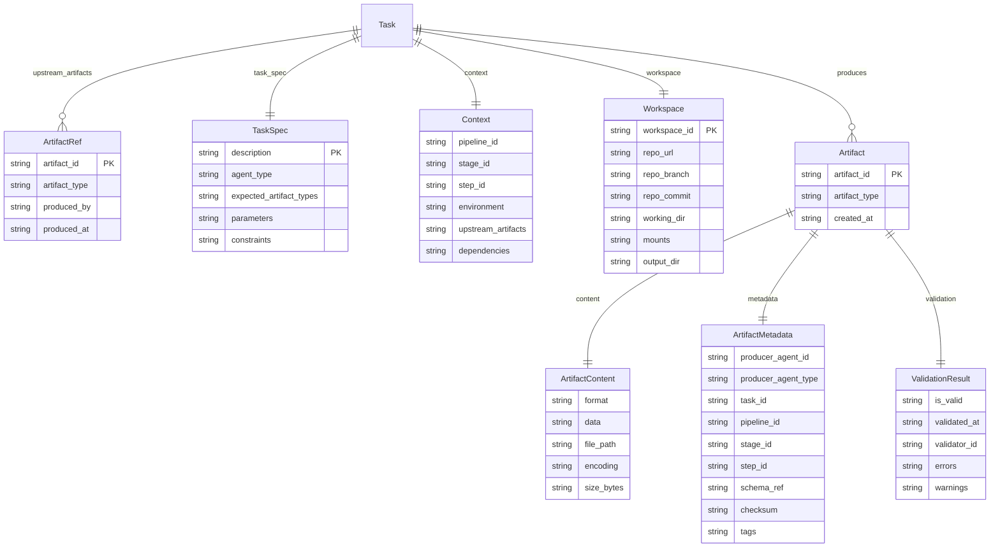
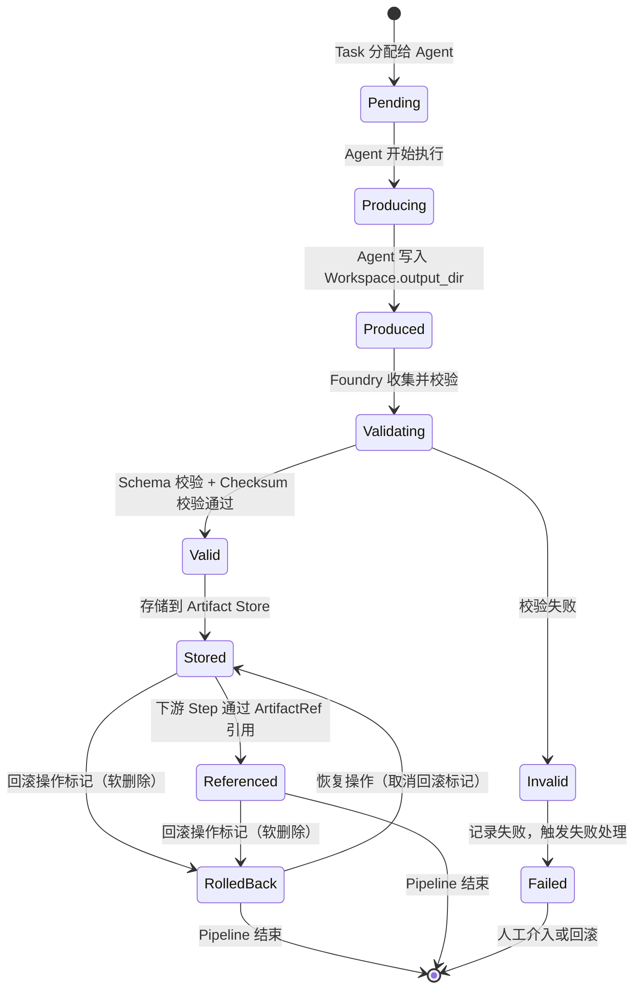

# Foundry v1 - 核心数据模型规范文档（Task & Artifact）

| 属性 | 内容 |
|------|------|
| **文档标题** | Foundry v1 - 核心数据模型规范文档（Task & Artifact） |
| **文档作者** | Foundry Team |
| **文档日期** | 2026-05-06 |
| **文档版本** | v1.7 |
| **文档描述** | Foundry v1 核心数据模型定义，覆盖 Task、Context、Workspace、Artifact 的完整字段规范、类型约束、序列化格式和接口契约 |

---

## 概述

本文档定义 Foundry v1 的核心数据模型，是系统所有其他设计文档的基础。核心数据模型包含两个领域：

1. **Task 领域**：Agent 的输入描述，包含任务描述（Task）、上下文（Context）、工作空间（Workspace）
2. **Artifact 领域**：Agent 的输出产物，结构化的工程产物，非无结构对话

本文档覆盖 FR-2（Task 结构化规范）和 FR-3（Artifact 结构化规范），对应验收标准 AC-2 和 AC-3。

### 读者

- 软件架构师：理解数据模型设计决策
- 一线开发者：根据模型定义实现 Go 结构体和 Protobuf 消息
- DevOps 工程师：理解 Task/Artifact 在 Pipeline 中的流转方式

### 前置依赖

- [tech_stack_and_architecture.md](tech_stack_and_architecture.md)：技术栈选型（Go 1.22+、gRPC + Protobuf、JSON Schema）
- [spec.md](../../.trae/specs/foundry-v1/spec.md)：术语定义和功能需求

---

## 设计动机

### 为什么需要统一的数据模型

Foundry 的核心协作模型是「多 Agent 分工并行」，Agent 之间禁止直接通信，协作只通过结构化 Artifact 完成。这意味着：

1. **Task 是 Agent 的唯一输入契约**：Agent 不拥有项目视角，只能通过 Task 获取任务信息
2. **Artifact 是 Agent 的唯一输出契约**：Agent 不产生无结构对话，只产出结构化工程产物
3. **数据模型是跨 Agent 类型的统一语言**：四种 Agent 类型（本地 AI CLI、远程 API、传统 CLI、人类 Gate）必须共享相同的输入输出格式

### 设计约束

| 约束来源 | 约束内容 |
|---------|---------|
| Artifact Over Conversation | Artifact 必须是结构化的，必须定义类型和 Schema，禁止无结构文本输出 |
| Deterministic Over Smart | 给定相同 Task 输入，Agent 输出的 Artifact 类型必须确定；失败模式必须明确定义 |
| Agent Is Replaceable | 数据模型不依赖特定 Agent 类型的特性，任意 Agent 类型均可消费 Task 和产出 Artifact |
| Flow First | Task 和 Artifact 的生命周期附着在 Pipeline/Stage/Step 中，由 Harness Step 负责传递 |

---

## 详细设计

### 1. Task 数据模型

Task 是 Agent 执行任务的输入描述，由三个子结构组成：

```
Task
├── TaskSpec        任务描述（做什么）
├── Context         上下文信息（在什么环境下做）
└── Workspace       工作空间（在哪里做）
```

#### 1.1 Task 顶层结构

| 字段 | 类型 | 必填 | 约束 | 说明 |
|------|------|------|------|------|
| `task_id` | `string` | 是 | UUID v4 格式，全局唯一 | Task 唯一标识，由 Foundry Scheduler 生成 |
| `task_spec` | `TaskSpec` | 是 | 非空 | 任务描述，定义 Agent 需要完成的工作 |
| `context` | `Context` | 是 | 非空 | 执行上下文，提供环境和依赖信息 |
| `workspace` | `Workspace` | 是 | 非空 | 工作空间，定义代码仓库和文件系统 |
| `timeout_seconds` | `int32` | 否 | 默认 300，范围 [1, 3600] | 执行超时时间（秒），超时触发失败处理 |
| `retry_limit` | `int32` | 否 | 默认 0，范围 [0, 5] | 最大重试次数，0 表示不重试 |
| `created_at` | `Timestamp` | 是 | RFC 3339 格式 | Task 创建时间 |
| `created_by` | `string` | 是 | 非空 | Task 创建者标识（Pipeline/Stage/Step 路径或用户标识） |
| `labels` | `map<string, string>` | 否 | key/value 均为非空字符串 | 标签，用于分类和过滤 |

> **设计决策**：Task 数据模型不包含 status 字段（如 pending/running/completed/failed），原因：1) Task 是不可变的数据结构，描述"Agent 需要做什么"，而非"Agent 做到了哪一步"；2) Task 的执行状态由 Agent Scheduler 管理，属于运行时状态而非数据模型的一部分；3) 将状态与数据分离符合 Deterministic Over Smart 原则——Task 的内容不因执行状态改变而改变。

#### 1.2 TaskSpec 任务描述

TaskSpec 定义 Agent 需要完成的具体工作。

| 字段 | 类型 | 必填 | 约束 | 说明 |
|------|------|------|------|------|
| `description` | `string` | 是 | 非空，最大长度 4096 字符 | 任务的自然语言描述，Agent 据此理解任务目标 |
| `agent_type` | `AgentType` | 是 | 枚举值 | 要求的 Agent 类型（见 AgentType 枚举） |
| `expected_artifact_types` | `repeated ArtifactType` | 是 | 至少 1 个 | 期望输出的 Artifact 类型列表，用于输出校验 |
| `parameters` | `map<string, string>` | 否 | key 非空 | Agent 特定参数，不同 Agent 类型可定义各自的参数键 |
| `constraints` | `repeated string` | 否 | 每项非空 | Agent 约束声明，补充 FR-7 的四项禁止能力 |
| `expected_artifact_counts` | `repeated ArtifactCountSpec` | 否 | 默认 min_count=1, max_count=0 | 每种 ArtifactType 的产出数量约束，未声明时默认每种类型至少 1 个、无上限 |
| `required_capabilities` | `repeated string` | 否 | 每项为合法能力标识（snake_case） | 要求 Agent 必须具备的能力列表，用于 Scheduler 发现匹配 |

**ArtifactCountSpec 结构**（Artifact 产出数量约束）：

| 字段 | 类型 | 必填 | 约束 | 说明 |
|------|------|------|------|------|
| `artifact_type` | `ArtifactType` | 是 | 枚举值 | 约束的 Artifact 类型 |
| `min_count` | `int32` | 否 | 默认 1，范围 [0, 100] | 最少产出数量 |
| `max_count` | `int32` | 否 | 默认 0（无上限），范围 [0, 100] | 最多产出数量，0 表示无上限 |

| 场景 | min_count | max_count | Foundry Core 校验行为 |
|------|-----------|-----------|---------------------|
| 标准场景（默认） | 1 | 0（无上限） | 至少 1 个 Artifact |
| 固定数量 | 1 | 1 | 恰好 1 个 Artifact |
| 可选产出 | 0 | 1 | 可以没有该类型 Artifact（Warning，不阻塞） |
| 批量产出 | 1 | 5 | 1~5 个该类型 Artifact |

**AgentType 枚举**：

| 枚举值 | Protobuf 数值 | 说明 | 代码命名 |
|--------|-------------|------|---------|
| `AGENT_TYPE_UNSPECIFIED` | 0 | 占位值，Protobuf 默认值，不作为合法业务值使用 | — |
| `AGENT_TYPE_LOCAL_AI_CLI` | 1 | 本地 AI CLI 工具（Codex CLI、Claude Code 等） | `LocalAiCliAgent` |
| `AGENT_TYPE_REMOTE_API` | 2 | 远程大模型 API | `RemoteApiAgent` |
| `AGENT_TYPE_TRADITIONAL_CLI` | 3 | 传统 CLI 工具 | `TraditionalCliAgent` |
| `AGENT_TYPE_HUMAN_GATE` | 4 | 人类工程师（Gate 模式） | `HumanGateAgent` |

> **设计决策**：Protobuf 枚举值 0 为语言规范要求的默认值，使用 `UNSPECIFIED` 占位。JSON Schema 校验时 `UNSPECIFIED` 不是合法值，必须显式指定有效枚举值。

**parameters 按 Agent 类型的约定键**：

| Agent 类型 | 约定键 | 说明 |
|-----------|--------|------|
| `AGENT_TYPE_LOCAL_AI_CLI` | `cli_command` | CLI 工具的可执行路径或命令 |
| | `model` | 使用的模型标识（如 `gpt-4`、`claude-3`） |
| | `max_tokens` | 最大输出 token 数 |
| `AGENT_TYPE_REMOTE_API` | `api_endpoint` | 远程 API 端点 URL |
| | `model` | 使用的模型标识 |
| | `temperature` | 生成温度参数 |
| `AGENT_TYPE_TRADITIONAL_CLI` | `command` | 要执行的 CLI 命令 |
| | `exit_codes` | 期望的退出码列表（逗号分隔），默认 `0` |
| `AGENT_TYPE_HUMAN_GATE` | `gate_type` | Gate 类型：`approval` / `review` / `correction` |
| | `timeout_action` | 超时后的默认动作：`approve` / `reject` / `escalate` |

> **设计决策**：parameters 使用 `map<string, string>` 而非 `google.protobuf.Struct`，原因：1) 简单键值对足以满足参数传递需求；2) 强类型约束避免嵌套结构带来的解析歧义；3) 符合 Deterministic Over Smart 原则——参数结构可预测。

#### 1.3 Context 上下文

Context 提供 Agent 执行任务所需的环境和依赖信息。

| 字段 | 类型 | 必填 | 约束 | 说明 |
|------|------|------|------|------|
| `pipeline_id` | `string` | 是 | 非空 | 所属 Pipeline 标识 |
| `stage_id` | `string` | 是 | 非空 | 所属 Stage 标识 |
| `step_id` | `string` | 是 | 非空 | 所属 Step 标识 |
| `environment` | `map<string, string>` | 否 | key 非空 | 环境变量，注入到 Agent 执行环境中 |
| `upstream_artifacts` | `repeated ArtifactRef` | 是 | 可为空列表 | 前置 Artifact 引用列表，由 Harness Step 传递 |
| `dependencies` | `repeated string` | 否 | 每项非空 | 依赖的其他资源标识（如数据库连接、缓存地址） |

**ArtifactRef 结构**（前置 Artifact 引用）：

| 字段 | 类型 | 必填 | 约束 | 说明 |
|------|------|------|------|------|
| `artifact_id` | `string` | 是 | UUID v4 格式 | 引用的 Artifact 唯一标识 |
| `artifact_type` | `ArtifactType` | 是 | 枚举值 | Artifact 类型，用于快速路由 |
| `produced_by` | `string` | 是 | 非空 | 产出该 Artifact 的 Agent 标识 |
| `produced_at` | `Timestamp` | 是 | RFC 3339 格式 | Artifact 产出时间 |

> **设计决策**：Context 中的 `upstream_artifacts` 使用引用（ArtifactRef）而非内联完整 Artifact，原因：1) 避免数据冗余和传输开销；2) Artifact Store 是唯一数据源，引用保证一致性；3) 符合 Artifact Over Conversation 原则——Artifact 作为独立工程产物存储和引用。

> **引用完整性约束**：当 `upstream_artifacts` 中的 ArtifactRef 引用了一个已被删除或处于 Invalid 状态的 Artifact 时，Foundry Scheduler 应在 Task 调度前执行引用完整性检查。引用无效 Artifact 的处理方式由失败处理机制（Task 5）定义，数据模型层面仅声明：1) ArtifactRef 引用的 Artifact 必须在 Artifact Store 中存在；2) 引用的 Artifact 必须处于 Valid 或 Stored 状态；3) 违反约束时 Task 不进入调度队列，返回引用错误。

#### 1.4 Workspace 工作空间

Workspace 定义 Agent 执行任务的工作空间。

| 字段 | 类型 | 必填 | 约束 | 说明 |
|------|------|------|------|------|
| `workspace_id` | `string` | 是 | UUID v4 格式 | 工作空间唯一标识 |
| `repo_url` | `string` | 否 | 合法 Git URL 或本地路径 | 代码仓库地址 |
| `repo_branch` | `string` | 否 | 非空 | 代码分支，与 `repo_url` 配合使用 |
| `repo_commit` | `string` | 否 | 40 字符 SHA-1 | 代码提交哈希，与 `repo_url` 配合使用 |
| `working_dir` | `string` | 是 | 合法路径，绝对路径 | Agent 执行的工作目录 |
| `mounts` | `repeated Mount` | 否 | 最多 16 个 | 文件系统挂载点列表 |
| `output_dir` | `string` | 是 | 合法路径，绝对路径 | Artifact 输出目录，Agent 将产物写入此目录 |

**Mount 结构**（文件系统挂载点）：

| 字段 | 类型 | 必填 | 约束 | 说明 |
|------|------|------|------|------|
| `source` | `string` | 是 | 合法路径 | 宿主机路径 |
| `target` | `string` | 是 | 合法路径 | 容器内挂载路径 |
| `writable` | `bool` | 否 | 默认 false | 是否可写挂载，false 表示只读 |

> **设计决策**：Workspace 包含 `output_dir` 字段，Agent 将 Artifact 文件写入此目录，Foundry 负责从该目录收集和验证 Artifact。这种设计将文件 I/O 与数据模型解耦，符合 Agent Is Replaceable 原则——Agent 不需要了解 Artifact Store 的实现。

> **Human Gate 产出路径**：Human Gate Agent 不直接写文件到 output_dir，其产出路径与其他 Agent 类型不同。Foundry 在 Human Gate Agent 完成审批/评审/修正后，自动将审批结果构造为 `ARTIFACT_TYPE_APPROVAL_RECORD` 类型的 Artifact 并写入 Artifact Store，无需人类工程师操作文件系统。

**Workspace 生命周期**：

| 阶段 | 触发条件 | 说明 |
|------|---------|------|
| 创建 | Foundry Scheduler 为 Task 分配 Workspace | 根据 Agent 配置创建工作目录、克隆代码仓库、设置挂载点 |
| 使用 | Agent 执行 Task 期间 | Agent 在 working_dir 中工作，将产物写入 output_dir |
| 收集 | Agent 执行完成后 | Foundry 从 output_dir 收集 Artifact |
| 销毁 | Step 执行完成且 Artifact 收集完毕后 | 清理工作目录，释放资源 |

**Workspace 隔离粒度**：

- 每个 Task 拥有独立的 Workspace，不同 Task 的 Workspace 互不干扰
- 同一 Stage 内的并行 Step 各自拥有独立 Workspace，不共享文件系统
- Workspace 的创建和销毁由 Foundry Scheduler 管理，Agent 不感知 Workspace 的生命周期

---

### 2. Artifact 数据模型

Artifact 是 Agent 执行任务的输出产物，是结构化的工程产物，不是无结构对话。

**核心声明：Artifact 是结构化工程产物，与无结构对话严格区分。**

| 区分维度 | 结构化工程产物（Artifact） | 无结构对话 |
|---------|------------------------|-----------|
| 类型 | 有明确的 ArtifactType 枚举 | 无类型或自由文本 |
| Schema | 有 JSON Schema 定义，可机器校验 | 无 Schema，不可校验 |
| 元数据 | 包含完整的溯源信息（producer、pipeline、timestamp） | 无或仅有时间戳 |
| 持久化 | 存储在 Artifact Store，可被后续 Step 引用 | 存储在聊天记录，不可被程序引用 |
| 校验 | 可通过 Schema 验证完整性 | 无法程序化校验 |

#### 2.1 Artifact 顶层结构

| 字段 | 类型 | 必填 | 约束 | 说明 |
|------|------|------|------|------|
| `artifact_id` | `string` | 是 | UUID v4 格式，全局唯一 | Artifact 唯一标识 |
| `artifact_type` | `ArtifactType` | 是 | 枚举值 | Artifact 类型（见 ArtifactType 枚举） |
| `content` | `ArtifactContent` | 是 | 非空 | Artifact 内容 |
| `metadata` | `ArtifactMetadata` | 是 | 非空 | Artifact 元数据 |
| `validation` | `ValidationResult` | 否 | 非空（校验后必填） | Artifact 校验结果，Agent 产出时为空，Foundry Core 校验后填充 |
| `created_at` | `Timestamp` | 是 | RFC 3339 格式 | Artifact 创建时间 |

#### 2.2 ArtifactType 类型体系

ArtifactType 枚举定义了 Foundry v1 支持的所有 Artifact 类型。

| 枚举值 | Protobuf 数值 | 说明 | 典型产出 Agent |
|--------|-------------|------|---------------|
| `ARTIFACT_TYPE_UNSPECIFIED` | 0 | 占位值，Protobuf 默认值，不作为合法业务值使用 | — |
| `ARTIFACT_TYPE_CODE_REVIEW_REPORT` | 1 | 代码评审报告 | 本地 AI CLI、人类 Gate |
| `ARTIFACT_TYPE_SECURITY_SCAN_REPORT` | 2 | 安全扫描报告 | 远程 API、传统 CLI |
| `ARTIFACT_TYPE_STATIC_ANALYSIS_REPORT` | 3 | 静态分析报告 | 传统 CLI |
| `ARTIFACT_TYPE_TEST_REPORT` | 4 | 测试报告 | 传统 CLI、远程 API |
| `ARTIFACT_TYPE_BUILD_OUTPUT` | 5 | 构建产物 | 传统 CLI |
| `ARTIFACT_TYPE_DOCUMENTATION` | 6 | 文档产物 | 本地 AI CLI、远程 API |
| `ARTIFACT_TYPE_DESIGN_PROPOSAL` | 7 | 设计提案 | 本地 AI CLI、远程 API |
| `ARTIFACT_TYPE_PATCH_DIFF` | 8 | 代码补丁 | 本地 AI CLI |
| `ARTIFACT_TYPE_APPROVAL_RECORD` | 9 | 审批记录 | 人类 Gate |
| `ARTIFACT_TYPE_ERROR_REPORT` | 10 | 错误报告 | 任意 Agent（失败时产出） |
| `ARTIFACT_TYPE_EXECUTION_RECORD` | 11 | 执行记录 | 通知类 Agent（无自然产出时由 Foundry Core 自动构造） |
| `ARTIFACT_TYPE_CUSTOM` | 99 | 自定义类型 | 任意 Agent |

> **设计决策**：ArtifactType 使用枚举而非自由字符串，原因：1) 枚举值在编译时可检查，符合 Deterministic Over Smart 原则；2) 枚举值可用于自动路由和校验，无需解析自由文本；3) `ARTIFACT_TYPE_CUSTOM`（99）保留为扩展点，自定义类型必须通过 `metadata.schema_ref` 引用外部 Schema。

**每种 ArtifactType 的专属内容 Schema**：

通用 `artifact.schema.json` 定义了 Artifact 的外壳结构（id/type/content/metadata/validation），每种 ArtifactType 还应有专属的内容 Schema，定义 `content` 内部的具体字段。专属 Schema 的引用机制如下：

| 机制 | 说明 |
|------|------|
| 内置类型 | Foundry 为每种内置 ArtifactType 提供标准内容 Schema，存储在 `schemas/artifacts/` 目录下（如 `schemas/artifacts/code_review_report.schema.json`） |
| 自定义类型 | `ARTIFACT_TYPE_CUSTOM` 类型的 Artifact 必须通过 `metadata.schema_ref` 引用外部 Schema |
| Schema 查找 | Artifact 校验时，根据 `artifact_type` 查找对应的内容 Schema：内置类型自动匹配，自定义类型通过 `schema_ref` 解析 |
| v1 范围 | v1 仅定义通用 Schema 和 Schema 引用机制，各类型的专属内容 Schema 在后续版本中逐步完善 |

> **设计决策**：v1 不为每种 ArtifactType 定义完整的内容 Schema，原因：1) v1 的核心目标是建立数据模型框架和校验机制，而非穷举所有 Artifact 类型的内容格式；2) 各 Agent 实现对同一 ArtifactType 的内容格式可能有差异，过早定义会限制灵活性；3) 专属内容 Schema 可在 Agent 注册时（Task 4）逐步沉淀。

**多 Artifact 输出时的类型映射**：

一个 Task 可能产出多个 Artifact（如 `expected_artifact_types = [CODE_REVIEW_REPORT, PATCH_DIFF]`）。Artifact 与 expected_type 的映射规则：

1. 每个 Artifact 的 `artifact_type` 必须在 `expected_artifact_types` 列表中
2. 同一 `artifact_type` 允许产出多个 Artifact（如两个 `PATCH_DIFF`），通过 `artifact_id` 区分
3. 下游 Step 通过 `ArtifactRef.artifact_type` + `ArtifactRef.artifact_id` 精确定位所需 Artifact
4. 如果 `expected_artifact_types` 中的某个类型未被任何 Artifact 满足，校验结果为 Warning（`TYPE_NOT_PRODUCED`），不阻塞流程

#### 2.3 ArtifactContent 内容结构

| 字段 | 类型 | 必填 | 约束 | 说明 |
|------|------|------|------|------|
| `format` | `ContentFormat` | 是 | 枚举值 | 内容格式（见 ContentFormat 枚举） |
| `data` | `bytes` | 否 | 与 `file_path` 二选一 | 内联内容（二进制安全） |
| `file_path` | `string` | 否 | 与 `data` 二选一，合法路径 | 内容文件路径（指向 Workspace.output_dir 下的文件） |
| `encoding` | `string` | 否 | 默认 `utf-8` | 内容编码（仅对文本格式有效） |
| `size_bytes` | `int64` | 是 | >= 0 | 内容大小（字节） |

**ContentFormat 枚举**：

| 枚举值 | Protobuf 数值 | 说明 |
|--------|-------------|------|
| `CONTENT_FORMAT_UNSPECIFIED` | 0 | 占位值，Protobuf 默认值，不作为合法业务值使用 |
| `CONTENT_FORMAT_JSON` | 1 | JSON 格式 |
| `CONTENT_FORMAT_YAML` | 2 | YAML 格式 |
| `CONTENT_FORMAT_MARKDOWN` | 3 | Markdown 格式 |
| `CONTENT_FORMAT_PLAINTEXT` | 4 | 纯文本格式 |
| `CONTENT_FORMAT_BINARY` | 5 | 二进制格式（如编译产物、镜像） |
| `CONTENT_FORMAT_DIFF` | 6 | Diff 格式（统一差异格式） |

> **设计决策**：ArtifactContent 支持 `data`（内联）和 `file_path`（引用）两种方式，原因：1) 小型 Artifact（如报告、评审意见）适合内联传输，减少 I/O；2) 大型 Artifact（如构建产物、镜像）适合文件引用，避免 gRPC 消息过大；3) `size_bytes` 字段始终存在，支持传输前的容量校验。

> **约束说明**：`data` 和 `file_path` 的互斥约束（二选一）在 JSON Schema 中通过 `oneOf` 表达，但 Protobuf 无法在 Schema 层表达此约束。该约束必须在应用层（Foundry Core 校验逻辑）强制执行，校验错误码为 `CONTENT_EMPTY`（两者均为空）或通过业务逻辑拒绝两者同时有值的情况。

#### 2.4 ArtifactMetadata 元数据

| 字段 | 类型 | 必填 | 约束 | 说明 |
|------|------|------|------|------|
| `producer_agent_id` | `string` | 是 | 非空 | 产出该 Artifact 的 Agent 标识 |
| `producer_agent_type` | `AgentType` | 是 | 枚举值 | 产出该 Artifact 的 Agent 类型 |
| `task_id` | `string` | 是 | UUID v4 格式 | 产出该 Artifact 的 Task 标识 |
| `pipeline_id` | `string` | 是 | 非空 | 所属 Pipeline 标识 |
| `stage_id` | `string` | 是 | 非空 | 所属 Stage 标识 |
| `step_id` | `string` | 是 | 非空 | 所属 Step 标识 |
| `schema_ref` | `string` | 否 | 合法 URL 或文件路径 | 该 Artifact 类型的 JSON Schema 引用 |
| `checksum` | `string` | 是 | SHA-256 格式（64 字符十六进制） | 内容校验和，用于完整性验证 |
| `tags` | `map<string, string>` | 否 | key 非空 | 自定义标签，用于分类和查询 |

> **设计决策**：ArtifactMetadata 包含完整的溯源信息（producer、pipeline、stage、step），原因：1) 支持全流程审计追溯（NFR-1 可审计）；2) 支持按维度查询 Artifact（Task 6 审计查询）；3) 支持回滚时定位 Artifact 来源（Task 5 回滚机制）。

> **冗余说明**：`pipeline_id`、`stage_id`、`step_id` 同时出现在 Context 和 ArtifactMetadata 中，这是有意为之的冗余。Artifact 可能被独立于 Task 消费（如审计查询、跨 Pipeline 复用），因此 Artifact 必须自包含溯源信息，不能依赖对 Task 的引用来获取流程定位。

#### 2.5 ValidationResult 校验结果

| 字段 | 类型 | 必填 | 约束 | 说明 |
|------|------|------|------|------|
| `is_valid` | `bool` | 是 | — | 是否通过校验 |
| `validated_at` | `Timestamp` | 是 | RFC 3339 格式 | 校验时间 |
| `validator_id` | `string` | 是 | 非空 | 执行校验的组件标识 |
| `errors` | `repeated ValidationError` | 否 | — | 校验错误列表 |
| `warnings` | `repeated ValidationWarning` | 否 | — | 校验警告列表 |

**ValidationError 结构**：

| 字段 | 类型 | 必填 | 约束 | 说明 |
|------|------|------|------|------|
| `code` | `string` | 是 | 非空 | 错误码（如 `SCHEMA_MISMATCH`、`CHECKSUM_INVALID`） |
| `message` | `string` | 是 | 非空 | 错误描述 |
| `field_path` | `string` | 否 | JSON Pointer 格式 | 错误字段路径 |

**ValidationWarning 结构**：

| 字段 | 类型 | 必填 | 约束 | 说明 |
|------|------|------|------|------|
| `code` | `string` | 是 | 非空 | 警告码（如 `SIZE_EXCEEDS_SOFT_LIMIT`） |
| `message` | `string` | 是 | 非空 | 警告描述 |
| `field_path` | `string` | 否 | JSON Pointer 格式 | 警告字段路径 |

> **设计决策**：ValidationResult 内嵌在 Artifact 中而非独立存储，原因：1) 校验结果与 Artifact 生命周期一致，不可分离；2) 下游 Step 可直接读取校验结果决定是否消费该 Artifact；3) 审计日志可从 Artifact 中提取校验信息，无需额外查询。

---

### 3. 数据模型关系图



---

### 4. Artifact 生命周期

Artifact 的生命周期附着在 Pipeline/Stage/Step 中，由 Harness Step 负责传递。



**状态说明**：

| 状态 | 触发条件 | 负责组件 |
|------|---------|---------|
| Pending | Foundry Scheduler 将 Task 分配给 Agent | Scheduler |
| Producing | Agent 接收 Task，开始执行 | Executor |
| Produced | Agent 将产物写入 Workspace.output_dir | Executor |
| Validating | Foundry 从 output_dir 收集产物，执行 Schema 校验和 Checksum 校验 | Foundry Core |
| Valid | 校验通过 | Foundry Core |
| Invalid | 校验失败（Schema 不匹配、Checksum 不一致、类型不在 expected_artifact_types 中） | Foundry Core |
| Stored | Artifact 写入 Artifact Store | Artifact Store |
| Referenced | 下游 Step 通过 Context.upstream_artifacts 引用 | Harness Step |
| RolledBack | 回滚操作将 Artifact 标记为已回滚（软删除，保留审计记录） | Failure Handler |

> **RolledBack 状态说明**：回滚操作不物理删除 Artifact，而是将其状态标记为 `RolledBack`。被标记为 `RolledBack` 的 Artifact 仍保留在 Artifact Store 中用于审计追溯，但不可被下游 Step 引用。ArtifactRef 引用完整性检查时，`RolledBack` 状态的 Artifact 视为无效引用。恢复操作（`POST /api/v1/artifacts/{artifact_id}/restore`）可将 `RolledBack` 状态的 Artifact 恢复为 `Stored` 状态，使其重新可被引用。

---

## 接口定义

### 1. Protobuf 定义

#### 1.1 common.proto（共享枚举）

> 将 AgentType、ArtifactType、ContentFormat 提取到独立的 common.proto，避免 task.proto 和 artifact.proto 之间的循环依赖。

```protobuf
syntax = "proto3";

package foundry.v1;

option go_package = "github.com/foundry/foundry/gen/foundry/v1";

enum AgentType {
  AGENT_TYPE_UNSPECIFIED = 0;
  AGENT_TYPE_LOCAL_AI_CLI = 1;
  AGENT_TYPE_REMOTE_API = 2;
  AGENT_TYPE_TRADITIONAL_CLI = 3;
  AGENT_TYPE_HUMAN_GATE = 4;
}

enum ArtifactType {
  ARTIFACT_TYPE_UNSPECIFIED = 0;
  ARTIFACT_TYPE_CODE_REVIEW_REPORT = 1;
  ARTIFACT_TYPE_SECURITY_SCAN_REPORT = 2;
  ARTIFACT_TYPE_STATIC_ANALYSIS_REPORT = 3;
  ARTIFACT_TYPE_TEST_REPORT = 4;
  ARTIFACT_TYPE_BUILD_OUTPUT = 5;
  ARTIFACT_TYPE_DOCUMENTATION = 6;
  ARTIFACT_TYPE_DESIGN_PROPOSAL = 7;
  ARTIFACT_TYPE_PATCH_DIFF = 8;
  ARTIFACT_TYPE_APPROVAL_RECORD = 9;
  ARTIFACT_TYPE_ERROR_REPORT = 10;
  ARTIFACT_TYPE_EXECUTION_RECORD = 11;
  ARTIFACT_TYPE_CUSTOM = 99;
}

enum ContentFormat {
  CONTENT_FORMAT_UNSPECIFIED = 0;
  CONTENT_FORMAT_JSON = 1;
  CONTENT_FORMAT_YAML = 2;
  CONTENT_FORMAT_MARKDOWN = 3;
  CONTENT_FORMAT_PLAINTEXT = 4;
  CONTENT_FORMAT_BINARY = 5;
  CONTENT_FORMAT_DIFF = 6;
}

enum ExecutionStatus {
  EXECUTION_STATUS_UNSPECIFIED = 0;
  EXECUTION_STATUS_SUCCESS = 1;
  EXECUTION_STATUS_FAILED = 2;
  EXECUTION_STATUS_TIMEOUT = 3;
  EXECUTION_STATUS_CANCELLED = 4;
}
```

#### 1.2 task.proto

```protobuf
syntax = "proto3";

package foundry.v1;

option go_package = "github.com/foundry/foundry/gen/foundry/v1";

import "google/protobuf/timestamp.proto";
import "foundry/v1/common.proto";

message Task {
  string task_id = 1;
  TaskSpec task_spec = 2;
  Context context = 3;
  Workspace workspace = 4;
  int32 timeout_seconds = 5;
  int32 retry_limit = 6;
  google.protobuf.Timestamp created_at = 7;
  string created_by = 8;
  map<string, string> labels = 9;
}

message TaskSpec {
  string description = 1;
  AgentType agent_type = 2;
  repeated ArtifactType expected_artifact_types = 3;
  map<string, string> parameters = 4;
  repeated string constraints = 5;
  repeated ArtifactCountSpec expected_artifact_counts = 6;
  repeated string required_capabilities = 7;
}

message ArtifactCountSpec {
  ArtifactType artifact_type = 1;
  int32 min_count = 2;
  int32 max_count = 3;
}

message Context {
  string pipeline_id = 1;
  string stage_id = 2;
  string step_id = 3;
  map<string, string> environment = 4;
  repeated ArtifactRef upstream_artifacts = 5;
  repeated string dependencies = 6;
}

message Workspace {
  string workspace_id = 1;
  string repo_url = 2;
  string repo_branch = 3;
  string repo_commit = 4;
  string working_dir = 5;
  repeated Mount mounts = 6;
  string output_dir = 7;
}

message Mount {
  string source = 1;
  string target = 2;
  bool writable = 3;
}

message ArtifactRef {
  string artifact_id = 1;
  ArtifactType artifact_type = 2;
  string produced_by = 3;
  google.protobuf.Timestamp produced_at = 4;
}
```

#### 1.3 artifact.proto

```protobuf
syntax = "proto3";

package foundry.v1;

option go_package = "github.com/foundry/foundry/gen/foundry/v1";

import "google/protobuf/timestamp.proto";
import "foundry/v1/common.proto";

message Artifact {
  string artifact_id = 1;
  ArtifactType artifact_type = 2;
  ArtifactContent content = 3;
  ArtifactMetadata metadata = 4;
  ValidationResult validation = 5;
  google.protobuf.Timestamp created_at = 6;
}

message ArtifactContent {
  ContentFormat format = 1;
  bytes data = 2;
  string file_path = 3;
  string encoding = 4;
  int64 size_bytes = 5;
}

message ArtifactMetadata {
  string producer_agent_id = 1;
  AgentType producer_agent_type = 2;
  string task_id = 3;
  string pipeline_id = 4;
  string stage_id = 5;
  string step_id = 6;
  string schema_ref = 7;
  string checksum = 8;
  map<string, string> tags = 9;
}

message ValidationResult {
  bool is_valid = 1;
  google.protobuf.Timestamp validated_at = 2;
  string validator_id = 3;
  repeated ValidationError errors = 4;
  repeated ValidationWarning warnings = 5;
}

message ValidationError {
  string code = 1;
  string message = 2;
  string field_path = 3;
}

message ValidationWarning {
  string code = 1;
  string message = 2;
  string field_path = 3;
}
```

#### 1.4 intervention.proto（失败处理与人工介入枚举）

> 将 InterventionStatus、RollbackGranularity、OnFailureStrategy 提取到独立的 intervention.proto，供 executor.proto、scheduler.proto、audit.proto 等共享引用。枚举值定义与 Task 5（failure_handling_and_human_intervention.md）保持一致。

```protobuf
syntax = "proto3";

package foundry.v1;

option go_package = "github.com/foundry/foundry/gen/foundry/v1";

enum InterventionStatus {
  INTERVENTION_STATUS_UNSPECIFIED = 0;
  INTERVENTION_STATUS_PENDING = 1;
  INTERVENTION_STATUS_APPROVED = 2;
  INTERVENTION_STATUS_REJECTED = 3;
  INTERVENTION_STATUS_CORRECTED = 4;
  INTERVENTION_STATUS_ROLLED_BACK = 5;
  INTERVENTION_STATUS_CANCELLED = 6;
  INTERVENTION_STATUS_SKIPPED = 7;
}

enum RollbackGranularity {
  ROLLBACK_GRANULARITY_UNSPECIFIED = 0;
  ROLLBACK_GRANULARITY_STEP = 1;
  ROLLBACK_GRANULARITY_STAGE = 2;
  ROLLBACK_GRANULARITY_PIPELINE = 3;
}

enum OnFailureStrategy {
  ON_FAILURE_STRATEGY_UNSPECIFIED = 0;
  ON_FAILURE_STRATEGY_HUMAN_INTERVENTION = 1;
  ON_FAILURE_STRATEGY_AUTO_ROLLBACK = 2;
  ON_FAILURE_STRATEGY_RETRY_THEN_INTERVENTION = 3;
  ON_FAILURE_STRATEGY_RETRY_THEN_ROLLBACK = 4;
  ON_FAILURE_STRATEGY_SKIP = 5;
}
```

### 2. Go 结构体定义

> 以下为设计参考，实际代码由 Protobuf 生成（`gen/foundry/v1/`），不手动编写。

#### 2.1 Task 相关结构体

```go
package model

type Task struct {
    TaskID         string            `json:"task_id" validate:"required,uuid4"`
    TaskSpec       TaskSpec          `json:"task_spec" validate:"required"`
    Context        Context           `json:"context" validate:"required"`
    Workspace      Workspace         `json:"workspace" validate:"required"`
    TimeoutSeconds int32             `json:"timeout_seconds" validate:"min=1,max=3600"`
    RetryLimit     int32             `json:"retry_limit" validate:"min=0,max=5"`
    CreatedAt      time.Time         `json:"created_at" validate:"required"`
    CreatedBy      string            `json:"created_by" validate:"required"`
    Labels         map[string]string `json:"labels,omitempty"`
}

type TaskSpec struct {
    Description           string            `json:"description" validate:"required,max=4096"`
    AgentType             AgentType         `json:"agent_type" validate:"required"`
    ExpectedArtifactTypes []ArtifactType    `json:"expected_artifact_types" validate:"required,min=1"`
    Parameters            map[string]string `json:"parameters,omitempty"`
    Constraints           []string          `json:"constraints,omitempty"`
    ExpectedArtifactCounts []ArtifactCountSpec `json:"expected_artifact_counts,omitempty"`
    RequiredCapabilities  []string          `json:"required_capabilities,omitempty"`
}

type ArtifactCountSpec struct {
    ArtifactType ArtifactType `json:"artifact_type" validate:"required"`
    MinCount     int32        `json:"min_count,omitempty"`
    MaxCount     int32        `json:"max_count,omitempty"`
}

type Context struct {
    PipelineID        string            `json:"pipeline_id" validate:"required"`
    StageID           string            `json:"stage_id" validate:"required"`
    StepID            string            `json:"step_id" validate:"required"`
    Environment       map[string]string `json:"environment,omitempty"`
    UpstreamArtifacts []ArtifactRef     `json:"upstream_artifacts"`
    Dependencies      []string          `json:"dependencies,omitempty"`
}

type Workspace struct {
    WorkspaceID string   `json:"workspace_id" validate:"required,uuid4"`
    RepoURL     string   `json:"repo_url,omitempty"`
    RepoBranch  string   `json:"repo_branch,omitempty"`
    RepoCommit  string   `json:"repo_commit,omitempty"`
    WorkingDir  string   `json:"working_dir" validate:"required"`
    Mounts      []Mount  `json:"mounts,omitempty"`
    OutputDir   string   `json:"output_dir" validate:"required"`
}

type Mount struct {
    Source   string `json:"source" validate:"required"`
    Target   string `json:"target" validate:"required"`
    Writable bool   `json:"writable"`
}

type ArtifactRef struct {
    ArtifactID   string       `json:"artifact_id" validate:"required,uuid4"`
    ArtifactType ArtifactType `json:"artifact_type" validate:"required"`
    ProducedBy   string       `json:"produced_by" validate:"required"`
    ProducedAt   time.Time    `json:"produced_at" validate:"required"`
}
```

#### 2.2 Artifact 相关结构体

```go
package model

type Artifact struct {
    ArtifactID   string          `json:"artifact_id" validate:"required,uuid4"`
    ArtifactType ArtifactType    `json:"artifact_type" validate:"required"`
    Content      ArtifactContent `json:"content" validate:"required"`
    Metadata     ArtifactMetadata `json:"metadata" validate:"required"`
    Validation   ValidationResult `json:"validation,omitempty" validate:"omitempty"`
    CreatedAt    time.Time       `json:"created_at" validate:"required"`
}

type ArtifactContent struct {
    Format    ContentFormat `json:"format" validate:"required"`
    Data      []byte        `json:"data,omitempty"`
    FilePath  string        `json:"file_path,omitempty"`
    Encoding  string        `json:"encoding,omitempty"`
    SizeBytes int64         `json:"size_bytes" validate:"min=0"`
}

type ArtifactMetadata struct {
    ProducerAgentID   string            `json:"producer_agent_id" validate:"required"`
    ProducerAgentType AgentType         `json:"producer_agent_type" validate:"required"`
    TaskID            string            `json:"task_id" validate:"required,uuid4"`
    PipelineID        string            `json:"pipeline_id" validate:"required"`
    StageID           string            `json:"stage_id" validate:"required"`
    StepID            string            `json:"step_id" validate:"required"`
    SchemaRef         string            `json:"schema_ref,omitempty"`
    Checksum          string            `json:"checksum" validate:"required,len=64"`
    Tags              map[string]string `json:"tags,omitempty"`
}

type ValidationResult struct {
    IsValid     bool                `json:"is_valid"`
    ValidatedAt time.Time           `json:"validated_at" validate:"required"`
    ValidatorID string              `json:"validator_id" validate:"required"`
    Errors      []ValidationError   `json:"errors,omitempty"`
    Warnings    []ValidationWarning `json:"warnings,omitempty"`
}

type ValidationError struct {
    Code      string `json:"code" validate:"required"`
    Message   string `json:"message" validate:"required"`
    FieldPath string `json:"field_path,omitempty"`
}

type ValidationWarning struct {
    Code      string `json:"code" validate:"required"`
    Message   string `json:"message" validate:"required"`
    FieldPath string `json:"field_path,omitempty"`
}
```

### 3. JSON Schema 定义

#### 3.1 task.schema.json

```json
{
  "$schema": "http://json-schema.org/draft-07/schema#",
  "$id": "https://foundry.dev/schemas/task.schema.json",
  "title": "Task",
  "description": "Foundry v1 Task 数据模型 JSON Schema",
  "type": "object",
  "required": ["task_id", "task_spec", "context", "workspace", "created_at", "created_by"],
  "additionalProperties": false,
  "properties": {
    "task_id": {
      "type": "string",
      "format": "uuid",
      "description": "Task 唯一标识，UUID v4 格式"
    },
    "task_spec": {
      "$ref": "#/definitions/TaskSpec"
    },
    "context": {
      "$ref": "#/definitions/Context"
    },
    "workspace": {
      "$ref": "#/definitions/Workspace"
    },
    "timeout_seconds": {
      "type": "integer",
      "minimum": 1,
      "maximum": 3600,
      "default": 300,
      "description": "执行超时时间（秒）"
    },
    "retry_limit": {
      "type": "integer",
      "minimum": 0,
      "maximum": 5,
      "default": 0,
      "description": "最大重试次数"
    },
    "created_at": {
      "type": "string",
      "format": "date-time",
      "description": "Task 创建时间，RFC 3339 格式"
    },
    "created_by": {
      "type": "string",
      "minLength": 1,
      "description": "Task 创建者标识"
    },
    "labels": {
      "type": "object",
      "additionalProperties": {
        "type": "string",
        "minLength": 1
      },
      "description": "标签"
    }
  },
  "definitions": {
    "TaskSpec": {
      "type": "object",
      "required": ["description", "agent_type", "expected_artifact_types"],
      "additionalProperties": false,
      "properties": {
        "description": {
          "type": "string",
          "minLength": 1,
          "maxLength": 4096,
          "description": "任务的自然语言描述"
        },
        "agent_type": {
          "$ref": "#/definitions/AgentType"
        },
        "expected_artifact_types": {
          "type": "array",
          "items": {
            "$ref": "#/definitions/ArtifactType"
          },
          "minItems": 1,
          "description": "期望输出的 Artifact 类型列表"
        },
        "parameters": {
          "type": "object",
          "additionalProperties": {
            "type": "string"
          },
          "description": "Agent 特定参数"
        },
        "constraints": {
          "type": "array",
          "items": {
            "type": "string",
            "minLength": 1
          },
          "description": "Agent 约束声明"
        }
      }
    },
    "Context": {
      "type": "object",
      "required": ["pipeline_id", "stage_id", "step_id", "upstream_artifacts"],
      "additionalProperties": false,
      "properties": {
        "pipeline_id": {
          "type": "string",
          "minLength": 1,
          "description": "所属 Pipeline 标识"
        },
        "stage_id": {
          "type": "string",
          "minLength": 1,
          "description": "所属 Stage 标识"
        },
        "step_id": {
          "type": "string",
          "minLength": 1,
          "description": "所属 Step 标识"
        },
        "environment": {
          "type": "object",
          "additionalProperties": {
            "type": "string"
          },
          "description": "环境变量"
        },
        "upstream_artifacts": {
          "type": "array",
          "items": {
            "$ref": "#/definitions/ArtifactRef"
          },
          "description": "前置 Artifact 引用列表"
        },
        "dependencies": {
          "type": "array",
          "items": {
            "type": "string",
            "minLength": 1
          },
          "description": "依赖的其他资源标识"
        }
      }
    },
    "Workspace": {
      "type": "object",
      "required": ["workspace_id", "working_dir", "output_dir"],
      "additionalProperties": false,
      "properties": {
        "workspace_id": {
          "type": "string",
          "format": "uuid",
          "description": "工作空间唯一标识"
        },
        "repo_url": {
          "type": "string",
          "description": "代码仓库地址"
        },
        "repo_branch": {
          "type": "string",
          "description": "代码分支"
        },
        "repo_commit": {
          "type": "string",
          "pattern": "^[0-9a-f]{40}$",
          "description": "代码提交哈希"
        },
        "working_dir": {
          "type": "string",
          "minLength": 1,
          "description": "Agent 执行的工作目录"
        },
        "mounts": {
          "type": "array",
          "items": {
            "$ref": "#/definitions/Mount"
          },
          "maxItems": 16,
          "description": "文件系统挂载点列表"
        },
        "output_dir": {
          "type": "string",
          "minLength": 1,
          "description": "Artifact 输出目录"
        }
      }
    },
    "Mount": {
      "type": "object",
      "required": ["source", "target"],
      "additionalProperties": false,
      "properties": {
        "source": {
          "type": "string",
          "minLength": 1,
          "description": "宿主机路径"
        },
        "target": {
          "type": "string",
          "minLength": 1,
          "description": "容器内挂载路径"
        },
        "writable": {
          "type": "boolean",
          "default": false,
          "description": "是否可写挂载，false 表示只读"
        }
      }
    },
    "ArtifactRef": {
      "type": "object",
      "required": ["artifact_id", "artifact_type", "produced_by", "produced_at"],
      "additionalProperties": false,
      "properties": {
        "artifact_id": {
          "type": "string",
          "format": "uuid",
          "description": "引用的 Artifact 唯一标识"
        },
        "artifact_type": {
          "$ref": "#/definitions/ArtifactType"
        },
        "produced_by": {
          "type": "string",
          "minLength": 1,
          "description": "产出该 Artifact 的 Agent 标识"
        },
        "produced_at": {
          "type": "string",
          "format": "date-time",
          "description": "Artifact 产出时间"
        }
      }
    },
    "AgentType": {
      "type": "string",
      "enum": [
        "AGENT_TYPE_LOCAL_AI_CLI",
        "AGENT_TYPE_REMOTE_API",
        "AGENT_TYPE_TRADITIONAL_CLI",
        "AGENT_TYPE_HUMAN_GATE"
      ],
      "description": "Agent 类型枚举"
    },
    "ArtifactType": {
      "type": "string",
      "enum": [
        "ARTIFACT_TYPE_CODE_REVIEW_REPORT",
        "ARTIFACT_TYPE_SECURITY_SCAN_REPORT",
        "ARTIFACT_TYPE_STATIC_ANALYSIS_REPORT",
        "ARTIFACT_TYPE_TEST_REPORT",
        "ARTIFACT_TYPE_BUILD_OUTPUT",
        "ARTIFACT_TYPE_DOCUMENTATION",
        "ARTIFACT_TYPE_DESIGN_PROPOSAL",
        "ARTIFACT_TYPE_PATCH_DIFF",
        "ARTIFACT_TYPE_APPROVAL_RECORD",
        "ARTIFACT_TYPE_ERROR_REPORT",
        "ARTIFACT_TYPE_EXECUTION_RECORD",
        "ARTIFACT_TYPE_CUSTOM"
      ],
      "description": "Artifact 类型枚举"
    }
  }
}
```

#### 3.2 artifact.schema.json

```json
{
  "$schema": "http://json-schema.org/draft-07/schema#",
  "$id": "https://foundry.dev/schemas/artifact.schema.json",
  "title": "Artifact",
  "description": "Foundry v1 Artifact 数据模型 JSON Schema",
  "type": "object",
  "required": ["artifact_id", "artifact_type", "content", "metadata", "created_at"],
  "additionalProperties": false,
  "properties": {
    "artifact_id": {
      "type": "string",
      "format": "uuid",
      "description": "Artifact 唯一标识，UUID v4 格式"
    },
    "artifact_type": {
      "$ref": "#/definitions/ArtifactType"
    },
    "content": {
      "$ref": "#/definitions/ArtifactContent"
    },
    "metadata": {
      "$ref": "#/definitions/ArtifactMetadata"
    },
    "validation": {
      "$ref": "#/definitions/ValidationResult"
    },
    "created_at": {
      "type": "string",
      "format": "date-time",
      "description": "Artifact 创建时间，RFC 3339 格式"
    }
  },
  "definitions": {
    "ArtifactContent": {
      "type": "object",
      "required": ["format", "size_bytes"],
      "additionalProperties": false,
      "properties": {
        "format": {
          "$ref": "#/definitions/ContentFormat"
        },
        "data": {
          "type": "string",
          "contentEncoding": "base64",
          "description": "内联内容（Base64 编码）"
        },
        "file_path": {
          "type": "string",
          "minLength": 1,
          "description": "内容文件路径"
        },
        "encoding": {
          "type": "string",
          "default": "utf-8",
          "description": "内容编码"
        },
        "size_bytes": {
          "type": "integer",
          "minimum": 0,
          "description": "内容大小（字节）"
        }
      },
      "oneOf": [
        {"required": ["data"]},
        {"required": ["file_path"]}
      ],
      "description": "data 和 file_path 二选一"
    },
    "ArtifactMetadata": {
      "type": "object",
      "required": ["producer_agent_id", "producer_agent_type", "task_id", "pipeline_id", "stage_id", "step_id", "checksum"],
      "additionalProperties": false,
      "properties": {
        "producer_agent_id": {
          "type": "string",
          "minLength": 1,
          "description": "产出该 Artifact 的 Agent 标识"
        },
        "producer_agent_type": {
          "$ref": "#/definitions/AgentType"
        },
        "task_id": {
          "type": "string",
          "format": "uuid",
          "description": "产出该 Artifact 的 Task 标识"
        },
        "pipeline_id": {
          "type": "string",
          "minLength": 1,
          "description": "所属 Pipeline 标识"
        },
        "stage_id": {
          "type": "string",
          "minLength": 1,
          "description": "所属 Stage 标识"
        },
        "step_id": {
          "type": "string",
          "minLength": 1,
          "description": "所属 Step 标识"
        },
        "schema_ref": {
          "type": "string",
          "description": "该 Artifact 类型的 JSON Schema 引用"
        },
        "checksum": {
          "type": "string",
          "pattern": "^[0-9a-f]{64}$",
          "description": "SHA-256 校验和"
        },
        "tags": {
          "type": "object",
          "additionalProperties": {
            "type": "string",
            "minLength": 1
          },
          "description": "自定义标签"
        }
      }
    },
    "ValidationResult": {
      "type": "object",
      "required": ["is_valid", "validated_at", "validator_id"],
      "additionalProperties": false,
      "properties": {
        "is_valid": {
          "type": "boolean",
          "description": "是否通过校验"
        },
        "validated_at": {
          "type": "string",
          "format": "date-time",
          "description": "校验时间"
        },
        "validator_id": {
          "type": "string",
          "minLength": 1,
          "description": "执行校验的组件标识"
        },
        "errors": {
          "type": "array",
          "items": {
            "$ref": "#/definitions/ValidationError"
          },
          "description": "校验错误列表"
        },
        "warnings": {
          "type": "array",
          "items": {
            "$ref": "#/definitions/ValidationWarning"
          },
          "description": "校验警告列表"
        }
      }
    },
    "ValidationError": {
      "type": "object",
      "required": ["code", "message"],
      "additionalProperties": false,
      "properties": {
        "code": {
          "type": "string",
          "minLength": 1,
          "description": "错误码"
        },
        "message": {
          "type": "string",
          "minLength": 1,
          "description": "错误描述"
        },
        "field_path": {
          "type": "string",
          "description": "错误字段路径（JSON Pointer 格式）"
        }
      }
    },
    "ValidationWarning": {
      "type": "object",
      "required": ["code", "message"],
      "additionalProperties": false,
      "properties": {
        "code": {
          "type": "string",
          "minLength": 1,
          "description": "警告码"
        },
        "message": {
          "type": "string",
          "minLength": 1,
          "description": "警告描述"
        },
        "field_path": {
          "type": "string",
          "description": "警告字段路径（JSON Pointer 格式）"
        }
      }
    },
    "AgentType": {
      "type": "string",
      "enum": [
        "AGENT_TYPE_LOCAL_AI_CLI",
        "AGENT_TYPE_REMOTE_API",
        "AGENT_TYPE_TRADITIONAL_CLI",
        "AGENT_TYPE_HUMAN_GATE"
      ]
    },
    "ArtifactType": {
      "type": "string",
      "enum": [
        "ARTIFACT_TYPE_CODE_REVIEW_REPORT",
        "ARTIFACT_TYPE_SECURITY_SCAN_REPORT",
        "ARTIFACT_TYPE_STATIC_ANALYSIS_REPORT",
        "ARTIFACT_TYPE_TEST_REPORT",
        "ARTIFACT_TYPE_BUILD_OUTPUT",
        "ARTIFACT_TYPE_DOCUMENTATION",
        "ARTIFACT_TYPE_DESIGN_PROPOSAL",
        "ARTIFACT_TYPE_PATCH_DIFF",
        "ARTIFACT_TYPE_APPROVAL_RECORD",
        "ARTIFACT_TYPE_ERROR_REPORT",
        "ARTIFACT_TYPE_EXECUTION_RECORD",
        "ARTIFACT_TYPE_CUSTOM"
      ]
    },
    "ContentFormat": {
      "type": "string",
      "enum": [
        "CONTENT_FORMAT_JSON",
        "CONTENT_FORMAT_YAML",
        "CONTENT_FORMAT_MARKDOWN",
        "CONTENT_FORMAT_PLAINTEXT",
        "CONTENT_FORMAT_BINARY",
        "CONTENT_FORMAT_DIFF"
      ]
    }
  }
}
```

---

## 操作规范

### 1. Task 创建流程

```
1. Harness Step 触发 Foundry API 调用
2. Foundry Scheduler 生成 task_id (UUID v4)
3. Foundry Scheduler 填充 Context (pipeline_id, stage_id, step_id)
4. Foundry Scheduler 填充 Workspace (根据 Agent 配置)
5. Foundry Scheduler 设置 created_at 和 created_by
6. Foundry Scheduler 校验 Task 完整性 (JSON Schema 校验)
7. 校验通过 → Task 进入调度队列
8. 校验失败 → 返回校验错误，不进入调度
```

### 2. Artifact 校验流程

```
1. Agent 执行完成，将产物写入 Workspace.output_dir
2. Foundry 从 output_dir 收集产物
3. 计算内容 SHA-256 校验和
4. 根据 artifact_type 查找对应 JSON Schema
5. 执行 Schema 校验
6. 校验 artifact_type 是否在 Task.expected_artifact_types 中
7. 生成 ValidationResult
8. 校验通过 → Artifact 状态为 Valid
9. 校验失败 → Artifact 状态为 Invalid，触发失败处理
```

### 3. Artifact 引用传递流程

```
1. 当前 Step 的 Agent 产出 Artifact
2. Artifact 存储到 Artifact Store
3. Harness Step 完成后，Harness 将 Artifact 信息传递给下游 Step
4. 下游 Step 的 Task.Context.upstream_artifacts 中填充 ArtifactRef
5. 下游 Agent 通过 ArtifactRef 从 Artifact Store 获取完整 Artifact
```

### 4. 校验错误码定义

| 错误码 | 触发条件 | 严重级别 |
|--------|---------|---------|
| `SCHEMA_MISMATCH` | Artifact 内容不符合对应类型的 JSON Schema | Error |
| `CHECKSUM_INVALID` | 计算的 SHA-256 与 metadata.checksum 不一致 | Error |
| `TYPE_NOT_EXPECTED` | artifact_type 不在 Task.expected_artifact_types 中 | Error |
| `CONTENT_EMPTY` | content.data 和 content.file_path 均为空 | Error |
| `SIZE_EXCEEDS_LIMIT` | size_bytes 超过配置的最大限制 | Warning |
| `ENCODING_MISMATCH` | 声明的 encoding 与实际内容编码不一致 | Warning |
| `SCHEMA_REF_MISSING` | ARTIFACT_TYPE_CUSTOM 类型未提供 schema_ref | Warning |
| `TYPE_NOT_PRODUCED` | expected_artifact_types 中的某个类型未被任何 Artifact 满足 | Warning |
| `ARTIFACT_REF_INVALID` | upstream_artifacts 中引用的 Artifact 不存在或状态为 Invalid | Error |
| `ARTIFACT_COUNT_EXCEEDS_MAX` | 同一 ArtifactType 的产出数量超过 expected_artifact_counts 中声明的 max_count | Warning |
| `SECURITY_VULNERABILITY_DETECTED` | Artifact 内容中检测到安全漏洞（由安全扫描 Agent 产出，Foundry Core 根据扫描结果判定） | Error |

---

## 约束与限制

1. **v1 不支持 Artifact 版本化**：同一 task_id 产出的同名 Artifact 不保留历史版本，后续版本覆盖前版本
2. **v1 Artifact Store 实现待定**：存储选型（文件系统 / SQLite / 其他）在 Task 6 中确定
3. **ArtifactContent 互斥约束**：`data` 和 `file_path` 二选一，JSON Schema 通过 `oneOf` 表达，Protobuf 层无法表达，必须在应用层强制执行
4. **Protobuf 枚举零值占位**：Protobuf 规范要求枚举值 0 为默认值，使用 `UNSPECIFIED` 作为零值占位；JSON Schema 校验时 `UNSPECIFIED` 不是合法值
5. **parameters 键名不强制校验**：Agent 类型的约定键仅为推荐规范，Foundry Core 不做键名校验，由 Agent 实现自行处理
6. **Artifact.validation 字段时序**：Agent 产出时 validation 为空，Foundry Core 校验后填充；存储到 Artifact Store 的 Artifact 必须包含完整的 validation
7. **敏感数据处理**：`Context.environment`、`TaskSpec.parameters` 可能包含密钥/Token，Artifact 内容可能包含敏感信息（如安全扫描报告中的漏洞详情）。v1 通过以下机制约束：1) 敏感字段通过 `labels` 中 `sensitive=true` 标记；2) 审计日志记录时对标记为敏感的字段执行脱敏（替换为 `***`）；3) 具体脱敏规则在 Task 6（审计方案）中定义

---

## 待决问题

| 问题 | 解决任务 | 说明 |
|------|----------|------|
| Artifact Store 存储选型 | Task 6 ✅ | 已解决：SQLite 默认 + PostgreSQL 可选，详见 audit_scheme.md |
| Artifact 大小限制 | Task 3 ✅ | 已解决：各 Agent 类型大小限制详见 agent_executor_architecture.md |
| 自定义 Artifact 类型的 Schema 注册机制 | Task 4 ✅ | 已解决：Agent 注册时通过配置文件注册，详见 agent_registry_and_discovery.md |
| Task 调度结果记录 | Task 3 ✅ | 已解决：调度结果由 Scheduler 运行时管理，不在 Task 数据模型中记录 |
| Artifact 产出数量约束 | Task 3 ✅ | 已解决：新增 expected_artifact_counts 字段和 ArtifactCountSpec 结构 |
| 各 ArtifactType 专属内容 Schema | Task 4 | v1 仅定义通用 Schema 和引用机制，各类型的专属内容 Schema 在 Agent 注册时逐步沉淀 |

---

## 修订历史

| 版本 | 日期 | 修改内容 | 作者 |
|------|------|---------|------|
| v1.0 | 2026-05-04 | 初始版本 | Foundry Team |
| v1.1 | 2026-05-04 | 评审修订：1) 修正枚举数值表与 Protobuf 定义不一致（AgentType/ArtifactType/ContentFormat 均增加 UNSPECIFIED=0 占位）；2) 补充 task.proto 对 artifact.proto 的 import 声明；3) 补充 ArtifactContent data/file_path 互斥约束的应用层校验说明；4) 修正 Artifact.validation 字段为"校验后必填"并说明时序；5) 补充 Task 无 status 字段的设计决策；6) 补充 ArtifactMetadata 冗余字段的合理性说明；7) 补充 Human Gate Agent 产出路径说明 | Foundry Team |
| v1.2 | 2026-05-04 | 二次评审修订：1) 修复 artifact.schema.json 中 validation 从 required 移除；2) 修复 Go 结构体 Validation 标签为 omitempty；3) 提取共享枚举到 common.proto 解决循环依赖；4) 补充每种 ArtifactType 的专属内容 Schema 声明机制；5) 补充多 Artifact 输出时的类型映射规则；6) 补充 ArtifactRef 引用完整性约束；7) 补充 Workspace 生命周期和隔离粒度；8) 补充敏感数据处理约束；9) 新增待决问题（调度结果记录、Artifact 数量约束、专属内容 Schema）；10) 新增校验错误码 TYPE_NOT_PRODUCED 和 ARTIFACT_REF_INVALID | Foundry Team |
| v1.3 | 2026-05-04 | 三次评审修订：1) 修复 Mount.read_only 默认值与 Protobuf/Go 不一致（改为 writable 字段，默认 false，四方一致）；2) 修复 Context.upstream_artifacts 在 JSON Schema required 中缺失 | Foundry Team |
| v1.4 | 2026-05-05 | Task 3 评审同步：新增校验错误码 ARTIFACT_COUNT_EXCEEDS_MAX（Warning 级别，触发条件：同一 ArtifactType 产出数量超过 expected_artifact_counts 中 max_count） | Foundry Team |
| v1.5 | 2026-05-05 | Task 3 v1.2 同步：新增 ARTIFACT_TYPE_EXECUTION_RECORD（枚举值 11），用于通知类 Agent 无自然产出时由 Foundry Core 自动构造的执行记录 Artifact | Foundry Team |
| v1.6 | 2026-05-06 | 跨文档同步修正：1) Artifact 生命周期新增 RolledBack 状态（软删除，来自 Task 5）；2) 校验错误码新增 SECURITY_VULNERABILITY_DETECTED（Error 级别，来自 Task 5）；3) common.proto 新增 ExecutionStatus 枚举（来自 Task 3，供多 proto 共享）；4) 新增 intervention.proto 定义 InterventionStatus/RollbackGranularity/OnFailureStrategy 枚举（来自 Task 5）；5) TaskSpec 新增 expected_artifact_counts（ArtifactCountSpec）和 required_capabilities 字段（来自 Task 3）；6) 待决问题 5 项标记为已解决 | Foundry Team |
| v1.7 | 2026-05-06 | 一致性审查修正：1) Artifact 生命周期状态机补充 RolledBack→Stored 恢复转换（与 Task 5 一致）；2) RolledBack 状态说明补充恢复操作 API | Foundry Team |
